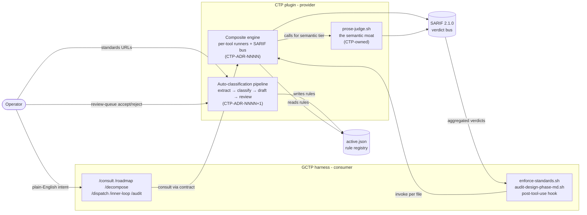
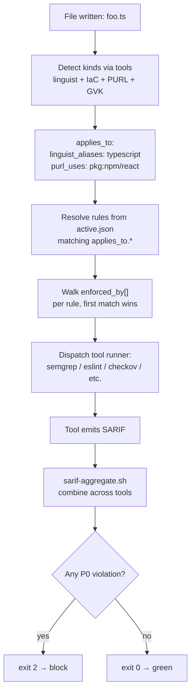
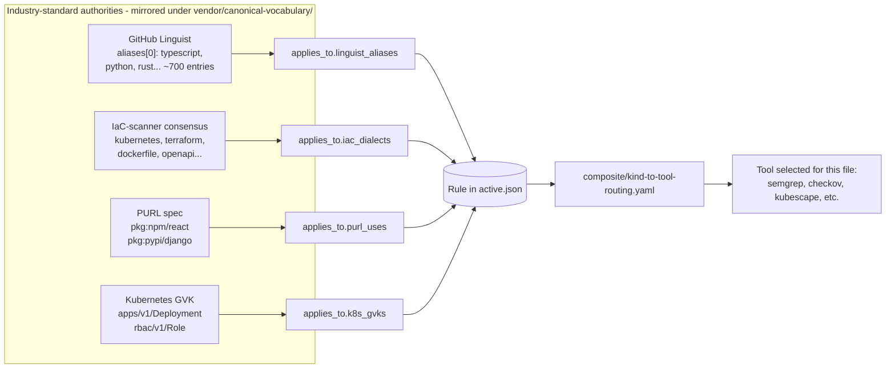
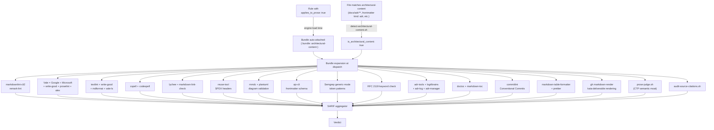
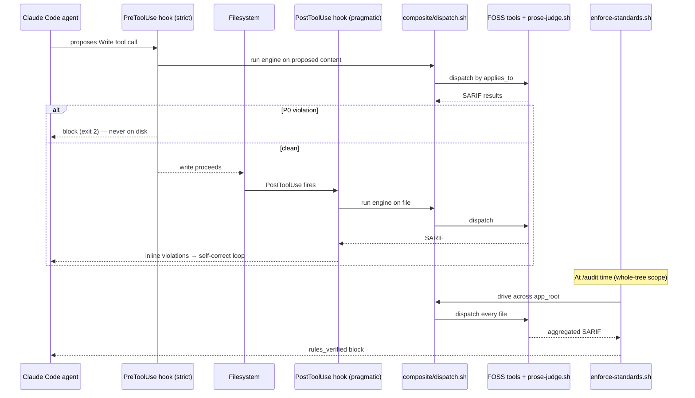
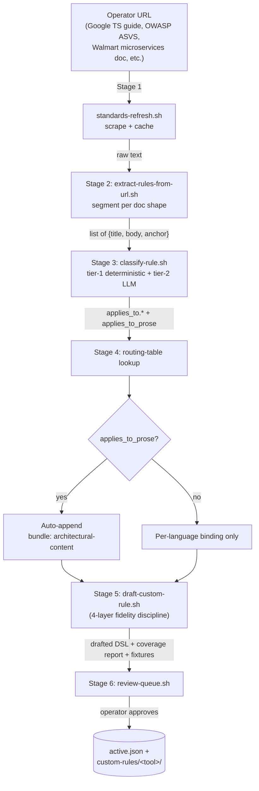
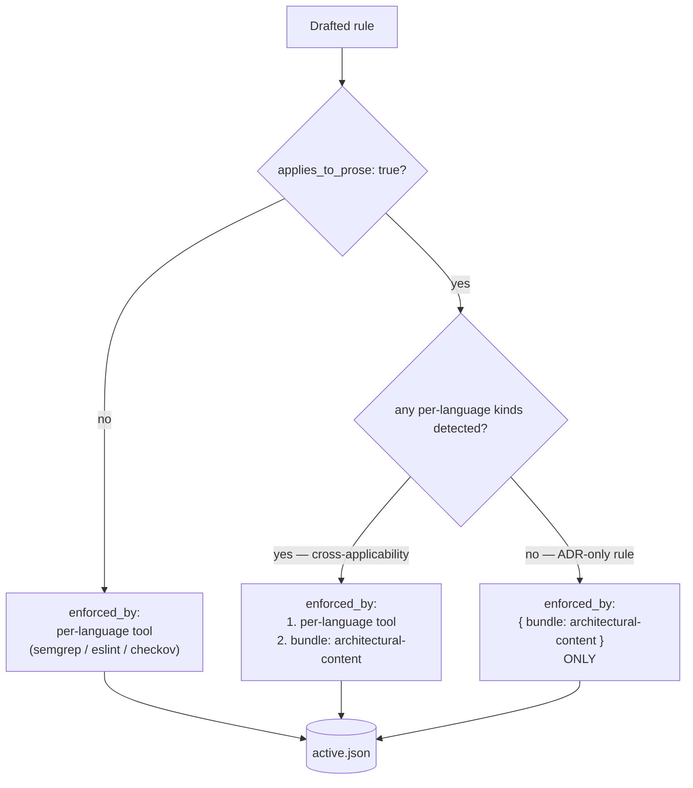
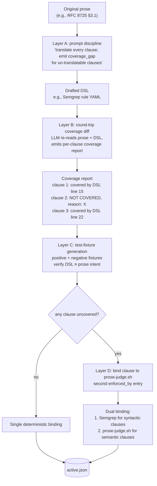

# Complete architecture for the CTP development session — single-entry handoff

> **You (the CTP dev session) have no access to the GCTP repo.** This document is the single entry point. Read it first; it tells you what else to fetch and in what order.
>
> **Source repo:** `https://github.com/drumfiend21/grok-claude-tdd-pro` (GCTP). All raw-URL references below resolve against this repo on branch `main`.
> **Handoff commit (canonical pin):** see "Pinned commit" below — when you fetch any file, prefer the pinned commit hash over `main` for reproducibility.
> **Audience:** the `claude-tdd-pro` development session and its operator.
> **Authority:** TIER-1 — adopt as two paired CTP ADRs (numbers assigned by you).

---

## 1. What this handoff is asking you to land

Two paired CTP ADRs. Adopt them together; one consumes the other's runtime.

| Order | ADR | What it decides | Source design (in GCTP) |
|---|---|---|---|
| **1st** | CTP-ADR-NNNN — **Composite engine + 4-axis canonical vocabulary + architectural-content enforcement bundle** | Replace CTP-handwritten grep detectors with a composite engine of FOSS tools (Semgrep, ESLint, Checkov, Kubescape, Trivy, Spectral, hadolint, zizmor, markdownlint, Vale, lychee, ...). Adopt 4 industry-standard authorities (GitHub Linguist + IaC-scanner consensus + PURL + Kubernetes GVK) as the rule-to-tool join vocabulary. Ship a named `architectural-content` bundle that fires the full prose tool stack on every ADR/design doc/RFC at write + audit time. | `proposals/PROPOSAL-005-composite-engine-4-axis-vocabulary.md` |
| **2nd** | CTP-ADR-NNNN+1 — **Auto-classification + custom-rule drafting pipeline** | Six-stage pipeline: URL → extract → 4-axis classify (with `applies_to_prose`) → route → LLM-draft DSL with four-layer fidelity discipline (no language silently dropped) → review-queue → commit. Auto-attaches `bundle: architectural-content` whenever `applies_to_prose: true`. Lets operators ingest arbitrary world-class standards (Google, Microsoft, OWASP, federal, Accenture, Walmart, internal) at LLM speed. | `proposals/PROPOSAL-006-auto-classification-and-rule-drafting-pipeline.md` |

The two ADRs share a contract: **CTP-ADR-NNNN+1 outputs rules that CTP-ADR-NNNN's engine consumes**, both keyed by the same 4-axis `applies_to.*` vocabulary.

---

## 2. Pinned commit

When fetching any GCTP file, use this commit for reproducibility. Replace `main` in raw URLs with the hash below.

```
Pinned: e44f484f0034b2cd86eb7193a78325fc87120417
Date:   2026-06-22
Author: drumfiend21 + Claude Opus 4.7 (GCTP cloud session)
```

Use this hash in place of `main` in every raw URL below for reproducibility — e.g. `https://raw.githubusercontent.com/drumfiend21/grok-claude-tdd-pro/e44f484f0034b2cd86eb7193a78325fc87120417/proposals/PROPOSAL-005-composite-engine-4-axis-vocabulary.md`. The handoff package is content-frozen at this commit, which includes:
- Mermaid diagram suite (8 diagrams)
- Complete ~115-tool inventory (Appendix A in both CTP-ADRs)
- CTP-ADR-NNNN Appendices B-P: schemas, runner contract, bundle expansion, path classifier, failure-mode matrix, migration plan, P-8 patch, perf/cost budget, cache, observability, versioning, sandboxing, operator overrides, worked example, fixture commitments
- CTP-ADR-NNNN+1 Appendices B-F: LLM prompt corpus verbatim, extractor strategies, coverage-diff harness, per-CL acceptance gates, ADR lifecycle state machine
- Non-goals section + boundary discipline (cover doc §6, §6.5)
- Paired GCTP-side ADRs: `docs/adr/0068-gctp-side-composite-engine-wiring.md` + `docs/adr/0069-gctp-side-auto-classification-pipeline-wiring.md`

Subsequent edits live on `main` HEAD with full `git log proposals/ docs/adr/` history.

---

## 3. Read order (CTP dev session)

Read these in order. Each is a single `curl`/`gh api`/WebFetch fetch.

1. **This file** (you're already here).
2. **GCTP `CLAUDE.md` and `AGENTS.md`** — orientation to GCTP's prime directive, founder-directives, R/G/C/D rulebooks, agent-operating-compact, and the GCTP↔CTP architecture-consult loop. Read so you understand the *consumer* side of the contract surface.
   - `https://raw.githubusercontent.com/drumfiend21/grok-claude-tdd-pro/main/CLAUDE.md`
   - `https://raw.githubusercontent.com/drumfiend21/grok-claude-tdd-pro/main/AGENTS.md`
3. **PROPOSAL-005** (the composite engine + 4-axis vocabulary source design).
   - `https://raw.githubusercontent.com/drumfiend21/grok-claude-tdd-pro/main/proposals/PROPOSAL-005-composite-engine-4-axis-vocabulary.md`
4. **PROPOSAL-006** (the auto-classification pipeline source design).
   - `https://raw.githubusercontent.com/drumfiend21/grok-claude-tdd-pro/main/proposals/PROPOSAL-006-auto-classification-and-rule-drafting-pipeline.md`
5. **CTP-ADR-NNNN draft** (the ADR you will land for PROPOSAL-005).
   - `https://raw.githubusercontent.com/drumfiend21/grok-claude-tdd-pro/main/proposals/ctp-adr-drafts/CTP-ADR-NNNN-composite-engine-4-axis-vocabulary.md`
6. **CTP-ADR-NNNN+1 draft** (the ADR you will land for PROPOSAL-006).
   - `https://raw.githubusercontent.com/drumfiend21/grok-claude-tdd-pro/main/proposals/ctp-adr-drafts/CTP-ADR-NNNN+1-auto-classification-and-rule-drafting-pipeline.md`
7. **PROPOSAL-003 brief** (the prior CTP ADR adopted at pin `39903da` — establishes `prose-judge.sh`, `applies_to_prose`, the 22 namespaces, SARIF emission; everything below COMPOSES on this).
   - `https://raw.githubusercontent.com/drumfiend21/grok-claude-tdd-pro/main/proposals/PROPOSAL-003-ctp-session-brief.md`
8. **P-8 upstream blocker** (the prose-judge.sh `--text` ↔ `--target` contract mismatch that must be fixed before the semantic moat is functional).
   - `https://raw.githubusercontent.com/drumfiend21/grok-claude-tdd-pro/main/docs/upstream-ctp-proposals.md`
9. **PROPOSAL-004** (detector quality uplift CTP-session brief — partially superseded by PROPOSAL-005's composite-engine approach; CTP-D-6 P-8 fix + CTP-D-7 SARIF confidence tier still relevant).
   - `https://raw.githubusercontent.com/drumfiend21/grok-claude-tdd-pro/main/proposals/PROPOSAL-004-detector-quality-uplift-ctp-session-brief.md`
10. **GCTP-side ADR-0066** (the harness-side ADR pairing PROPOSAL-003 — context on the consumer wiring).
    - `https://raw.githubusercontent.com/drumfiend21/grok-claude-tdd-pro/main/docs/adr/0066-yaml-json-md-corpora-and-prose-as-code-enforcement.md`
11. **Standards corpora** (75 YAML + 40+ JSON + 40 MD source URLs — worked examples of what the auto-classification pipeline will ingest):
    - `https://raw.githubusercontent.com/drumfiend21/grok-claude-tdd-pro/main/docs/standards-sources-yaml.md`
    - `https://raw.githubusercontent.com/drumfiend21/grok-claude-tdd-pro/main/docs/standards-sources-json.md`
    - `https://raw.githubusercontent.com/drumfiend21/grok-claude-tdd-pro/main/docs/standards-sources-md.md`
12. **Paired GCTP-side ADRs** (the consumer-side wiring — informative for understanding the boundary, NOT something the CTP author lands):
    - `https://raw.githubusercontent.com/drumfiend21/grok-claude-tdd-pro/main/docs/adr/0068-gctp-side-composite-engine-wiring.md`
    - `https://raw.githubusercontent.com/drumfiend21/grok-claude-tdd-pro/main/docs/adr/0069-gctp-side-auto-classification-pipeline-wiring.md`

That's the full fetch set. Everything else you need is in those 13 documents (plus the two CTP ADR drafts you'll land).

---

## 3.5 Diagrams — the architecture in pictures

All diagrams below are Mermaid. The architectural-content bundle validates them via `mmdc --validate`, so they are first-class enforcement artifacts (not just documentation).

### 3.5.1 System context — GCTP ↔ CTP ↔ Operator boundary



### 3.5.2 Composite engine — file-to-verdict flow



### 3.5.3 4-axis canonical vocabulary — how rules join to tools



### 3.5.4 Architectural-content bundle — bundle name fans out to ~24 tools



### 3.5.5 Two-phase enforcement — write-time + audit-time



### 3.5.6 Auto-classification pipeline — URL to enforcement in 6 stages



### 3.5.7 Auto-binding decision tree



### 3.5.8 Four-layer fidelity discipline — no language silently dropped



---

## 4. The single technical core, in 10 bullets

If you read nothing else, read this:

1. **CTP today owns the rule content + detectors.** GCTP consumes them via `.harness/rules/active.json` + `rubric/detectors/`. Pin `39903da` exposes 118 rules across 24 namespaces, with prose-judge LLM-tier semantic projection (PROPOSAL-003).
2. **The detector substrate is the bottleneck.** Hand-rolled grep is brittle, has coverage gaps for YAML / JSON / MD / container / helm / SBOM / SARIF, has no canonical rule→tool join vocabulary, and doesn't enforce on architectural prose. PROPOSAL-005 fixes all four.
3. **The 4 industry-standard authorities — adopt them; don't invent CTP-native vocabulary.** GitHub Linguist (`aliases[0]`, ~700 languages, MIT) + IaC-scanner consensus (`kubernetes`, `terraform`, `dockerfile`, `openapi`, `helm`, `github_actions`, ...) + PURL spec (`pkg:<ecosystem>/<name>`) + Kubernetes GVK (`apps/v1/Deployment`). Mirror under `vendor/canonical-vocabulary/`.
4. **Every rule carries an `applies_to.*` block + `applies_to_prose: true|false` flag.** The 4-axis tagging is the single join key. The `applies_to_prose` flag drives the architectural-content bundle auto-attachment (no per-rule operator effort).
5. **SARIF 2.1.0 is the universal output bus.** Every tool emits SARIF natively or via thin adapter; `sarif-aggregate.sh` (already shipped in GCTP) produces one normalized verdict stream.
6. **The composite engine routes each rule to one of ~40 FOSS tools** spanning universal SAST/SCA/secrets/policy/supply-chain, JS/TS, CSS, HTML, a11y, web-vitals, IaC, K8s, OpenAPI, GHA, Dockerfile, YAML, JSON, plus every major language ecosystem. Full inventory in CTP-ADR-NNNN §"Full tool-stack inventory".
7. **The architectural-content enforcement bundle is named, whole-or-nothing, and auto-attached.** It expands to ~24 tools (markdownlint + remark-lint + Vale × 5 packs + textlint + cspell + codespell + lychee + reuse + mmdc + plantuml + ajv-cli + Semgrep generic + RFC 2119 check + **prose-judge.sh** + audit-source-citations.sh + adr-tools + log4brains + adr-log + adr-manager + doctoc + markdown-toc + write-good + mdformat + markdown-link-check + commitlint + markdown-table-formatter + gh markdown-render). Fires on every ADR/design doc/RFC at write- and audit-time.
8. **Two-phase enforcement.** Write-time via the post-tool-use hook (GCTP CL-E, already shipped) + audit-time via `enforce-standards.sh` (Fix B, already shipped). A future PreToolUse strict variant gives the "never on disk in violating form" guarantee.
9. **Auto-classification pipeline (PROPOSAL-006).** Six stages — extract → classify (4-axis + `applies_to_prose`) → route → LLM-draft DSL with four-layer fidelity discipline → review-queue → commit. Reduces operator scrape-to-enforced-rule cycle from days to hours. "No language silently dropped" contract makes every catalog rule audit-defensible.
10. **The semantic moat = prose-judge.sh.** No FOSS equivalent. CTP-owned. Depends on P-8 fix (the `--text` ↔ `--target` contract mismatch) before the architectural-content bundle and the four-layer fidelity discipline's Layer D fallback are functional.

---

## 5. Tools we use — complete inventory (single source of truth)

This is the canonical, complete list. The two CTP-ADR drafts duplicate it as Appendix A (CTP-ADR-NNNN is authoritative; CTP-ADR-NNNN+1 reproduces for portability). Use as the checklist for `composite/runners/<tool>/runner.sh`.

**Totals:** ~115 distinct tools / libs / packs / registries across 27 categories. License posture: ~80% permissive (MIT / Apache-2.0 / BSD); 8% GPL/AGPL — all CLI-only (no derivative-work concern).

### 5.1 Universal tier (cross-language, fires on everything)

**SAST:** Semgrep community (LGPL-2.1 engine / Apache-2.0 rules; ~30 languages, ~5000 community rules including OWASP / CWE / MITRE / SANS / JWT BCP)

**SCA / CVE:** Trivy (Apache-2.0) • OSV-Scanner / Google (Apache-2.0) • syft / Anchore SBOM (Apache-2.0) • grype / Anchore vuln (Apache-2.0) • dependency-check / OWASP (Apache-2.0)

**Secrets:** gitleaks (MIT) • detect-secrets / Yelp (Apache-2.0) • trufflehog — live-credential verification (AGPL-3.0)

**Policy / Rego:** conftest (Apache-2.0) • OPA / Open Policy Agent (Apache-2.0) • regal — Rego linter (Apache-2.0) • kyverno + kyverno-cli — K8s-native policy engine (Apache-2.0)

**Supply-chain / Provenance:** OpenSSF Scorecard (Apache-2.0) • cosign (Apache-2.0) • slsa-verifier (Apache-2.0) • in-toto (Apache-2.0) • slsa-github-generator (Apache-2.0)

**SARIF:** SARIF 2.1.0 / OASIS — universal output bus • `sarif-aggregate.sh` — GCTP-shipped, mirrored to CTP (Apache-2.0)

### 5.2 JavaScript / TypeScript

ESLint (MIT) + plugin family: `gts` / Google TS style (Apache-2.0) • `@typescript-eslint` (MIT) • `@microsoft/eslint-plugin-sdl` (MIT) • `eslint-plugin-n` / Node (MIT) • `eslint-plugin-react` (MIT) • `eslint-config-next` (MIT) • `eslint-plugin-jsx-a11y` (MIT) • `@angular-eslint/eslint-plugin` (MIT) • `eslint-plugin-security` (Apache-2.0); Biome — Rust-based fast (MIT) • oxlint (MIT) • Prettier (MIT)

### 5.3 CSS

stylelint (MIT) + configs: SCSS / Less / Tailwind / Standard (all MIT)

### 5.4 HTML

htmlhint (MIT) • html-validate (MIT)

### 5.5 Accessibility (WCAG 2.2)

axe-core (MPL-2.0) • pa11y (MIT) • pa11y-ci (MIT)

### 5.6 Web Vitals

Lighthouse (Apache-2.0) • lighthouse-ci (Apache-2.0) — LCP / CLS / INP, PWA, SEO, performance budgets

### 5.7 IaC (general)

Checkov — 1000+ policies with NIST 800-53 / FedRAMP / SOC2 / PCI / HIPAA / CIS mappings (Apache-2.0) • tfsec (MIT) • terrascan (Apache-2.0) • tflint (MPL-2.0)

### 5.8 Kubernetes

Kubescape — 260+ controls / NSA-CISA + CIS + MITRE ATT&CK + NIST SSDF + FedRAMP (Apache-2.0) • kube-linter (Apache-2.0) • kubeconform — schema validation (Apache-2.0) • polaris (Apache-2.0) • kyverno + kyverno-cli (Apache-2.0)

### 5.9 OpenAPI / AsyncAPI

Spectral + `@stoplight/spectral-owasp-ruleset` (Apache-2.0) • vacuum — fast Go alt (Apache-2.0) • redocly-cli (MIT)

### 5.10 GitHub Actions

zizmor (Apache-2.0) • actionlint (MIT) • pinact — SHA pinning (MIT)

### 5.11 Dockerfile

hadolint (GPL-3.0)

### 5.12 YAML / JSON / Schema

yamllint (GPL-3.0) • ajv-cli — JSON Schema (700+ SchemaStore) (MIT) • jq (MIT)

### 5.13 Language-specific

**Rust:** rustfmt, clippy, cargo-audit, cargo-deny (Apache-2.0 / MIT)
**Go:** golangci-lint — wraps ~50 linters (MIT) • govulncheck (BSD) • gosec (Apache-2.0) • staticcheck (MIT)
**Python:** ruff (MIT) • bandit (Apache-2.0) • mypy (MIT) • pip-audit (Apache-2.0)
**Java / JVM:** Spotless (Apache-2.0) • ErrorProne (Apache-2.0) • SpotBugs (LGPL) • PMD (BSD)
**Kotlin:** ktlint (MIT) • Detekt (Apache-2.0)
**Swift:** SwiftLint (MIT) • SwiftFormat (MIT)
**C# / .NET:** Roslyn analyzers (MIT) • SonarAnalyzer.CSharp (LGPL) • SecurityCodeScan (LGPL)
**Ruby:** RuboCop, brakeman, bundler-audit (MIT)
**Elixir:** credo (MIT) • dialyxir (Apache-2.0) • sobelow (Apache-2.0)
**Scala:** Scalafix (BSD) • Scalafmt (Apache-2.0) • scapegoat (BSD)
**PHP:** PHPStan (MIT) • psalm (MIT) • phpcs-security-audit (Apache-2.0)
**Solidity:** Slither (AGPL-3.0) • solhint (MIT) • Mythril (MIT)
**Shell:** ShellCheck (GPL-3.0) • shfmt (BSD)
**SQL:** SQLFluff (MIT) • sqlfmt (Apache-2.0) • sqlcheck (Apache-2.0)
**GraphQL:** graphql-eslint (MIT) • graphql-schema-linter (MIT)
**Protobuf:** buf lint (Apache-2.0) • protolint (MIT)

### 5.14 Architectural-content bundle (fires on every ADR / design doc / RFC)

**Markdown structural:** markdownlint-cli2 (MIT) — MD001..MD060 • remark-lint + `remark-preset-lint-recommended` + `remark-preset-lint-markdown-style-guide` (MIT)

**Prose style packs:** Vale engine (MIT) + `errata-ai/Google` (CC-BY) + `vale-cli/Microsoft` (CC-BY-4.0) + `errata-ai/write-good` (MIT) + `errata-ai/proselint` (BSD)

**Inclusive language:** `errata-ai/alex` Vale pack (MIT) + `alex` standalone CLI (MIT)

**Additional prose CLIs:** textlint + rule plugins (MIT) • write-good standalone (MIT) • mdformat / Python (MIT) • vale-ls / LSP (MIT)

**Spelling:** cspell (MIT) — code-aware • codespell (GPL-2.0) — dictionary

**Link integrity:** lychee (Apache-2.0 / MIT) • markdown-link-check (MIT)

**License headers:** reuse-tool (GPL-3.0) — REUSE 3.3 / SPDX (FSFE)

**Diagram validation:** mmdc / mermaid-cli (MIT) — validates `mermaid` fenced blocks (C4, sequence, flowchart) • plantuml (GPL)

**Frontmatter schema:** ajv-cli (MIT) against MADR / arc42 / RFC schemas

**Token-pattern checks in prose:** Semgrep generic-mode rules under `composite/rulesets/semgrep/architectural-content/*.yml`

**RFC 2119 keyword discipline:** custom Vale rule or Semgrep pattern — checks BCP 14 invocation sentence presence

**ADR lifecycle:** adr-tools / Nat Pryce (MIT) • log4brains (Apache-2.0) • adr-log (Apache-2.0) • adr-manager (Apache-2.0)

**TOC integrity:** doctoc (MIT) • markdown-toc (MIT) • markdown-it-toc-done-right (MIT)

**Commit message hygiene:** commitlint + `@commitlint/config-conventional` (MIT) — ADR ID → commit → PR traceability

**Inline-table validation:** markdown-table-formatter (MIT) • prettier markdown parser (MIT)

**Kata / competition rendering:** `gh markdown-render` (MIT) • markdownlint-cli2 `--fix` dry-run (MIT)

**Semantic moat (CTP-owned, no FOSS equivalent):** `prose-judge.sh` — LLM-judge tier; projects every `applies_to_prose: true` rule onto prose

**Citation integrity (CTP-owned):** `audit-source-citations.sh` — every cited standard traces to `active.json` provenance

### 5.15 Industry-standard naming registries (mirrored under `vendor/canonical-vocabulary/`)

- GitHub Linguist `aliases[0]` (MIT) — ~700 languages
- IaC-scanner consensus (Apache-2.0) — Checkov + Trivy + Kubescape converge: kubernetes, terraform, dockerfile, openapi, helm, github_actions, cloudformation, compose, ansible, bicep, arm, kustomize, argo_workflows, etc.
- PURL spec (MIT) — `pkg:<ecosystem>/<name>`
- Kubernetes GVK (Apache-2.0) — `apps/v1/Deployment`-style identifiers

### 5.16 License summary

- MIT 55% • Apache-2.0 25% • BSD 5% • MPL 2% • GPL/AGPL 8% • LGPL 3% • CC-BY 2%
- **GPL/AGPL tools** (all CLI-only — no derivative-work concern): hadolint, ShellCheck, codespell, reuse-tool, plantuml, Slither, trufflehog, yamllint

---

## 5.19 Appendix index — the two CTP ADRs together cover this

**CTP-ADR-NNNN appendices:** A (tool inventory) — B (rule schema) — C (runner contract) — D (bundle expansion) — E (path classifier) — F (failure-mode matrix) — G (migration plan) — H (P-8 patch) — I (perf budget) — J (cache spec) — K (observability) — L (versioning) — M (sandboxing) — N (operator overrides) — O (worked example) — P (fixtures) — Q (severity→gate) — R (bundle YAML) — S (routing table) — T (concrete worked runner) — U (startup sequence) — V (empty-state) — W (status advancement) — X (test framework) — Y (repo file-tree diff) — Z (skills integration) — AA (rollback) — AB (cache migration) — AC (sandbox profile content) — AD (concurrency) — AE (degraded perf) — AF (PII / sensitive data) — AG (cost reporting) — AH (telemetry posture) — AI (license policy) — AJ (hot-reload) — AK (i18n) — AL (RFC 3339 timestamps) — AM (engine self-test) — AN (bundle naming) — AO (output formats) — AP (AGPL legal posture) — AQ (CTP dogfood) — AR (future schema migrations) — AS (plugin handshake) — AT (deprecation policy) — AU (Open Questions).

**CTP-ADR-NNNN+1 appendices:** A (tool inventory mirror) — B (LLM prompt corpus verbatim) — C (extractor strategies per doc shape) — D (coverage-diff harness) — E (per-CL acceptance gates) — F (ADR lifecycle state machine) — G (pipeline cost reporting addendum) — H (pipeline PII handling) — I (pipeline i18n addendum) — J (cross-cutting concerns ↔ CTP-ADR-NNNN index).

47 + 10 = 57 appendices total across the two ADRs. Most pipeline-specific concerns are short addenda to the corresponding CTP-ADR-NNNN appendix; cross-references are explicit.

---

## 5.17 Worked end-to-end example — pointer

The canonical wave-1 acceptance test is the Google TS style guide URL ingest, demonstrated step-by-step in **CTP-ADR-NNNN Appendix O**. It walks through:

1. `scripts/classify-from-url.sh --source-id google-ts-style --url https://google.github.io/styleguide/tsguide.html`
2. Stage 1 scrape → cached HTML
3. Stage 2 extraction → 47 rules in JSONL
4. Stage 3 classification → per-rule `applies_to.*` + `applies_to_prose`
5. Stage 4 routing → ESLint + Semgrep + auto-bound architectural-content bundle
6. Stage 5 drafting → 47 ESLint rules + 47 Semgrep rules + 47 coverage reports + per-rule fixtures
7. Stage 6 review-queue → operator batch-accepts 41 high-confidence + reviews 6 individually
8. Final state → 47 entries in `active.json`, ~$4.50 LLM cost, ~12 minutes wall-clock

If that example reproduces end-to-end on the CTP author's machine, the engine is wave-1 complete. See CTP-ADR-NNNN Appendix O for the full transcript.

## 5.18 Fixture-corpus commitments — pointer

CTP ships a comprehensive fixture corpus under `composite/fixtures/` enumerated in **CTP-ADR-NNNN Appendix P**. Covers:

- ≥3 positive + ≥3 negative fixtures per tool runner (Appendix A inventory, ~40 runners)
- 9+ fixtures for the architectural-content bundle (valid ADR / broken frontmatter / broken mermaid / dead links / Vale violation / Semgrep token pattern / RFC 2119 missing / wrong status transition / semantic violation)
- Per-namespace parity-diff fixtures for the migration (Appendix G in CTP-ADR-NNNN)
- ≥1 worked example per source-type in the auto-classification pipeline (Google TS, OWASP ASVS, Walmart-style HTML, NIST PDF, free-form blog)

---

## 6. Explicit non-goals (so CTP doesn't try to build them)

These are NOT in scope for CTP-ADR-NNNN or CTP-ADR-NNNN+1. CTP author should call them out explicitly when landing the ADRs so future-CTP doesn't misread the scope:

| Non-goal | Why excluded | If operator needs it |
|---|---|---|
| **Cross-rule conflict resolution** — when two rules from different sources contradict on the same file | Engine has no policy for "Google says X, Microsoft says ¬X" arbitration | Operator lands a deviation row in `<app_root>/docs/deviations.md` per ADR-0066 D-F (GCTP) |
| **Cluster-runtime / admission-control enforcement** | This ADR is build-time / write-time / audit-time only. Kyverno is in the inventory as a *linter* not as an admission controller | Operator wires Kyverno cluster-side independently via the kyverno-cli ruleset CTP emits |
| **Auto-translation between tool DSLs** | If a rule's Semgrep binding also needs Bandit, the drafter generates two bindings — engine doesn't auto-translate one DSL to another | Drafter handles per-target-tool generation (PROPOSAL-006 D-5) |
| **Custom LLM provider integration** | LLM calls go through `llm-judge.sh`'s existing provider abstraction. The engine doesn't pick the model. | Operator configures provider via `~/.config/ctp/llm.yaml` (PROPOSAL-005 §M.4) |
| **Real-time IDE feedback** | The engine fires on write (post-tool-use hook) + on audit. IDE-time feedback requires an LSP, which is NOT this ADR's scope (Vale's LSP is in the inventory for ADR-time IDE feedback specifically; not a general code-time LSP) | Future ADR; current path is hook-based |
| **Detecting whether an operator's app code conforms to its own ADRs (cross-doc consistency)** | Engine enforces rules against files; it does not verify "code matches the design ADR says it should match" — that's a TICKET-level concern | Operator manually validates code-vs-ADR alignment via consult-loop reviews |
| **Generating ADRs from code** (reverse direction) | The architectural-content bundle ENFORCES on ADRs; it does not GENERATE them. ADR drafting is the operator's responsibility via the GCTP consult loop (`/consult` → `/roadmap`) | Operator drafts in plain English; GCTP's consult loop drives the structure |
| **Multi-language single-rule DSL** (one rule body that enforces in TS + Python + Go simultaneously) | Semgrep already does this for ~30 languages; for the rare case where Semgrep can't, the drafter emits separate per-language bindings (PROPOSAL-006 §6.6) | Drafter handles |
| **Real-time rule-source URL change detection** | `standards-refresh.sh` (PROPOSAL-003) refreshes on cadence (default 1d). Real-time webhook-driven refresh is not in scope | Operator may shorten cadence or trigger manually |

These non-goals are intentional. The composite-engine + auto-classification ADRs are scoped tightly; future ADRs can re-open any of them.

---

## 6.5 Boundary discipline — what CTP must NOT do

Recap of the prime directive boundaries (see CTP-ADR-NNNN §"Boundary discipline" and CTP-ADR-NNNN+1 §"Boundary discipline" for the full statement):

- CTP MUST NOT edit GCTP files. If a CTP need arises that requires GCTP-side wiring, file it as a paired GCTP ADR (the operator drafts it; see §3.7 paired ADRs below) — never patch GCTP from a CTP commit.
- CTP MUST NOT consume or imitate GCTP's audit chain, consult-loop commands, or harness-side script names. The contract surface is `active.json` + canonical vocabulary mirrors + SARIF + the four runtime scripts CTP exposes.
- CTP MUST NOT alter the `prose-judge.sh` or `audit-source-citations.sh` interface in a way that breaks GCTP's existing consumers without a paired GCTP ADR.
- CTP MUST NOT bundle GCTP-side enforcement scripts into CTP's plugin distribution. GCTP-side scripts stay in GCTP.

---

## 6. Implementation order (high level)

The detailed CL inventory is in CTP-ADR-NNNN §"Implementation CLs" and CTP-ADR-NNNN+1 §"Implementation waves". Here's the sequencing constraint summary:

1. **P-8 fix first** (single ~5-line patch to `llm-judge.sh`). Without this, the architectural-content bundle's semantic moat and the auto-classification pipeline's Layer D fallback both return `not_enforced`.
2. **Wave 1 of PROPOSAL-005:** canonical vocabulary mirrors + 4-axis schema migration + SARIF bus. Existing detectors keep working; no regressions.
3. **Wave 1 of PROPOSAL-006:** extractor + classifier (with `applies_to_prose`) + routing table. End-to-end ingest of one operator URL (recommend: Google TS style guide as the first worked example).
4. **Wave 2 of PROPOSAL-005:** per-tool runners + dispatch loop + coverage-diff parity for swapped detectors.
5. **Wave 2 of PROPOSAL-006:** LLM-drafter with four-layer fidelity discipline + drafting-for-architectural-prose (D-6). Depends on P-8.
6. **Wave 3 of PROPOSAL-005:** architectural-content bundle + detection + two-phase wiring.
7. **Wave 3 of PROPOSAL-006:** review-queue CLI + end-to-end driver.

After all six waves: operator scrape-to-enforced-rule cycle drops from days to hours; every ADR passes the full architectural-content bundle; every file in the app tree passes the appropriate language-specific stack.

---

## 7. Boundary discipline (recap of prime directive)

**CTP owns** (both ADRs): the composite engine runtime, per-tool runners, SARIF bus, architectural-content bundle definition, canonical vocabulary mirrors, the extraction/classification/routing/drafting/review-queue stack, the architectural-content auto-binding logic, `prose-judge.sh`, `audit-source-citations.sh`.

**GCTP owns** (NOT either ADR): the harness-side wiring — `enforce-standards.sh` invocation, `audit-design-phase-md.sh` invocation, post-tool-use hook extension, static gate alignment, operator-facing CLI workflow, the consult-loop (`/consult`..`/inner-loop`..`/audit`).

**Operator owns**: source URLs, per-rule deviation approval, operator-extension paths, accept/reject decision per drafted rule, per-tool custom-rule files committed to `.harness/operator-standards/custom-rules/`.

Neither side reaches into the other. The only contract surface is `active.json` + the canonical vocabulary mirrors + SARIF + the four runtime scripts CTP exposes (`enforce.sh`, `enforce-file.sh`, `prose-judge.sh`, `standards-refresh.sh`).

---

## 8. Sign-off

When both ADRs land in `claude-tdd-pro/docs/adr/` at sequentially-assigned numbers and the corresponding pin bump completes in GCTP, the operator's standing directive is satisfied:

> *"Nothing is written to the repo (including architectural content during the design phase) that has not first been vetted against every applicable rule by every applicable tool."*

The architectural-content bundle delivers this for ADRs/design docs/RFCs. The composite engine delivers this for code. The auto-classification pipeline ensures every rule from every operator-sourced standard becomes enforcement automatically.

---

End of cover doc. Now fetch the 10 files in §3 and land the two CTP ADRs.
