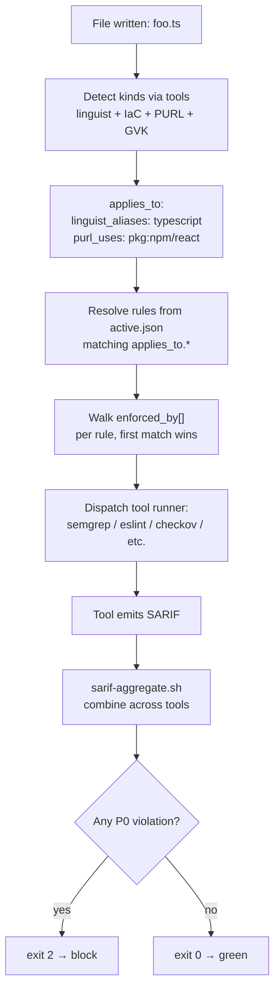
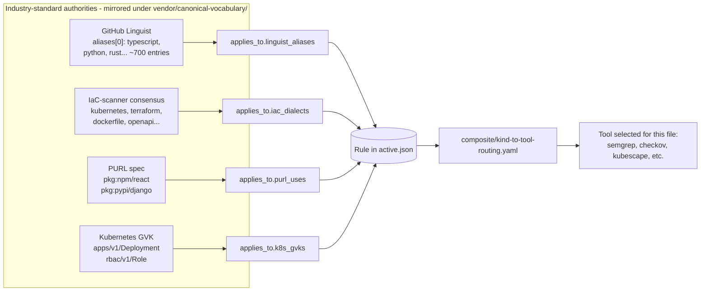
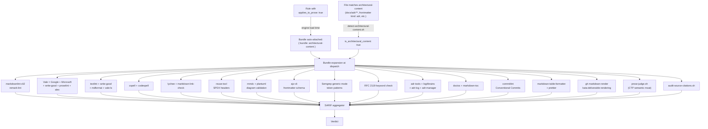
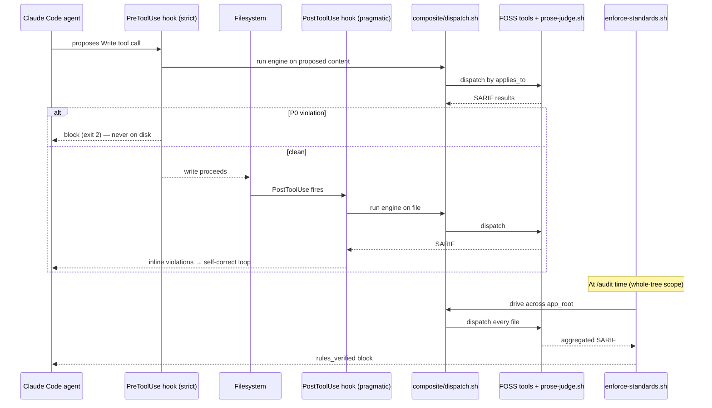
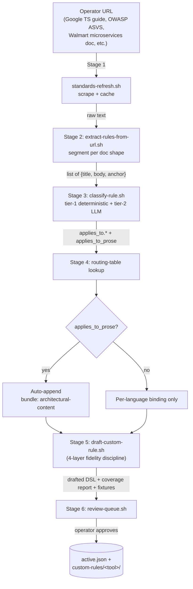
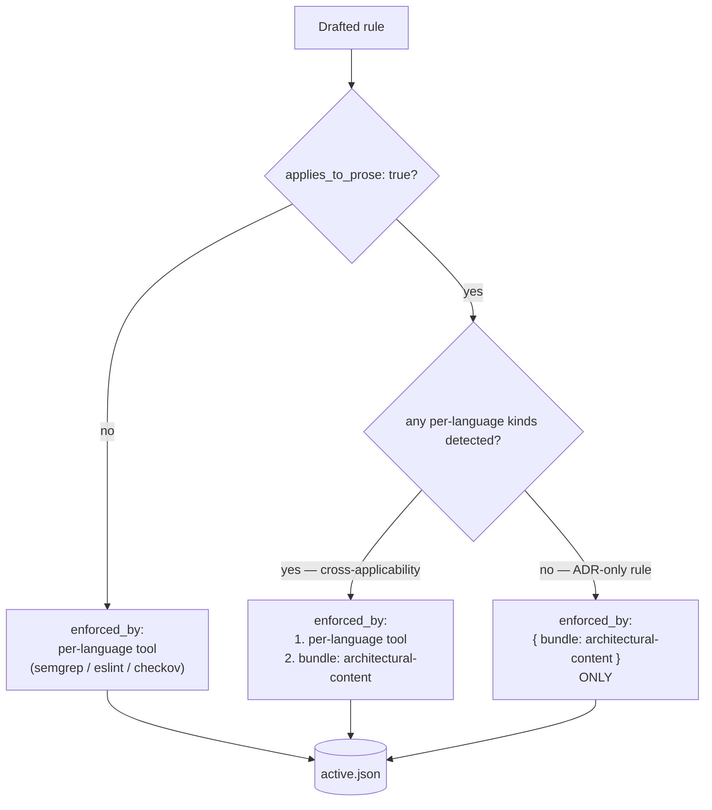
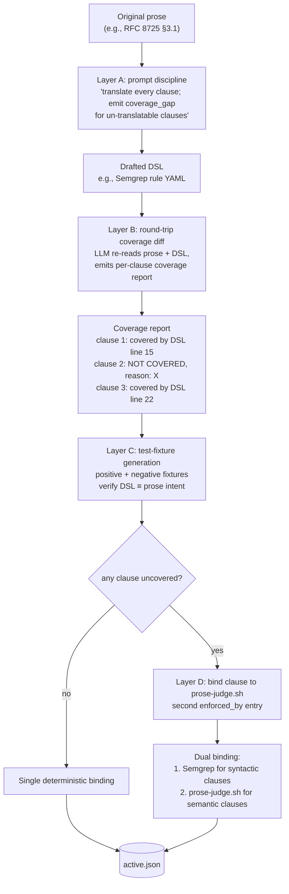

# Complete architecture for the CTP development session — single-entry handoff

> **You (the CTP dev session) have no access to the GCTP repo.** This document is the single entry point. Read it first; it tells you what else to fetch and in what order.
>
> **Source repo:** `https://github.com/drumfiend21/grok-claude-tdd-pro` (GCTP). All raw-URL references below resolve against this repo on branch `main`.
> **Handoff commit (canonical pin):** see "Pinned commit" below — when you fetch any file, prefer the pinned commit hash over `main` for reproducibility.
> **Audience:** the `claude-tdd-pro` development session and its operator.
> **Authority:** TIER-1 — adopt as two paired CTP ADRs (numbers assigned by you).

---

## 1. What this handoff is asking you to land

Two paired CTP ADRs. Adopt them together; one consumes the other's runtime.

| Order | ADR | What it decides | Source design (in GCTP) |
|---|---|---|---|
| **1st** | CTP-ADR-NNNN — **Composite engine + 4-axis canonical vocabulary + architectural-content enforcement bundle** | Replace CTP-handwritten grep detectors with a composite engine of FOSS tools (Semgrep, ESLint, Checkov, Kubescape, Trivy, Spectral, hadolint, zizmor, markdownlint, Vale, lychee, ...). Adopt 4 industry-standard authorities (GitHub Linguist + IaC-scanner consensus + PURL + Kubernetes GVK) as the rule-to-tool join vocabulary. Ship a named `architectural-content` bundle that fires the full prose tool stack on every ADR/design doc/RFC at write + audit time. | `proposals/PROPOSAL-005-composite-engine-4-axis-vocabulary.md` |
| **2nd** | CTP-ADR-NNNN+1 — **Auto-classification + custom-rule drafting pipeline** | Six-stage pipeline: URL → extract → 4-axis classify (with `applies_to_prose`) → route → LLM-draft DSL with four-layer fidelity discipline (no language silently dropped) → review-queue → commit. Auto-attaches `bundle: architectural-content` whenever `applies_to_prose: true`. Lets operators ingest arbitrary world-class standards (Google, Microsoft, OWASP, federal, Accenture, Walmart, internal) at LLM speed. | `proposals/PROPOSAL-006-auto-classification-and-rule-drafting-pipeline.md` |

The two ADRs share a contract: **CTP-ADR-NNNN+1 outputs rules that CTP-ADR-NNNN's engine consumes**, both keyed by the same 4-axis `applies_to.*` vocabulary.

---

## 2. Pinned commit

When fetching any GCTP file, use this commit for reproducibility. Replace `main` in raw URLs with the hash below.

```
Pinned: a1efe2c32d993bdd9692d2a84efc7cf907e346ca
Date:   2026-06-22
Author: drumfiend21 + Claude Opus 4.7 (GCTP cloud session)
```

Use this hash in place of `main` in every raw URL below for reproducibility — e.g. `https://raw.githubusercontent.com/drumfiend21/grok-claude-tdd-pro/a1efe2c32d993bdd9692d2a84efc7cf907e346ca/proposals/PROPOSAL-005-composite-engine-4-axis-vocabulary.md`. The handoff package is content-frozen at this commit. Subsequent edits live on `main` HEAD with full `git log proposals/` history.

---

## 3. Read order (CTP dev session)

Read these in order. Each is a single `curl`/`gh api`/WebFetch fetch.

1. **This file** (you're already here).
2. **GCTP `CLAUDE.md` and `AGENTS.md`** — orientation to GCTP's prime directive, founder-directives, R/G/C/D rulebooks, agent-operating-compact, and the GCTP↔CTP architecture-consult loop. Read so you understand the *consumer* side of the contract surface.
   - `https://raw.githubusercontent.com/drumfiend21/grok-claude-tdd-pro/main/CLAUDE.md`
   - `https://raw.githubusercontent.com/drumfiend21/grok-claude-tdd-pro/main/AGENTS.md`
3. **PROPOSAL-005** (the composite engine + 4-axis vocabulary source design).
   - `https://raw.githubusercontent.com/drumfiend21/grok-claude-tdd-pro/main/proposals/PROPOSAL-005-composite-engine-4-axis-vocabulary.md`
4. **PROPOSAL-006** (the auto-classification pipeline source design).
   - `https://raw.githubusercontent.com/drumfiend21/grok-claude-tdd-pro/main/proposals/PROPOSAL-006-auto-classification-and-rule-drafting-pipeline.md`
5. **CTP-ADR-NNNN draft** (the ADR you will land for PROPOSAL-005).
   - `https://raw.githubusercontent.com/drumfiend21/grok-claude-tdd-pro/main/proposals/ctp-adr-drafts/CTP-ADR-NNNN-composite-engine-4-axis-vocabulary.md`
6. **CTP-ADR-NNNN+1 draft** (the ADR you will land for PROPOSAL-006).
   - `https://raw.githubusercontent.com/drumfiend21/grok-claude-tdd-pro/main/proposals/ctp-adr-drafts/CTP-ADR-NNNN+1-auto-classification-and-rule-drafting-pipeline.md`
7. **PROPOSAL-003 brief** (the prior CTP ADR adopted at pin `39903da` — establishes `prose-judge.sh`, `applies_to_prose`, the 22 namespaces, SARIF emission; everything below COMPOSES on this).
   - `https://raw.githubusercontent.com/drumfiend21/grok-claude-tdd-pro/main/proposals/PROPOSAL-003-ctp-session-brief.md`
8. **P-8 upstream blocker** (the prose-judge.sh `--text` ↔ `--target` contract mismatch that must be fixed before the semantic moat is functional).
   - `https://raw.githubusercontent.com/drumfiend21/grok-claude-tdd-pro/main/docs/upstream-ctp-proposals.md`
9. **PROPOSAL-004** (detector quality uplift CTP-session brief — partially superseded by PROPOSAL-005's composite-engine approach; CTP-D-6 P-8 fix + CTP-D-7 SARIF confidence tier still relevant).
   - `https://raw.githubusercontent.com/drumfiend21/grok-claude-tdd-pro/main/proposals/PROPOSAL-004-detector-quality-uplift-ctp-session-brief.md`
10. **GCTP-side ADR-0066** (the harness-side ADR pairing PROPOSAL-003 — context on the consumer wiring).
    - `https://raw.githubusercontent.com/drumfiend21/grok-claude-tdd-pro/main/docs/adr/0066-yaml-json-md-corpora-and-prose-as-code-enforcement.md`
11. **Standards corpora** (75 YAML + 40+ JSON + 40 MD source URLs — worked examples of what the auto-classification pipeline will ingest):
    - `https://raw.githubusercontent.com/drumfiend21/grok-claude-tdd-pro/main/docs/standards-sources-yaml.md`
    - `https://raw.githubusercontent.com/drumfiend21/grok-claude-tdd-pro/main/docs/standards-sources-json.md`
    - `https://raw.githubusercontent.com/drumfiend21/grok-claude-tdd-pro/main/docs/standards-sources-md.md`

That's the full fetch set. Everything else you need is in those 11 documents (plus the two CTP ADR drafts you'll land).

---

## 3.5 Diagrams — the architecture in pictures

All diagrams below are Mermaid. The architectural-content bundle validates them via `mmdc --validate`, so they are first-class enforcement artifacts (not just documentation).

### 3.5.1 System context — GCTP ↔ CTP ↔ Operator boundary


### 3.5.2 Composite engine — file-to-verdict flow



### 3.5.3 4-axis canonical vocabulary — how rules join to tools



### 3.5.4 Architectural-content bundle — bundle name fans out to ~24 tools



### 3.5.5 Two-phase enforcement — write-time + audit-time



### 3.5.6 Auto-classification pipeline — URL to enforcement in 6 stages



### 3.5.7 Auto-binding decision tree



### 3.5.8 Four-layer fidelity discipline — no language silently dropped



---

## 4. The single technical core, in 10 bullets

If you read nothing else, read this:

1. **CTP today owns the rule content + detectors.** GCTP consumes them via `.harness/rules/active.json` + `rubric/detectors/`. Pin `39903da` exposes 118 rules across 24 namespaces, with prose-judge LLM-tier semantic projection (PROPOSAL-003).
2. **The detector substrate is the bottleneck.** Hand-rolled grep is brittle, has coverage gaps for YAML / JSON / MD / container / helm / SBOM / SARIF, has no canonical rule→tool join vocabulary, and doesn't enforce on architectural prose. PROPOSAL-005 fixes all four.
3. **The 4 industry-standard authorities — adopt them; don't invent CTP-native vocabulary.** GitHub Linguist (`aliases[0]`, ~700 languages, MIT) + IaC-scanner consensus (`kubernetes`, `terraform`, `dockerfile`, `openapi`, `helm`, `github_actions`, ...) + PURL spec (`pkg:<ecosystem>/<name>`) + Kubernetes GVK (`apps/v1/Deployment`). Mirror under `vendor/canonical-vocabulary/`.
4. **Every rule carries an `applies_to.*` block + `applies_to_prose: true|false` flag.** The 4-axis tagging is the single join key. The `applies_to_prose` flag drives the architectural-content bundle auto-attachment (no per-rule operator effort).
5. **SARIF 2.1.0 is the universal output bus.** Every tool emits SARIF natively or via thin adapter; `sarif-aggregate.sh` (already shipped in GCTP) produces one normalized verdict stream.
6. **The composite engine routes each rule to one of ~40 FOSS tools** spanning universal SAST/SCA/secrets/policy/supply-chain, JS/TS, CSS, HTML, a11y, web-vitals, IaC, K8s, OpenAPI, GHA, Dockerfile, YAML, JSON, plus every major language ecosystem. Full inventory in CTP-ADR-NNNN §"Full tool-stack inventory".
7. **The architectural-content enforcement bundle is named, whole-or-nothing, and auto-attached.** It expands to ~24 tools (markdownlint + remark-lint + Vale × 5 packs + textlint + cspell + codespell + lychee + reuse + mmdc + plantuml + ajv-cli + Semgrep generic + RFC 2119 check + **prose-judge.sh** + audit-source-citations.sh + adr-tools + log4brains + adr-log + adr-manager + doctoc + markdown-toc + write-good + mdformat + markdown-link-check + commitlint + markdown-table-formatter + gh markdown-render). Fires on every ADR/design doc/RFC at write- and audit-time.
8. **Two-phase enforcement.** Write-time via the post-tool-use hook (GCTP CL-E, already shipped) + audit-time via `enforce-standards.sh` (Fix B, already shipped). A future PreToolUse strict variant gives the "never on disk in violating form" guarantee.
9. **Auto-classification pipeline (PROPOSAL-006).** Six stages — extract → classify (4-axis + `applies_to_prose`) → route → LLM-draft DSL with four-layer fidelity discipline → review-queue → commit. Reduces operator scrape-to-enforced-rule cycle from days to hours. "No language silently dropped" contract makes every catalog rule audit-defensible.
10. **The semantic moat = prose-judge.sh.** No FOSS equivalent. CTP-owned. Depends on P-8 fix (the `--text` ↔ `--target` contract mismatch) before the architectural-content bundle and the four-layer fidelity discipline's Layer D fallback are functional.

---

## 5. Tools we use — complete inventory (single source of truth for the CTP ADR landing PRs)

Below is the **complete** list of every FOSS tool the composite engine + architectural-content bundle dispatches. Use this as the checklist when shipping per-tool runner wrappers under `composite/runners/<tool>/runner.sh`.

### 5.1 Universal tier (cross-language, fires on everything)

- **SAST:** Semgrep community
- **SCA / CVE:** Trivy, OSV-Scanner, syft + grype
- **Secrets:** gitleaks, detect-secrets, trufflehog
- **Policy:** conftest, OPA, regal
- **Supply chain:** OpenSSF Scorecard, cosign, slsa-verifier, in-toto, slsa-github-generator

### 5.2 Language-specific tier

- **JS/TS:** ESLint + `gts` + `@typescript-eslint` + `@microsoft/eslint-plugin-sdl` + `eslint-plugin-n` + `eslint-plugin-react` + `eslint-config-next` + `eslint-plugin-jsx-a11y` + `@angular-eslint/eslint-plugin` + `eslint-plugin-security`; Biome; oxlint; Prettier
- **CSS:** stylelint + `stylelint-config-recommended-scss` + `stylelint-config-recommended-less` + `stylelint-config-tailwindcss` + `stylelint-config-standard`
- **HTML:** htmlhint, html-validate
- **Accessibility:** axe-core, pa11y, pa11y-ci
- **Web Vitals:** Lighthouse, lighthouse-ci
- **Rust:** rustfmt, clippy, cargo-audit, cargo-deny
- **Go:** golangci-lint, govulncheck, gosec
- **Python:** ruff, bandit, mypy, pip-audit
- **Java:** Spotless, ErrorProne, SpotBugs, PMD, dependency-check
- **Kotlin:** ktlint, Detekt
- **Swift:** SwiftLint, SwiftFormat
- **C#:** Roslyn analyzers, SonarAnalyzer.CSharp, SecurityCodeScan
- **Ruby:** RuboCop, brakeman, bundler-audit
- **Elixir:** credo, dialyxir, sobelow
- **Scala:** Scalafix, Scalafmt, scapegoat
- **PHP:** PHPStan, psalm, phpcs-security-audit
- **Solidity:** Slither, solhint, Mythril
- **Shell:** ShellCheck, shfmt
- **SQL:** SQLFluff, sqlfmt, sqlcheck
- **GraphQL:** graphql-eslint, graphql-schema-linter
- **Protobuf:** buf lint, protolint

### 5.3 IaC + structured-config tier

- **General IaC:** Checkov, tfsec, terrascan, tflint
- **Kubernetes:** Kubescape, kube-linter, kubeconform, polaris, kyverno + kyverno-cli
- **OpenAPI:** Spectral + `@stoplight/spectral-owasp-ruleset`, vacuum, redocly-cli
- **GitHub Actions:** zizmor, actionlint, pinact
- **Dockerfile:** hadolint
- **YAML:** yamllint
- **JSON:** ajv-cli, jq

### 5.4 Architectural-content bundle (fires on every ADR/design doc/RFC)

- **Markdown structural:** markdownlint-cli2, remark-lint
- **Prose style — corporate:** Vale + `errata-ai/Google` + `vale-cli/Microsoft` packs
- **Prose style — general:** Vale + `errata-ai/write-good` + `errata-ai/proselint`
- **Inclusive language:** Vale + `errata-ai/alex`; alex (standalone CLI)
- **Additional prose CLIs:** textlint + `textlint-rule-no-todo` + `textlint-rule-common-misspellings` + `textlint-rule-max-number-of-lines`; write-good (standalone); mdformat (Python); vale-ls (language server)
- **Spelling:** cspell (code-aware), codespell (dictionary)
- **Links:** lychee, markdown-link-check
- **License headers:** reuse-tool (REUSE 3.3 / SPDX)
- **Diagram validation:** mmdc (mermaid-cli), plantuml
- **Frontmatter schema:** ajv-cli against MADR / arc42 / RFC schemas
- **Token-pattern checks:** Semgrep generic-mode rules under `composite/rulesets/semgrep/architectural-content/*.yml`
- **RFC 2119 keyword discipline:** custom Vale rule or Semgrep pattern (BCP 14 invocation sentence presence)
- **ADR lifecycle:** adr-tools (Nat Pryce), log4brains, adr-log, adr-manager
- **TOC integrity:** doctoc, markdown-toc, markdown-it-toc-done-right
- **Commit message hygiene:** commitlint + `@commitlint/config-conventional`
- **Inline-table validation:** markdown-table-formatter, prettier (markdown parser)
- **Kata/competition rendering:** gh markdown-render, markdownlint-cli2 `--fix` (dry-run)
- **Semantic moat (CTP-owned):** **prose-judge.sh** (LLM-judge tier — projects every `applies_to_prose: true` rule onto the prose)
- **Citation integrity (CTP-owned):** audit-source-citations.sh (every cited standard traces to an `active.json` provenance entry)

---

## 6. Implementation order (high level)

The detailed CL inventory is in CTP-ADR-NNNN §"Implementation CLs" and CTP-ADR-NNNN+1 §"Implementation waves". Here's the sequencing constraint summary:

1. **P-8 fix first** (single ~5-line patch to `llm-judge.sh`). Without this, the architectural-content bundle's semantic moat and the auto-classification pipeline's Layer D fallback both return `not_enforced`.
2. **Wave 1 of PROPOSAL-005:** canonical vocabulary mirrors + 4-axis schema migration + SARIF bus. Existing detectors keep working; no regressions.
3. **Wave 1 of PROPOSAL-006:** extractor + classifier (with `applies_to_prose`) + routing table. End-to-end ingest of one operator URL (recommend: Google TS style guide as the first worked example).
4. **Wave 2 of PROPOSAL-005:** per-tool runners + dispatch loop + coverage-diff parity for swapped detectors.
5. **Wave 2 of PROPOSAL-006:** LLM-drafter with four-layer fidelity discipline + drafting-for-architectural-prose (D-6). Depends on P-8.
6. **Wave 3 of PROPOSAL-005:** architectural-content bundle + detection + two-phase wiring.
7. **Wave 3 of PROPOSAL-006:** review-queue CLI + end-to-end driver.

After all six waves: operator scrape-to-enforced-rule cycle drops from days to hours; every ADR passes the full architectural-content bundle; every file in the app tree passes the appropriate language-specific stack.

---

## 7. Boundary discipline (recap of prime directive)

**CTP owns** (both ADRs): the composite engine runtime, per-tool runners, SARIF bus, architectural-content bundle definition, canonical vocabulary mirrors, the extraction/classification/routing/drafting/review-queue stack, the architectural-content auto-binding logic, `prose-judge.sh`, `audit-source-citations.sh`.

**GCTP owns** (NOT either ADR): the harness-side wiring — `enforce-standards.sh` invocation, `audit-design-phase-md.sh` invocation, post-tool-use hook extension, static gate alignment, operator-facing CLI workflow, the consult-loop (`/consult`..`/inner-loop`..`/audit`).

**Operator owns**: source URLs, per-rule deviation approval, operator-extension paths, accept/reject decision per drafted rule, per-tool custom-rule files committed to `.harness/operator-standards/custom-rules/`.

Neither side reaches into the other. The only contract surface is `active.json` + the canonical vocabulary mirrors + SARIF + the four runtime scripts CTP exposes (`enforce.sh`, `enforce-file.sh`, `prose-judge.sh`, `standards-refresh.sh`).

---

## 8. Sign-off

When both ADRs land in `claude-tdd-pro/docs/adr/` at sequentially-assigned numbers and the corresponding pin bump completes in GCTP, the operator's standing directive is satisfied:

> *"Nothing is written to the repo (including architectural content during the design phase) that has not first been vetted against every applicable rule by every applicable tool."*

The architectural-content bundle delivers this for ADRs/design docs/RFCs. The composite engine delivers this for code. The auto-classification pipeline ensures every rule from every operator-sourced standard becomes enforcement automatically.

---

End of cover doc. Now fetch the 10 files in §3 and land the two CTP ADRs.
