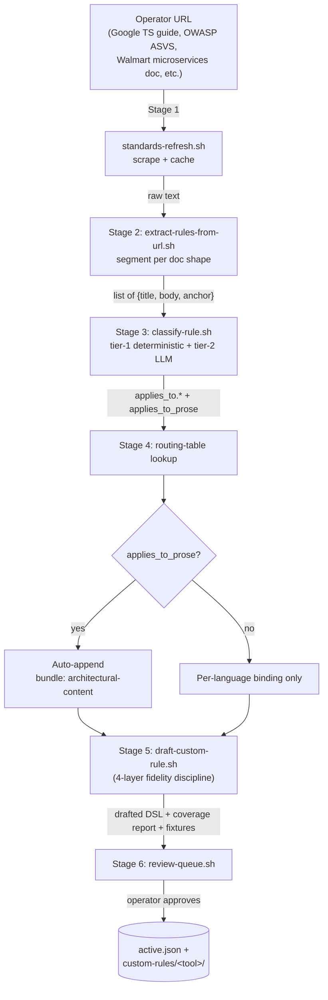
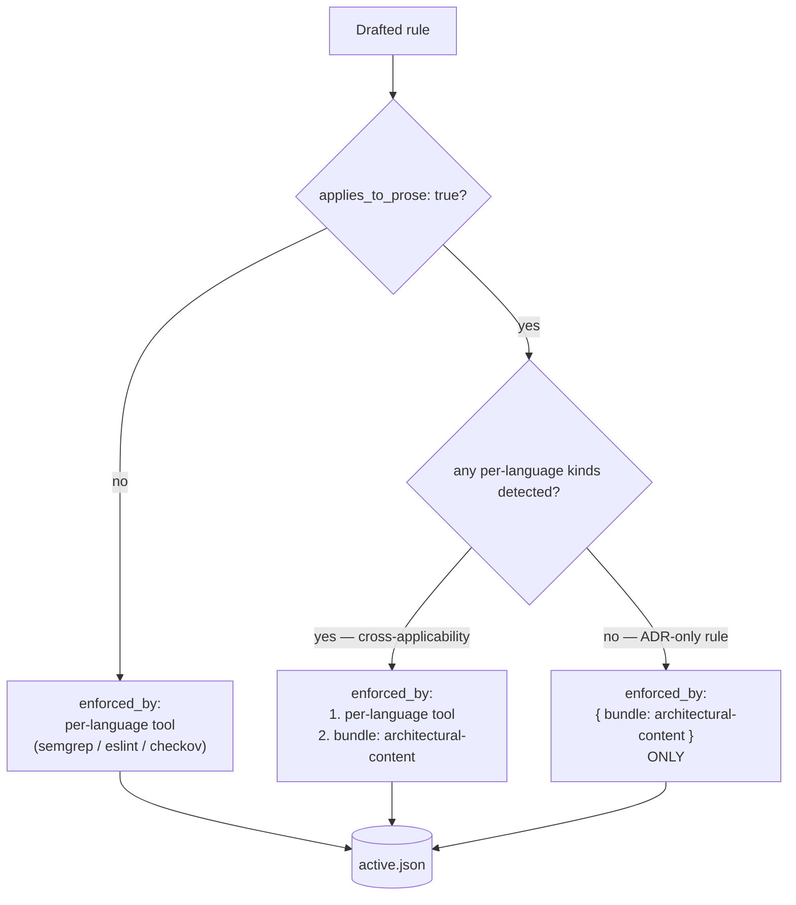
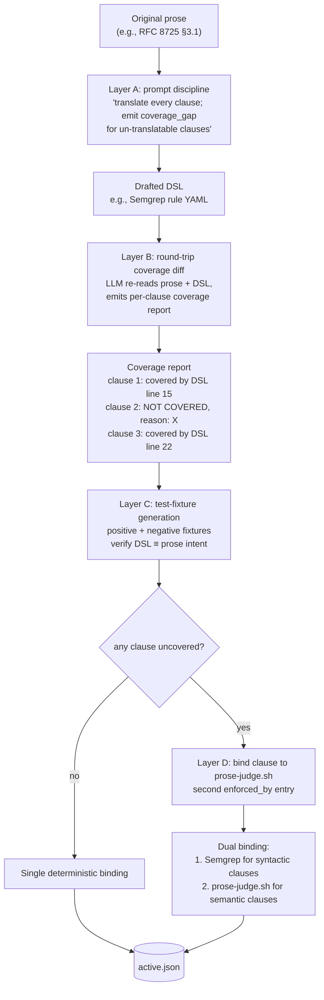
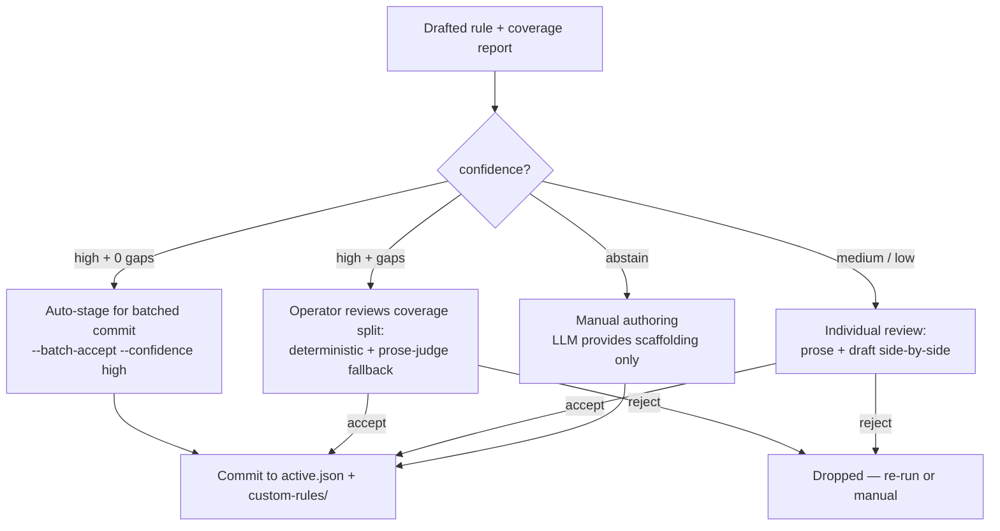
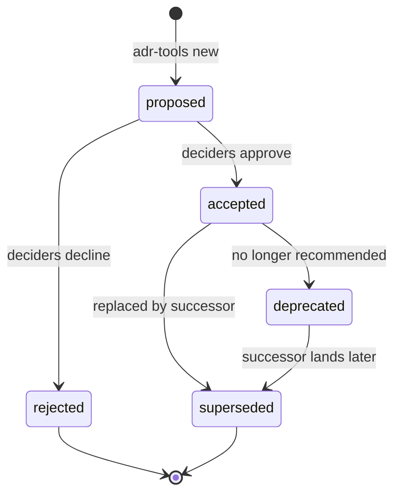

# CTP-ADR-NNNN+1 — Auto-classification + custom-rule drafting pipeline

> **Audience:** the `claude-tdd-pro` (CTP) development session.
> **Source design:** `proposals/PROPOSAL-006-auto-classification-and-rule-drafting-pipeline.md` (GCTP repo, drumfiend21/grok-claude-tdd-pro@main, commit `5284156`).
> **Authority:** TIER-1 process change for CTP. Land as a new CTP ADR (next available number, paired with CTP-ADR-NNNN).
> **Date proposed:** 2026-06-22.

- **Status:** Proposed
- **Deciders:** drumfiend21 (architect — multi-turn operator directives, June 2026: *"every URL I bring becomes enforcement automatically"* → *"the LLM writes the custom rule one-to-one with the original prose, no language silently dropped"* → *"ensure rulesets are enforced on the generated architectural content"*) + CTP dev session.
- **Pairs with:** **CTP-ADR-NNNN** (composite engine + 4-axis vocabulary + architectural-content bundle — separate ADR derived from `proposals/PROPOSAL-005-...`). This ADR consumes that ADR's runtime; it doesn't replace it.
- **Composes on:** CTP-side prose-judge.sh + source refresh + applies_to_prose flag (PROPOSAL-003, adopted at pin `39903da`).
- **Depends on:** P-8 fix (prose-judge.sh tier-2 `--text` ↔ `--target` contract mismatch — see `docs/upstream-ctp-proposals.md` in GCTP repo) for the coverage-gap fallback (Stage 5D) to be functional.

---

## Context

After CTP-ADR-NNNN lands the composite engine + 4-axis vocabulary + architectural-content bundle, the engine is **runtime-ready** but **catalog-empty** beyond the seeded 118 rules. Operators want to bring standards from arbitrary world-class engineering organizations — Google, Microsoft, OWASP, federal/EO, Accenture, Walmart, NASA, internal wikis. Each source is a URL that scrapes to a blob of text containing N rules.

For the catalog to scale, every rule must be:

1. **Extracted** — segmented from the source blob into discrete entries (title + body + citation anchor).
2. **Classified** — tagged with the 4-axis canonical vocabulary (per CTP-ADR-NNNN D-1): `applies_to.{linguist_aliases, iac_dialects, purl_uses, k8s_gvks}` + `applies_to_prose`.
3. **Routed** — mapped to the right FOSS tool(s) via a kind→tool routing table. When `applies_to_prose: true`, auto-attach `{ bundle: architectural-content }`.
4. **Drafted** — translated from natural-language prose into the chosen tool's DSL (Semgrep YAML, ESLint plugin, Rego policy, Vale directive, etc.) by LLM-assisted authoring with explicit fidelity discipline.
5. **Reviewed** — operator confirms before commit.
6. **Committed** — lands in `.harness/operator-standards/custom-rules/<tool>/<rule-id>.<ext>` and `active.json`.

Today every step is manual. With the typical operator adopting ~500-1000 rules across Google + Microsoft + OWASP + federal + internal sources, manual is multi-month effort. This ADR proposes the automated pipeline.

**The "no language silently dropped" contract** is the architecturally novel piece. When the LLM drafts a Semgrep rule from a Google style guide entry, every clause of the original prose must end up either (a) deterministically enforced in Semgrep's DSL, (b) semantically enforced via `prose-judge.sh`, or (c) explicitly flagged as un-enforceable with operator acknowledgment. **Never silently dropped.** The four-layer fidelity discipline (prompt + coverage diff + fixtures + prose-judge fallback) operationalizes this contract.

---

## Architecture diagrams

### Auto-classification pipeline — URL to enforcement in 6 stages



### Auto-binding decision tree



### Four-layer fidelity discipline — no language silently dropped



### Review-queue confidence routing



---

## Decision

Eight numbered decisions (D-1..D-8) implementing the six-stage pipeline + the fidelity discipline + the architectural-content auto-binding. Each defines a component or contract. Implementation is itemized in §"Implementation waves".

### D-1. Ship `scripts/extract-rules-from-url.sh` for Stage 2 (rule extraction).

Per source-doc shape:

| Doc shape | Extraction strategy |
|---|---|
| Markdown with hierarchical headings | Parse heading levels; each `H2`/`H3` becomes one rule; body = content between heading and next sibling |
| HTML doc with `<section>` / structured pages | DOM walk + heading-level segmentation |
| OWASP-style numbered lists | Regex split on `^\d+\.` or `^[A-Z]\d+:` patterns |
| Free-form prose (blog post / policy doc) | LLM segmentation — pass full doc + prompt "extract individual normative rules; return JSON array of `{title, body, citation_anchor}`" |
| PDF | `pdftotext` → free-form prose → LLM segmentation |

Output: uniform shape `{rule_index, title, body, source_anchor}` regardless of input format. CTP ships extractors for the top 4-5 doc shapes; operator can plug in custom extractors under `composite/extractors/`.

### D-2. Ship `scripts/classify-rule.sh` for Stage 3 (4-axis classification).

**Tier 1 (deterministic, milliseconds).** Build an inverted index from the 4 canonical vocabulary mirrors (per CTP-ADR-NNNN D-1) at session start: `{word → set of (axis, canonical_id)}`. ~5,000-10,000 entries because each canonical ID is paired with common variants (TypeScript / typescript / TS / ts all point to the same Linguist entry). For each extracted rule, tokenize the body, look up each token, aggregate the axis-identifier set with multiplicity weighting.

**Tier 2 (LLM-judge, seconds per rule).** Pass `{rule_text, tier-1 candidate set, the 4 authority registries as enumerated options}` to the LLM judge with explicit anti-overreach discipline. Output is a confidence-tagged `applies_to` block. Low-confidence → review queue (Stage 6). High-confidence → auto-commit-after-review.

**Critical extension — `applies_to_prose` field.** Tier-2 LLM-judge ALSO emits `applies_to_prose: true | false`, derived from whether the rule's body expresses a constraint that can be projected semantically onto natural-language architectural prose. E.g.:

- *"JWT alg MUST NOT be `none`"* — applies to TypeScript code AND any ADR proposing a token design → `applies_to_prose: true`.
- *"Use 2-space indentation"* — applies only to code, not to ADRs → `applies_to_prose: false`.

**Caching.** Hash by `(rule_body_sha256, mirror_files_sha256)`. Re-judge only on change. Identical cost-control pattern to `prose-judge.sh`.

### D-3. Ship `composite/kind-to-tool-routing.yaml` for Stage 4 (routing).

Static ~50-entry routing table maps each canonical kind to recommended FOSS tools:

```yaml
routing:
  linguist:typescript:
    primary: [semgrep, eslint]
    secondary: [biome]
  linguist:python:
    primary: [semgrep, ruff, bandit]
  iac_dialects:kubernetes:
    primary: [kubescape, kube-linter]
    secondary: [checkov, kubeconform]
  iac_dialects:terraform:
    primary: [checkov, trivy]
    secondary: [tfsec, terrascan]
  # ... ~50 entries total
  # Plus one synthetic entry for the prose dimension:
  prose:architectural-content:
    primary: [bundle:architectural-content]
    notes: "Auto-attached when applies_to_prose: true. Fires the full PROPOSAL-005 §9b stack."
```

For each rule, given its `applies_to.*` set, look up each kind; intersect candidate tool sets; produce recommended primary tool(s). Cross-language rules (8+ `linguist_aliases`) almost always recommend Semgrep — the only tool that enforces one rule across many languages.

Refresh discipline: operator may extend; CTP curates the canonical table per CTP release.

### D-4. **Architectural-content auto-binding** (pairs with CTP-ADR-NNNN D-5).

When Stage 3 emits `applies_to_prose: true`, the Stage-4 router unconditionally appends `{ bundle: architectural-content }` to the rule's `enforced_by[]` list AFTER the per-language tool binding. The bundle expansion happens at engine load time (CTP-ADR-NNNN D-5 — the engine reads the bundle name and dispatches the full prose stack on every architectural .md). The drafter (Stage 5) does NOT enumerate the bundle tools individually.

**Inverted lookup for ADR-only rules.** When `applies_to_prose: true` AND the deterministic 4-axis tagging produces no per-language kinds (i.e., the rule is purely about architectural prose — RFC 2119 keyword usage, mandatory ADR sections, citation discipline, prose-style requirements), the router omits the per-language binding entirely and binds ONLY `{ bundle: architectural-content }`. The bundle is sufficient on its own for ADR-only rules.

The operator never has to manually attach the bundle. Every rule the classifier flags as projectable onto prose gets the full architectural enforcement stack automatically.

### D-5. Ship `scripts/draft-custom-rule.sh` for Stage 5 (LLM-draft DSL rule) with four-layer fidelity discipline.

**Layer A — Explicit fidelity discipline in the prompt:**

```
Translate this rule into <TOOL>'s rule DSL. You MUST:
1. Translate every clause, including exceptions, edge cases, conditional
   phrasing, and severity hedges (RFC 2119 MUST vs SHOULD vs MAY).
2. If a clause CANNOT be expressed in <TOOL>'s DSL, do NOT silently drop it.
   Instead, emit a `coverage_gap:` entry naming the clause and the reason.
3. Include cited source URL + page/section anchor in the rule metadata block.

RULE TEXT: <verbatim>
TARGET TOOL: <tool>
TARGET LANGUAGES: <linguist_aliases>
OUTPUT: <tool-specific DSL syntax with metadata + coverage_report>
```

**Layer B — Round-trip coverage diff:** After drafting, LLM reads both original prose AND drafted DSL, produces a coverage report — every prose clause mapped to "covered by DSL at line N" or "not covered, reason: X". Saved alongside rule body at `.harness/operator-standards/custom-rules/<tool>/<rule-id>.coverage.md`.

**Layer C — Test-fixture generation:** LLM generates positive (must-flag) and negative (must-not-flag) fixture files derived from the rule's prose. Run the drafted rule against fixtures; equivalence to prose intent demonstrated by both fixtures producing expected verdict. Saved in `.harness/operator-standards/custom-rules/<tool>/fixtures/<rule-id>/`.

**Layer D — Coverage-gap fallback to prose-judge:** Any clause flagged un-translatable to the tool's DSL is routed to a second `enforced_by` binding using `prose-judge.sh`. Rule's `enforced_by[]` ends up with two entries: one deterministic Semgrep/Checkov/etc. binding for syntactic clauses, one `prose-judge.sh` binding for semantic-judgment clauses. Operator sees the split explicitly in the coverage report.

**The "no language silently dropped" contract:** every clause of the original prose ends up either (a) deterministically enforced in the tool's DSL, (b) semantically enforced via `prose-judge.sh`, or (c) explicitly flagged as un-enforceable with operator acknowledgment.

### D-6. Drafting for architectural-prose rules.

When Stage 4 attaches `bundle: architectural-content` (i.e., `applies_to_prose: true`), the Stage-5 drafter generates ONLY:

1. **The `prose-judge.sh` binding metadata** — a structured directive for the LLM-judge tier containing rule's verbatim prose, rule ID, source citation, confidence threshold, deny-context affordance markers.
2. **Optional Semgrep generic-mode rule** — only when the rule contains literal forbidden tokens (`0.0.0.0/0`, `alg":"none"`, `*:*` IAM). Emit as `composite/rulesets/semgrep/architectural-content/<rule-id>.yml`; bundle picks it up automatically.
3. **Coverage report** against the bundle's combined capability — "Clause 1 covered deterministically by bundle's markdownlint MD025; clause 2 covered semantically by prose-judge.sh with rule body; clause 3 covered by bundle's Vale Microsoft rule write-good.E-Prime."

**Per-tool custom files for the bundle's structural tools (markdownlint, Vale, textlint, etc.) are NOT generated per rule.** The bundle's tools already enforce universal architectural-prose hygiene via default rule packs; per-rule custom Vale / markdownlint files would be redundant maintenance debt. One prose-judge directive per architectural-prose rule; bundle does the structural work.

**Cross-applicability rules.** When a rule applies to BOTH code and prose (typical case — e.g., JWT-none applies to TypeScript code AND ADRs proposing JWT designs), drafter emits TWO bindings: per-language DSL rule (Semgrep / ESLint / etc.) for code targets, AND prose-judge directive for ADR targets. Coverage report sums combined coverage.

### D-7. Ship `scripts/review-queue.sh` for Stage 6 (operator review).

For each drafted rule:

- **Confidence: high + coverage_gaps: 0** → auto-stage for batched commit (5-10 rules at once).
- **Confidence: high + coverage_gaps: >0** → operator reviews coverage report + prose-judge fallback binding; confirms split.
- **Confidence: medium / low** → individual review; operator reads prose + draft side-by-side; accepts, edits, or rejects.
- **Confidence: abstain** → manual authoring; LLM provides scaffolding only.

Review queue lives in `.harness/operator-standards/review-queue/`. CLI workflow:

```bash
scripts/classify-from-url.sh \
  --source-id walmart-microservices \
  --url https://walmart.example/standards/microservices.html

scripts/review-queue.sh --list                                  # show pending + confidence
scripts/review-queue.sh --review walmart-microservices-001      # open in editor
scripts/review-queue.sh --accept walmart-microservices-001
scripts/review-queue.sh --batch-accept --confidence high
```

On accept: rule committed to `active.json`, rule body to `.harness/operator-standards/custom-rules/<tool>/`, fixtures alongside.

### D-8. End-to-end driver + the "no language silently dropped" contract documentation.

Ship `scripts/classify-from-url.sh --source-id <id> --url <url>` — runs Stages 1-5 in sequence, populates review queue. Operator runs Stage 6 interactively.

Document the "no language silently dropped" contract prominently in `claude-tdd-pro/docs/composite-engine.md` §"Fidelity discipline". Every drafted rule MUST emit a coverage report; any prose clause not covered by deterministic binding MUST appear in a `prose-judge.sh` binding OR be flagged with explicit operator acknowledgment.

---

## Implementation waves

| Wave | Deliverable | Acceptance criteria |
|---|---|---|
| **Wave 1** | Stages 1-4: source-refresh adapter + `extract-rules-from-url.sh` + `classify-rule.sh` (with `applies_to_prose`) + `kind-to-tool-routing.yaml` + auto-binding logic | End-to-end: Google TS style guide URL → 47 rules in review-queue with populated `applies_to.*` + `applies_to_prose` + routed tool; OWASP ASVS URL → 286 rules with same |
| **Wave 2** | Stage 5: `draft-custom-rule.sh` with four-layer fidelity discipline + drafting-for-architectural-prose logic + coverage-diff generation + fixture generation | Per-rule: rule body + coverage report + positive/negative fixtures emitted; LLM token cost <$1/rule on typical inputs; bundle-auto-attach verified on `applies_to_prose: true` rules |
| **Wave 3** | Stage 6: `review-queue.sh` CLI + `classify-from-url.sh` end-to-end driver | Operator can ingest a URL → review queue → batch-accept → rules live in `active.json` + commits in `composite/rulesets/` and `.harness/operator-standards/custom-rules/`; scrape-to-enforced-rule cycle drops from days to hours |

---

## Consequences

### Positive

- **Catalog scaling.** Operators ingest world-class standards at LLM speed instead of manual-authoring speed. Typical adoption of ~500-1000 rules across Google + Microsoft + OWASP + federal + Accenture + Walmart + internal sources drops from multi-month to multi-week.
- **Provenance + audit-defensibility per rule.** Every rule arrives with provenance (source URL + anchor), coverage report (which clauses covered by which tool + which by prose-judge), and test fixtures (positive + negative). The catalog is audit-defensible — every clause traces to either a deterministic binding or an LLM-judge binding, with operator acknowledgment for un-enforceable clauses.
- **Architectural-prose enforcement at scale.** Every classifier-flagged prose-applicable rule (from any source) auto-attaches the architectural-content bundle without operator effort. The semantic moat (`prose-judge.sh`) fires on every ADR for every `applies_to_prose: true` rule. The operator's guarantee — "nothing is written to architectural files that has not been vetted against every applicable rule" — is now achievable at the catalog scale operators actually want.
- **The catalog grows naturally** with the operator's source set; no per-rule engineering effort beyond review-queue approval.

### Neutral

- LLM token cost bounded by hash cache + one-time-per-rule drafting cost. Estimated <$1 per rule drafted for typical inputs.
- Operator review is the human bottleneck; bulk-accept for high-confidence reduces it. Default is human-in-the-loop; opt-in `--auto-accept-high-confidence` flag for operators with high trust.

### Negative / cost

- **LLM dependency for Stages 3 + 5.** Mitigation: deterministic tier-1 handles ~60-70% of classifications; LLM tier handles only the residual. Hash cache eliminates re-drafting.
- **Quality of drafted DSL depends on LLM capability.** Mitigation: per-tool fixture-based equivalence test catches regressions; operator review catches semantic failures.
- **Depends on P-8 fix.** Stage 5D (coverage-gap fallback to prose-judge.sh) cannot land until the `--text` ↔ `--target` contract mismatch is fixed. Mitigation: Waves 1 + 3 can ship with Wave 2 deferred until P-8.

---

## Alternatives considered

- **Manual authoring of every rule.** REJECTED — catalog size makes this multi-month; doesn't scale with operator source set.
- **No fidelity verification — trust the LLM.** REJECTED — silent drops are the failure mode that breaks the "every rule enforced" contract. Four-layer fidelity mechanism is non-optional.
- **Single rule per LLM call.** ACCEPTED for Stages 3 + 5 — improves attribution + caching. Stage 2 segmentation is one LLM call per doc.
- **Skip operator review for high-confidence rules.** REJECTED for v1; opt-in via flag for high-trust operators. Default is human-in-the-loop.
- **Hand-attach architectural-content bundle per rule.** REJECTED — invites per-rule oversights; the auto-binding when `applies_to_prose: true` is the universal contract.

---

## Boundary discipline (per prime directive)

- **CTP owns** (this ADR): extraction strategies, classifier, routing table, DSL drafter, review-queue CLI, fidelity discipline, architectural-content auto-binding logic.
- **GCTP owns** (NOT this ADR): operator workflow + the audit chain's consumption of resulting rules + the GCTP-side post-tool-use + audit-time invocation of the composite engine.
- **Operator owns**: the source URLs to scrape, the per-rule accept/reject decision, the per-tool custom-rule files committed to `.harness/operator-standards/custom-rules/`.

---

---

## Supplementary GCTP files to fetch (the CTP session has no access to the GCTP repo, so fetch via raw URL)

GCTP repo: `https://github.com/drumfiend21/grok-claude-tdd-pro` — branch `main` at HEAD or any specific commit. Fetch the following with WebFetch / `curl` / `gh api`:

| Purpose | Raw URL (replace `main` with a pinned commit if reproducibility matters) |
|---|---|
| **The full source design** for this ADR | `https://raw.githubusercontent.com/drumfiend21/grok-claude-tdd-pro/main/proposals/PROPOSAL-006-auto-classification-and-rule-drafting-pipeline.md` |
| The paired composite-engine ADR draft (this ADR consumes its runtime) | `https://raw.githubusercontent.com/drumfiend21/grok-claude-tdd-pro/main/proposals/ctp-adr-drafts/CTP-ADR-NNNN-composite-engine-4-axis-vocabulary.md` |
| The composite-engine source design | `https://raw.githubusercontent.com/drumfiend21/grok-claude-tdd-pro/main/proposals/PROPOSAL-005-composite-engine-4-axis-vocabulary.md` |
| P-8 upstream blocker (prose-judge.sh `--text` ↔ `--target`) — needed for D-5 Layer D (coverage-gap fallback) | `https://raw.githubusercontent.com/drumfiend21/grok-claude-tdd-pro/main/docs/upstream-ctp-proposals.md` |
| Prior CTP-side ADR for PROPOSAL-003 (already adopted at pin `39903da`) — establishes the source refresh + prose-judge.sh surface this ADR composes on | `https://raw.githubusercontent.com/drumfiend21/grok-claude-tdd-pro/main/proposals/PROPOSAL-003-ctp-session-brief.md` |
| YAML / JSON / MD source corpora (worked examples of operator-sourced standards the pipeline will ingest) | `https://raw.githubusercontent.com/drumfiend21/grok-claude-tdd-pro/main/docs/standards-sources-yaml.md`, `.../standards-sources-json.md`, `.../standards-sources-md.md` |
| Complete-architecture cover doc (single entry point with all context) | `https://raw.githubusercontent.com/drumfiend21/grok-claude-tdd-pro/main/proposals/ctp-adr-drafts/COMPLETE-ARCHITECTURE-FOR-CTP.md` |

**Pinned-commit canonicalization (recommended):** swap `main` for commit `<HEAD-at-handoff>` in every URL above. The handoff cover doc records the canonical pin.

---

---

## Appendix A — Complete tool inventory the pipeline targets

The auto-classification pipeline routes drafted rules into the FOSS tools enumerated in **CTP-ADR-NNNN Appendix A** (the composite engine's complete ~115-tool inventory across 27 categories). That appendix is the single source of truth; this ADR consumes it.

For convenience when this ADR is read standalone, the same inventory is reproduced below verbatim. If both ADRs land in the same CTP commit, the CTP author MAY collapse this appendix into a `See CTP-ADR-NNNN Appendix A` cross-reference; if they land separately, this duplication ensures the pipeline ADR is self-contained.

### A.1 Universal tier (cross-language, fires on everything)

**SAST**
- Semgrep (community) — LGPL-2.1 engine / Apache-2.0 rules — ~30 languages, ~5000 community rules: OWASP/CWE/MITRE/SANS/JWT BCP

**SCA / CVE**
- Trivy — Apache-2.0 — CVE + secrets + IaC misconfig + SBOM (CycloneDX + SPDX)
- OSV-Scanner (Google, against OSV.dev) — Apache-2.0
- syft (Anchore SBOM gen) — Apache-2.0
- grype (Anchore vuln scanner) — Apache-2.0
- dependency-check (OWASP) — Apache-2.0

**Secrets**
- gitleaks — MIT
- detect-secrets (Yelp) — Apache-2.0
- trufflehog — AGPL-3.0 — live-credential verification beyond pattern match

**Policy / Rego**
- conftest — Apache-2.0 — Rego over YAML/JSON/TOML/HCL/Dockerfile/Cue
- OPA (Open Policy Agent) — Apache-2.0
- regal (Rego linter) — Apache-2.0
- kyverno + kyverno-cli — Apache-2.0 — K8s-native policy engine

**Supply-chain / Provenance**
- OpenSSF Scorecard — Apache-2.0
- cosign — Apache-2.0
- slsa-verifier — Apache-2.0
- in-toto — Apache-2.0
- slsa-github-generator — Apache-2.0

**SARIF**
- SARIF 2.1.0 (OASIS) — the universal output bus
- `sarif-aggregate.sh` (GCTP-shipped, mirrored to CTP) — Apache-2.0

### A.2 JavaScript / TypeScript

- ESLint — MIT
- `gts` (Google TS style) — Apache-2.0
- `@typescript-eslint` — MIT
- `@microsoft/eslint-plugin-sdl` — MIT
- `eslint-plugin-n` (Node) — MIT
- `eslint-plugin-react` — MIT
- `eslint-config-next` — MIT
- `eslint-plugin-jsx-a11y` — MIT
- `@angular-eslint/eslint-plugin` — MIT
- `eslint-plugin-security` — Apache-2.0
- Biome (Rust-based fast linter+formatter) — MIT
- oxlint — MIT
- Prettier — MIT

### A.3 CSS

- stylelint — MIT
- `stylelint-config-recommended-scss` — MIT
- `stylelint-config-recommended-less` — MIT
- `stylelint-config-tailwindcss` — MIT
- `stylelint-config-standard` — MIT

### A.4 HTML

- htmlhint — MIT
- html-validate — MIT

### A.5 Accessibility (WCAG 2.2)

- axe-core — MPL-2.0
- pa11y — MIT
- pa11y-ci — MIT

### A.6 Web Vitals

- Lighthouse — Apache-2.0
- lighthouse-ci — Apache-2.0

### A.7 IaC (general)

- Checkov (1000+ policies; NIST 800-53 / FedRAMP / SOC2 / PCI / HIPAA / CIS mappings) — Apache-2.0
- tfsec — MIT
- terrascan — Apache-2.0
- tflint — MPL-2.0

### A.8 Kubernetes

- Kubescape (260+ controls: NSA-CISA + CIS + MITRE ATT&CK + NIST SSDF + FedRAMP) — Apache-2.0
- kube-linter — Apache-2.0
- kubeconform — Apache-2.0
- polaris — Apache-2.0
- kyverno + kyverno-cli — Apache-2.0

### A.9 OpenAPI / AsyncAPI

- Spectral + `@stoplight/spectral-owasp-ruleset` — Apache-2.0
- vacuum — Apache-2.0
- redocly-cli — MIT

### A.10 GitHub Actions

- zizmor — Apache-2.0
- actionlint — MIT
- pinact — MIT

### A.11 Dockerfile

- hadolint — GPL-3.0

### A.12 YAML / JSON / Schema

- yamllint — GPL-3.0
- ajv-cli — MIT
- jq — MIT

### A.13 Language-specific

**Rust:** rustfmt, clippy, cargo-audit, cargo-deny — Apache-2.0/MIT
**Go:** golangci-lint, govulncheck, gosec, staticcheck — MIT/BSD/Apache-2.0/MIT
**Python:** ruff, bandit, mypy, pip-audit — MIT/Apache-2.0/MIT/Apache-2.0
**Java/JVM:** Spotless, ErrorProne, SpotBugs, PMD — Apache-2.0/Apache-2.0/LGPL/BSD
**Kotlin:** ktlint, Detekt — MIT/Apache-2.0
**Swift:** SwiftLint, SwiftFormat — MIT/MIT
**C#/.NET:** Roslyn analyzers, SonarAnalyzer.CSharp, SecurityCodeScan — MIT/LGPL/LGPL
**Ruby:** RuboCop, brakeman, bundler-audit — MIT
**Elixir:** credo, dialyxir, sobelow — MIT/Apache-2.0/Apache-2.0
**Scala:** Scalafix, Scalafmt, scapegoat — BSD/Apache-2.0/BSD
**PHP:** PHPStan, psalm, phpcs-security-audit — MIT/MIT/Apache-2.0
**Solidity:** Slither, solhint, Mythril — AGPL-3.0/MIT/MIT
**Shell:** ShellCheck, shfmt — GPL-3.0/BSD
**SQL:** SQLFluff, sqlfmt, sqlcheck — MIT/Apache-2.0/Apache-2.0
**GraphQL:** graphql-eslint, graphql-schema-linter — MIT
**Protobuf:** buf lint, protolint — Apache-2.0/MIT

### A.14 Architectural-content bundle (fires on every ADR / design doc / RFC)

**Markdown structural:** markdownlint-cli2 (MIT), remark-lint + presets (MIT)
**Prose style packs:** Vale engine (MIT) + Google (CC-BY), Microsoft (CC-BY-4.0), write-good (MIT), proselint (BSD)
**Inclusive language:** alex (MIT) standalone + alex (MIT) Vale pack
**Additional prose CLIs:** textlint + rule plugins (MIT), write-good standalone (MIT), mdformat (MIT), vale-ls (MIT)
**Spelling:** cspell (MIT), codespell (GPL-2.0)
**Link integrity:** lychee (Apache-2.0/MIT), markdown-link-check (MIT)
**License headers:** reuse-tool (GPL-3.0) — REUSE 3.3 / SPDX (FSFE)
**Diagram validation:** mmdc (MIT), plantuml (GPL)
**Frontmatter schema:** ajv-cli (MIT) against MADR / arc42 / RFC schemas
**Token-pattern checks:** Semgrep generic-mode rules
**RFC 2119 discipline:** custom Vale rule or Semgrep pattern (BCP 14 invocation)
**ADR lifecycle:** adr-tools (MIT, Nat Pryce), log4brains (Apache-2.0), adr-log (Apache-2.0), adr-manager (Apache-2.0)
**TOC integrity:** doctoc (MIT), markdown-toc (MIT), markdown-it-toc-done-right (MIT)
**Commit message hygiene:** commitlint + `@commitlint/config-conventional` (MIT)
**Inline-table validation:** markdown-table-formatter (MIT), prettier (MIT)
**Kata / competition rendering:** `gh markdown-render` (MIT), markdownlint-cli2 `--fix` dry-run (MIT)
**Semantic moat (CTP-owned):** `prose-judge.sh`
**Citation integrity (CTP-owned):** `audit-source-citations.sh`

### A.15 Industry-standard naming registries (mirrored under `vendor/canonical-vocabulary/`)

- GitHub Linguist (`aliases[0]` for ~700 languages) — MIT
- IaC-scanner consensus (Checkov + Trivy + Kubescape) — Apache-2.0
- PURL spec (`pkg:<ecosystem>/<name>`) — MIT
- Kubernetes GVK (`apps/v1/Deployment`-style) — Apache-2.0

### A.16 Counts + license summary

- **Total distinct tools/libs/packs/registries:** ~115
- **Distinct categories:** 27
- **License distribution:** MIT 55% / Apache-2.0 25% / BSD 5% / MPL 2% / GPL/AGPL 8% / LGPL 3% / CC-BY 2%
- **GPL/AGPL tools** (all CLI-only — no derivative-work concern): hadolint, ShellCheck, codespell, reuse-tool, plantuml, Slither, trufflehog, yamllint

---

---

## Appendix B — LLM prompt corpus (verbatim, not summarized)

These prompts are normative. CTP MUST ship them verbatim under `composite/prompts/` and treat any modification as a breaking change to the pipeline contract.

### B.1 Tier-2 classifier prompt (`composite/prompts/classify-rule.md`)

```
You are a rule classifier. Your job is to assign a single normative rule to
the four canonical content-kind axes, with confidence.

INPUT:
- RULE TEXT: <verbatim prose of one rule>
- CANDIDATE KINDS from deterministic tier-1 scan:
    linguist_aliases: <list>
    iac_dialects:    <list>
    purl_uses:       <list>
    k8s_gvks:        <list>
- AUTHORITY REGISTRIES for validation:
    Linguist:   https://github.com/github-linguist/linguist/blob/main/lib/linguist/languages.yml
    IaC dialects (Checkov + Trivy + Kubescape consensus): <embedded list>
    PURL spec:  https://github.com/package-url/purl-spec
    K8s GVK:    canonical via kubectl api-resources

OUTPUT — JSON conforming to this schema:
{
  "applies_to": {
    "linguist_aliases": [string, ...],
    "iac_dialects":    [string, ...],
    "purl_uses":       [string, ...],
    "k8s_gvks":        [string, ...]
  },
  "applies_to_prose": boolean,
  "confidence": "high" | "medium" | "low" | "abstain",
  "rationale": {
    "<axis>:<id>": "one-sentence reason this kind was included"
  },
  "rejected_candidates": {
    "<axis>:<id>": "one-sentence reason this tier-1 candidate was REJECTED"
  }
}

DISCIPLINE:
1. Wildcards ("*") are FORBIDDEN. If a rule is truly universal, leave all
   four arrays empty AND set applies_to_prose: true (universal architectural
   constraint).
2. Include a kind only if you can name the specific construct the rule
   constrains. "Don't know" → reject.
3. False positives are MORE COSTLY than false negatives. When in doubt,
   reject.
4. applies_to_prose: true iff the rule's normative content can be projected
   onto natural-language architectural prose. Test: could an ADR violate
   this rule by PROPOSING a design that the rule forbids? If yes → true.
5. confidence: "high" = unambiguous; "medium" = clear but with judgment
   calls; "low" = significant ambiguity remains; "abstain" = cannot
   classify, send to manual review.
6. Cite the source registry entry in rationale (e.g. "linguist: typescript
   is aliases[0] of TypeScript per languages.yml line 6291").

RULE TEXT:
"""
<verbatim rule body>
"""

Output JSON only. No prose preamble or postamble.
```

### B.2 Drafter prompt template (`composite/prompts/draft-rule.md`)

```
You are a rule drafter. Translate a natural-language normative rule into
the rule DSL of a specific FOSS tool, with explicit fidelity discipline.

INPUT:
- RULE TEXT (verbatim): <prose>
- RULE ID: <g-...>
- TARGET TOOL: <semgrep|eslint|checkov|spectral|vale|...>
- TARGET DSL VERSION: <tool version pinned in COMPAT.yaml>
- TARGET LANGUAGES (linguist aliases): <list>
- TARGET FILE GLOBS (derived from applies_to.*): <list>
- SOURCE CITATION: <URL + anchor>

YOU MUST:
1. Translate every clause of the rule, including:
   - exceptions ("except when...")
   - edge cases ("does not apply to test files")
   - conditional phrasing ("if A then B")
   - severity hedges (RFC 2119 MUST vs SHOULD vs MAY)
2. For each clause, identify whether <TARGET TOOL>'s DSL can express it:
   - YES → translate
   - NO  → emit a coverage_gap entry with the clause text and reason
3. NEVER silently drop a clause. If you cannot translate AND cannot
   identify a clear coverage_gap, emit confidence: abstain.
4. Include the source citation in the rule's metadata block.
5. Use <TARGET TOOL>'s idiomatic patterns. For Semgrep: prefer pattern
   over pattern-either when one suffices. For ESLint: use AST visitors
   over selector strings when AST-precise. For Vale: prefer existence
   over substitution. For Checkov: prefer the policy-as-code mode.
6. Pin metadata: emit the target tool version pinned for this rule.

OUTPUT — two artifacts:

ARTIFACT A: the rule body in <TARGET TOOL>'s DSL, with metadata.

ARTIFACT B: a JSON coverage report:
{
  "rule_id": "<g-...>",
  "target_tool": "<tool>",
  "clauses": [
    {
      "prose_excerpt": "<verbatim 1-3 sentences from the rule>",
      "coverage": "covered" | "coverage_gap" | "abstain",
      "covered_by": "<line ref in artifact A>" (if covered),
      "gap_reason": "<reason DSL can't express this>" (if gap),
      "prose_judge_fallback_recommended": boolean
    }
  ],
  "overall_confidence": "high" | "medium" | "low" | "abstain"
}

DISCIPLINE: artifact A must be deterministically enforceable. Artifact B
must list every clause from the prose. The clauses array MUST have at
least one entry per sentence of the rule body.

RULE TEXT:
"""
<verbatim rule body>
"""

Output artifact A (in the tool's DSL syntax, fenced in triple-backticks
with the tool name) followed by artifact B (in fenced JSON).
```

### B.3 Round-trip coverage-diff prompt (`composite/prompts/coverage-diff.md`)

```
You are reviewing a rule translation. Given the original prose and a
drafted DSL artifact, verify the translation is faithful.

INPUT:
- ORIGINAL PROSE: <verbatim>
- DRAFTED DSL: <artifact A from drafter>
- DRAFTER'S COVERAGE REPORT: <artifact B from drafter>

YOUR JOB:
1. Re-read the prose. List every distinct normative clause yourself.
   Do not rely on the drafter's clause list.
2. For each clause you list, check whether the drafted DSL enforces it.
3. Compare your clause list against the drafter's.

OUTPUT — JSON:
{
  "drafter_complete": boolean,    # does drafter's clause list match yours?
  "missing_clauses": [
    {
      "prose_excerpt": "<clause the drafter missed>",
      "criticality": "P0" | "P1" | "P2"
    }
  ],
  "spurious_clauses": [
    {
      "drafter_clause": "<clause drafter listed that isn't in prose>",
      "reason": "<why this is spurious>"
    }
  ],
  "coverage_disagreements": [
    {
      "clause": "<...>",
      "drafter_said": "covered" | "coverage_gap",
      "reviewer_says": "covered" | "coverage_gap",
      "rationale": "<why>"
    }
  ],
  "verdict": "accept" | "redraft" | "review-individual",
  "fidelity_score": <0.0 to 1.0>
}

DISCIPLINE: the reviewer is harder than the drafter. If you would rate
fidelity below 0.85, set verdict: redraft.

Output JSON only.
```

### B.4 Fixture-generation prompt (`composite/prompts/generate-fixtures.md`)

```
Generate positive and negative test fixtures for a drafted rule.

INPUT:
- RULE PROSE: <verbatim>
- DRAFTED DSL: <artifact A>
- TARGET TOOL: <tool>
- TARGET LANGUAGES: <list>

OUTPUT — directory structure as JSON:
{
  "positive": [
    {
      "filename": "<descriptive-name>.<ext>",
      "content": "<file content that MUST trigger the rule>",
      "expected_violation_location": "<line N or block range>",
      "rationale": "<why this triggers>"
    }
  ],
  "negative": [
    {
      "filename": "<descriptive-name>.<ext>",
      "content": "<file content that must NOT trigger>",
      "rationale": "<why this is conformant>"
    }
  ]
}

DISCIPLINE:
1. At least 3 positive fixtures, exercising different forms of violation.
2. At least 3 negative fixtures, exercising boundary cases (almost-but-not-
   quite a violation).
3. Each fixture is minimal — smallest file that demonstrates the case.
4. Fixtures are syntactically valid for the target language.

Output JSON only.
```

### B.5 prose-judge prompt (`composite/prompts/prose-judge.md`)

```
You are evaluating whether a piece of architectural prose violates a
normative rule.

INPUT:
- RULE: <verbatim prose>
- RULE ID: <g-...>
- RULE SEVERITY: <P0|P1|P2|P3>
- ARCHITECTURAL DOCUMENT EXCERPT: <verbatim>
- DOC METADATA: { kind: <adr|design|rfc>, status: <proposed|accepted|...> }

TASK: determine whether the doc excerpt PROPOSES, ACCEPTS, or RECOMMENDS
a design that violates the rule.

CRITICAL DISTINCTION — deny-context affordance:
- "We forbid using 0.0.0.0/0 in any production ingress" → MENTIONS the
  forbidden token in DENY context. Not a violation.
- "For convenience, we'll allow 0.0.0.0/0 on dev clusters" → PROPOSES the
  forbidden design. Violation.

The author of the rule has annotated this distinction in the rule's
metadata under `deny_context_markers`. Honor these.

OUTPUT — JSON:
{
  "verdict": "pass" | "fail" | "uncertain",
  "confidence": "high" | "medium" | "low",
  "violated_clause": "<which clause of the rule, if any>",
  "doc_excerpt_violating": "<the exact text from the doc that violates>",
  "rationale": "<1-3 sentences>",
  "deny_context_check": "the prose mentions the forbidden token in DENY|PROPOSE|UNCLEAR context"
}

DISCIPLINE: when verdict is "uncertain", the gate treats it as fail UNLESS
operator has a deviation row. Lean toward "uncertain" rather than false
"pass" — under-reporting is worse than over-reporting here.

Output JSON only.
```

### B.6 Extractor LLM-segmentation prompt (`composite/prompts/extract-segments.md`)

```
You are extracting individual normative rules from a body of source text.

INPUT:
- SOURCE TEXT: <verbatim, may be raw markdown / HTML-extracted text /
  pdftotext output>
- SOURCE TYPE: markdown | html | pdf | prose
- HINT (if known): "this is OWASP ASVS so rules are numbered like '1.1.1'"

TASK: segment the text into discrete normative rules. Each rule is a
self-contained constraint with a title, body, and ideally a citation
anchor.

OUTPUT — JSON array:
[
  {
    "rule_index": <int, monotonic>,
    "title": "<short, imperative>",
    "body": "<verbatim normative content>",
    "source_anchor": "<URL fragment if identifiable, else null>",
    "confidence": "high" | "medium" | "low"
  }
]

DISCIPLINE:
1. One concrete constraint per rule. Don't merge multiple constraints.
2. If a rule has exceptions/edge cases, include them in the body verbatim.
3. Discard preamble, motivation paragraphs, examples without normative
   content.
4. Preserve verbatim language (no paraphrasing) — the body is what
   downstream LLM-tier work cites.

Output JSON only.
```

---

## Appendix C — Extractor strategies (per doc shape)

### C.1 Markdown heading-segmented (e.g. Google TS style guide)

```bash
extract-rules-from-url.sh --shape md-heading
```

Algorithm:
1. Parse markdown via `remark` AST
2. Walk H2 + H3 headings
3. Each heading becomes one rule
4. Body = AST content between heading and next sibling heading at same-or-higher level
5. `source_anchor` = heading slug (per `github-slugger` convention)
6. Skip headings tagged with HTML class `non-normative` or text matching `^(Introduction|Motivation|Examples?|Background)$`

### C.2 HTML structured-page (e.g. styleguides with `<section>` markup)

```bash
extract-rules-from-url.sh --shape html-section
```

Algorithm:
1. Parse via `cheerio`
2. Each `<section id="...">` with an `<h2>`/`<h3>` becomes one rule
3. Body = innerText of the section, excluding nav / breadcrumbs / sibling-link blocks
4. `source_anchor` = section ID

### C.3 OWASP / regex-numbered lists (e.g. OWASP ASVS, OWASP Top 10)

```bash
extract-rules-from-url.sh --shape regex-numbered \
  --pattern '^[VL]\d+\.\d+\.\d+' \
  --title-pattern '^V?\d+\.\d+ '
```

Algorithm:
1. Plain-text extract via `html-to-text` or `pdftotext`
2. Regex-split on the rule prefix pattern
3. First sentence after the prefix is the title; remainder is the body
4. `source_anchor` = `#<prefix>` (e.g. `#V2.1.1`)

### C.4 PDF (e.g. NIST 800-53, federal specifications)

```bash
extract-rules-from-url.sh --shape pdf
```

Algorithm:
1. `pdftotext -layout <pdf>` → plain text
2. Strip page numbers + running heads + footers (heuristic: lines repeated on >50% of pages)
3. Feed to LLM segmentation (Appendix B.6 prompt)
4. Reconcile against the document's table of contents (if detectable) for `source_anchor` resolution

### C.5 Free-form prose / blog post / policy doc

```bash
extract-rules-from-url.sh --shape free-form
```

Algorithm:
1. Strip non-content elements (nav, footer, ads)
2. Feed full text to LLM segmentation
3. `source_anchor` is best-effort (paragraph offset) — usually null

### C.6 Operator-pluggable extractor

`.harness/operator-standards/extractors/<source-id>/extract.sh` — if present, used in place of CTP-shipped extractors. Conforms to the same JSONL output contract.

---

## Appendix D — Coverage-diff harness specifics

### D.1 Format

Per-rule coverage report at `.harness/operator-standards/custom-rules/<tool>/<rule-id>.coverage.md`:

```markdown
# Coverage report — <rule-id>

**Source:** <URL + anchor>
**Target tool:** <tool> @ <version>
**Drafter confidence:** <high|medium|low|abstain>
**Reviewer fidelity score:** <0.0–1.0>
**Verdict:** <accept|redraft|review-individual>

## Clauses

| # | Prose excerpt | Coverage | Covered by | Notes |
|---:|---|---|---|---|
| 1 | "..." | covered | DSL line 15 | AST-precise |
| 2 | "..." | coverage_gap | prose-judge.sh | binding emitted |
| 3 | "..." | covered | DSL line 22 | |

## prose-judge.sh fallback binding (if any)

<rule-body subset used by prose-judge for un-translated clauses>

## Operator notes

<free-form, optional>
```

### D.2 Pass criterion

`accept` verdict requires:
- `reviewer_fidelity_score >= 0.85`
- Every clause is either `covered` or has a `prose-judge.sh` binding
- Zero `coverage_gap` entries without a fallback binding

Engine rejects ingest into `active.json` for rules failing this gate. Operator can override with explicit `--accept-with-gaps` flag (logged in audit trail).

### D.3 Reviewer disagreement

If the round-trip coverage-diff (Appendix B.3) flags `missing_clauses` or `coverage_disagreements`, the drafter is re-invoked with the reviewer's feedback embedded in the prompt. Maximum 3 re-draft attempts; on the 4th attempt, the rule is routed to manual review (review-queue with `confidence: abstain`).

### D.4 Operator visibility

Review-queue CLI surfaces the coverage report:

```
$ scripts/review-queue.sh --review walmart-microservices-007
Rule: g-walmart-rest-versioning
Source: https://walmart.example/std/microservices.html#rest-versioning
Confidence: high; Fidelity: 0.91
Clauses: 5 total — 4 covered deterministically, 1 prose-judge fallback

Press [a] to accept, [r] to reject, [v] to view coverage report,
[e] to edit DSL, [j] to view prose-judge fallback, [q] to skip.
```

---

## Appendix E — Per-CL acceptance gates

Concrete green-light criteria per CL in PROPOSAL-006 §"Implementation waves".

### E.1 Wave 1 — extraction + classification + routing

| CL | Green criterion (exit-0 test command) |
|---|---|
| W1-A | `scripts/test-composite.sh --component vocabulary-mirrors` — mirrors present + parseable + 4-axis registries resolve |
| W1-B | `scripts/test-composite.sh --component classifier-tier-1` — deterministic classifier produces expected candidates for 20-rule fixture set |
| W1-C | `scripts/test-composite.sh --component classifier-tier-2` — LLM-tier classifier matches expected `applies_to.*` + `applies_to_prose` for the same 20-rule fixtures (within confidence bands) |
| W1-D | `scripts/test-composite.sh --e2e google-ts-style` — Google TS guide URL → 47 rules in review-queue with populated `applies_to.*` (the Appendix O worked example) |

### E.2 Wave 2 — drafter + fidelity discipline

| CL | Green criterion |
|---|---|
| W2-A | `scripts/test-composite.sh --component drafter --tool semgrep` — drafts the 47 Google TS rules with fidelity ≥0.85 each |
| W2-B | Same for ESLint, Checkov, Spectral, Vale (one CL each) |
| W2-C | `scripts/test-composite.sh --component coverage-diff` — coverage diff harness produces expected reports for the fixture set |
| W2-D | `scripts/test-composite.sh --component fixture-gen` — fixture generator produces ≥3 positive + ≥3 negative per rule |
| W2-E | `scripts/test-composite.sh --component prose-judge-fallback` — Layer D un-translatable-clause binding works end-to-end (depends on P-8 fix) |

### E.3 Wave 3 — review queue + driver

| CL | Green criterion |
|---|---|
| W3-A | `scripts/test-composite.sh --component review-queue` — list / accept / reject / batch-accept work |
| W3-B | `scripts/test-composite.sh --e2e walmart-microservices` — operator-private URL ingest → review-queue → accept → rules live in `active.json` |
| W3-C | `scripts/test-composite.sh --e2e fixture-corpus` — full architectural-content fixture set (Appendix P in CTP-ADR-NNNN) passes |

---

## Appendix F — ADR lifecycle state machine

The architectural-content bundle's ADR-lifecycle tools (`adr-tools` + `log4brains` + `adr-log` + `adr-manager`) enforce this state machine on every ADR landing in the operator's app tree (NOT on CTP's or GCTP's own ADRs — those live under their own conventions).

### F.1 States

- `proposed` — initial state; ADR drafted but not approved
- `accepted` — approved by deciders; in force
- `deprecated` — no longer recommended but not yet removed; still informative
- `superseded` — replaced by another ADR (must point to successor)
- `rejected` — proposed but explicitly not adopted (kept for historical context)

### F.2 Valid transitions

```
proposed → accepted        (deciders approve)
proposed → rejected        (deciders decline)
accepted → deprecated      (no longer recommended)
accepted → superseded      (replaced by successor ADR)
deprecated → superseded    (a successor lands later)
```

Invalid transitions (engine red):
- `rejected → *` (rejected is terminal except via new ADR)
- `superseded → *` (superseded is terminal)
- `accepted → proposed` (no reversal)

### F.3 Frontmatter contract

Every ADR's frontmatter MUST include:

```yaml
---
id: NNNN
title: <short title>
status: proposed | accepted | deprecated | superseded | rejected
date: YYYY-MM-DD
deciders: [<list>]
superseded_by: NNNN   # required when status=superseded
supersedes: NNNN      # optional when this ADR replaces another
---
```

`ajv-cli` validates against `composite/schemas/adr-frontmatter.schema.json` (Appendix A.14 in CTP-ADR-NNNN).

### F.4 Numbering authority

`adr-tools new <title>` (Nat Pryce's CLI) assigns the next available number based on the local ADR directory. Monotonic; no gaps; engine checks this at audit time.

Operator-extended numbering schemes (e.g. namespaced like `PRODUCT-NNNN`) are permitted via `.harness/operator-standards/adr-numbering.yaml`.

### F.5 Supersession chain validation

`adr-log` generates a chronological index. Engine verifies:
- Every `superseded_by` reference resolves to a real ADR
- The successor's `supersedes` reference points back (bidirectional)
- No cycles in the supersession graph
- The terminal `accepted` ADR in any chain is what's in force

Violations are P0 — block the commit.

### F.6 State diagram



---

End of CTP-ADR-NNNN+1 draft. Land in `claude-tdd-pro/docs/adr/` at the next available number (paired with CTP-ADR-NNNN). On landing, close `proposals/PROPOSAL-006-auto-classification-and-rule-drafting-pipeline.md` as adopted, and pin-bump in GCTP to mark the auto-classification pipeline live.
