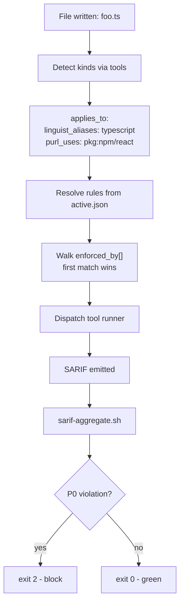
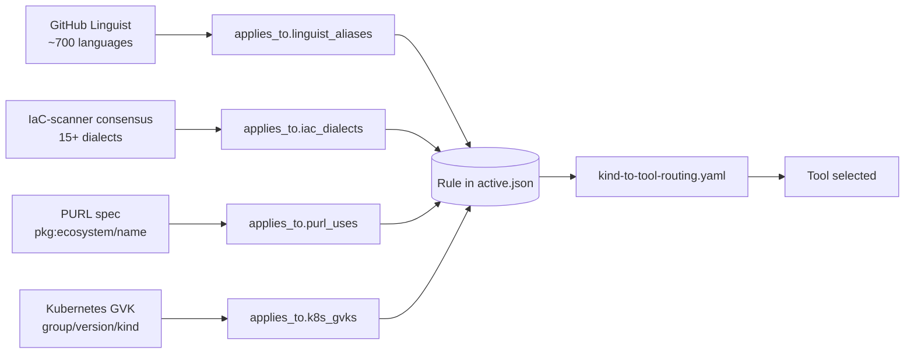
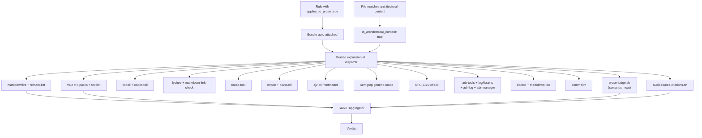
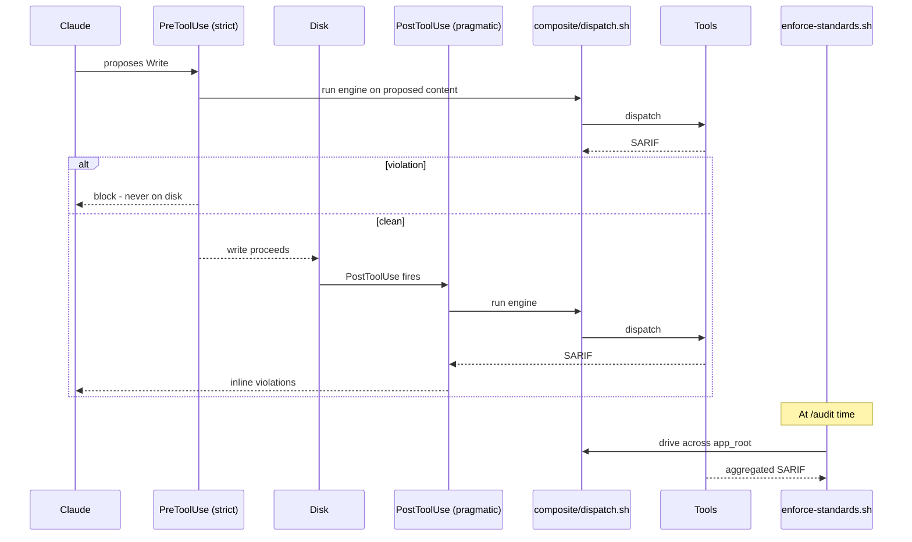

# CTP-ADR-NNNN — Composite engine + 4-axis canonical vocabulary + architectural-content enforcement bundle

> **Audience:** the `claude-tdd-pro` (CTP) development session.
> **Source design:** `proposals/PROPOSAL-005-composite-engine-4-axis-vocabulary.md` (GCTP repo, drumfiend21/grok-claude-tdd-pro@main, commit `5284156`).
> **Authority:** TIER-1 architectural change for CTP. Land as a new CTP ADR (next available number).
> **Date proposed:** 2026-06-22.

- **Status:** Proposed
- **Deciders:** drumfiend21 (architect — multi-turn operator directives, June 2026: *"replace handwritten detectors with FOSS tools"* → *"adopt an industry-standard naming registry rather than inventing one"* → *"ensure all rulesets are enforced on the generated architectural content"*) + CTP dev session.
- **Pairs with:** **GCTP PROPOSAL-005 §9b** (architectural-content enforcement bundle) and **CTP-ADR-NNNN+1** (auto-classification + custom-rule drafting pipeline — separate ADR derived from `proposals/PROPOSAL-006-...`).
- **Composes on:** CTP-side prose-judge.sh + applies_to_prose flag + 22 new namespaces + SARIF emission (CTP-ADR adopted at pin `39903da` for PROPOSAL-003).
- **Depends on:** P-8 fix (prose-judge.sh tier-2 `--text` ↔ `--target` contract mismatch — see `docs/upstream-ctp-proposals.md` in GCTP repo) for the architectural-content bundle's semantic moat to be functional.

---

## Context

CTP today owns the **rule content** for the composite engine the GCTP harness consumes. After PROPOSAL-003 landed at pin `39903da`, CTP exposes 118 rules across 24 namespaces with prose-judge LLM-tier semantic projection. The detectors backing those rules are CTP-handwritten grep / awk / shell heuristics, with the following standing limitations:

1. **Brittleness.** Hand-rolled grep on TypeScript / Terraform / Kubernetes manifests produces false positives + false negatives that mature FOSS tools (Semgrep, ESLint, Checkov, Kubescape, Trivy, Spectral, hadolint, zizmor, markdownlint, Vale) handle through proper AST/IR parsing.
2. **Coverage debt.** Many file types in real operator codebases (`.yml` workflows, `.json` SBOMs, `.md` ADRs, container images, helm charts) have thin or no detector coverage because hand-rolling each one is unbounded effort.
3. **No canonical rule-to-tool join vocabulary.** Rules from arbitrary sources (Google, Microsoft, OWASP, federal/EO, Accenture, Walmart, internal wikis) need to bind to the right tool, but there is no shared key — every CTP rule today carries its own ad-hoc `language: typescript` / `language: terraform` field, with no provenance into an industry-standard registry.
4. **No first-class enforcement on architectural prose.** ADRs, design docs, RFCs, architecture notes are the primary artifact of the GCTP↔CTP consult loop (ADR-0056 in GCTP), yet the existing detectors don't fire on them. The operator's standing directive is that **nothing is written to disk — including architectural content — without first being vetted against every applicable rule by every applicable tool.**

Industry-standard naming registries already exist and are battle-tested by mature tooling — CTP must adopt them rather than invent its own. The composite engine must be **extensible to any standard from any source** (operator brings a URL → it becomes enforcement, automatically). The architectural-content enforcement story must be **first-class, not a footnote** — every ADR passes the full prose tool stack before commit.

---

## Architecture diagrams

All diagrams below are Mermaid. The architectural-content bundle validates them via `mmdc --validate`, so the architecture-of-the-architecture is itself enforcement-conformant.

### Composite engine — file-to-verdict flow



### 4-axis vocabulary — rule binding through industry authorities



### Architectural-content bundle — auto-attached when applies_to_prose: true



### Two-phase enforcement — write-time + audit-time



---

## Decision

Eight numbered decisions (D-1..D-8) implementing the composite engine, the 4-axis vocabulary, and the architectural-content enforcement bundle. Each defines a contract or component. Implementation is itemized in §"Implementation CLs".

### D-1. Adopt the four industry-standard authorities as the canonical rule-binding vocabulary.

CTP MUST NOT invent a CTP-native kind vocabulary. The four authorities mirrored into CTP at session start:

| Axis | Authority | Canonical form | License |
|---|---|---|---|
| Languages | **GitHub Linguist** (`github/linguist/lib/linguist/languages.yml`) | `aliases[0]` (lowercase) — e.g. `typescript`, `python`, `rust`, ~700 entries | MIT |
| IaC dialects | **IaC-scanner consensus** (Checkov + Trivy + Kubescape) | lowercase: `kubernetes`, `terraform`, `dockerfile`, `openapi`, `helm`, `github_actions`, `cloudformation`, `compose`, etc. | Apache 2.0 |
| Package ecosystems / uses | **PURL spec** (`package-url/purl-spec`) | `pkg:<ecosystem>/<name>` — e.g. `pkg:npm/react`, `pkg:pypi/django`, `pkg:cargo/tokio`. Used by SBOM/SCA tools | MIT |
| Kubernetes object kinds | **Kubernetes Group/Version/Kind** | `apps/v1/Deployment`, `rbac.authorization.k8s.io/v1/Role` | Apache 2.0 |

Mirror the four registries at session start under `vendor/canonical-vocabulary/` (read-only snapshots). Refresh cadence matches `standards-refresh.sh` (default 1d).

### D-2. Adopt the `applies_to.*` block as the rule's binding surface.

Every rule in `active.json` carries an `applies_to` block keyed by the four axes:

```yaml
- id: g-jwt-no-none-alg
  source: rfc-8725
  cite: "RFC 8725 §3.1 — algorithm 'none' MUST NOT be accepted"
  applies_to:
    linguist_aliases: [typescript, javascript, python, go, java, rust]
    iac_dialects: []
    purl_uses: [pkg:npm/jsonwebtoken, pkg:npm/jose, pkg:pypi/pyjwt]
    k8s_gvks: []
  applies_to_prose: true
  enforced_by:
    - tool: semgrep
      ruleset: composite/rulesets/semgrep/jwt-no-none-alg.yml
    - bundle: architectural-content  # auto-attached because applies_to_prose: true
```

The 4-axis tagging is the single join key between rules and tools. The existing `language: typescript` ad-hoc field is deprecated; migration is automatic via the auto-classifier (CTP-ADR-NNNN+1).

### D-3. Adopt SARIF 2.1.0 as the universal output bus.

Every FOSS tool the engine invokes either emits SARIF natively (Semgrep, ESLint, Checkov, Kubescape, Trivy, Spectral, hadolint, zizmor, markdownlint-cli2, Vale) or has a SARIF adapter (`<tool>-to-sarif.sh` thin wrappers under `composite/adapters/`). The engine aggregates SARIF results across tools via `sarif-aggregate.sh` (already shipped in GCTP CL-B) and consumes a single normalized verdict stream.

### D-4. Ship `composite/runners/<tool>/runner.sh` per-tool runner with the ordered binding contract.

Each FOSS tool gets a runner script that (a) accepts a file path + applicable rule list, (b) invokes the tool with the rule set, (c) emits SARIF, (d) returns deterministic exit codes. First-matching-binding-wins per file — the engine walks `enforced_by[]` in order and dispatches the first tool whose `applies_to` matches the file's detected kind set. The match-then-dispatch loop lives in `composite/dispatch.sh`.

**Full tool-stack inventory — what each binding can route to.** Every tool below ships with a `composite/runners/<tool>/runner.sh` wrapper. Universal tools fire across language boundaries; language- or dialect-specific tools fire only when `applies_to.*` resolves to their domain.

| Tier | Tool(s) | License | Domain | SARIF |
|---|---|---|---|---|
| Universal SAST | **Semgrep** community + Semgrep OSS rules | LGPL-2.1 / Apache-2.0 | Multi-language SAST (~30 langs, ~5000 community rules: OWASP/CWE/MITRE/SANS/JWT BCP) | yes |
| Universal SCA | **Trivy** + **OSV-Scanner** + **syft** + **grype** | Apache-2.0 | CVE + secrets + IaC misconfig + SBOM (CycloneDX + SPDX); Google's OSV.dev cross-check; Anchore SBOM + vuln | yes |
| Universal secrets | **gitleaks** + **detect-secrets** + **trufflehog** | MIT / Apache-2.0 / AGPL-3.0 | Pattern-based secret detection + Yelp baseline + live credential verification | yes (via formatter) |
| Universal policy | **conftest** + **OPA** + **regal** | Apache-2.0 | Rego policies over YAML/JSON/TOML/HCL/Dockerfile/Cue; OPA runtime; Rego linter | yes (via wrapper) |
| Universal supply chain | **OpenSSF Scorecard** + **cosign** + **slsa-verifier** + **in-toto** + **slsa-github-generator** | Apache-2.0 | Repo posture; signing; SLSA build-level provenance; attestation generation | n/a (attestations) |
| JS/TS | **ESLint** + plugin family (`gts`, `@typescript-eslint`, `@microsoft/eslint-plugin-sdl`, `eslint-plugin-n`, `eslint-plugin-react`, `eslint-config-next`, `eslint-plugin-jsx-a11y`, `@angular-eslint/eslint-plugin`, `eslint-plugin-security`) + **Biome** + **oxlint** + **Prettier** | MIT/Apache-2.0 | Style + a11y + Node security + Microsoft SDL + Google TS + Rust-based fast alternative | yes (via formatter) |
| CSS | **stylelint** + SCSS/Less/Tailwind/Standard configs | MIT | CSS/SCSS/Less/PostCSS/Tailwind | yes (via formatter) |
| HTML | **htmlhint** + **html-validate** | MIT | HTML lint + W3C validator | yes (via formatter) |
| Accessibility | **axe-core** + **pa11y** + **pa11y-ci** | MPL-2.0/MIT | WCAG 2.2 a11y auditing | yes (via formatter) |
| Web Vitals | **Lighthouse** + **lighthouse-ci** | Apache-2.0 | LCP/CLS/INP + PWA + SEO + performance budgets | yes (via formatter) |
| IaC | **Checkov** + **tfsec** + **terrascan** + **tflint** | Apache-2.0/MIT | 1000+ policies across Terraform/CFN/k8s/Helm/Dockerfile/ARM/Bicep/Compose/GHA/GitLab CI/Azure Pipelines/Ansible/CircleCI/Bitbucket/Argo with NIST 800-53/FedRAMP/SOC2/PCI/HIPAA/CIS mappings; Terraform-specific alts | yes |
| K8s | **Kubescape** + **kube-linter** + **kubeconform** + **polaris** + **kyverno** | Apache-2.0 | 260+ controls (NSA-CISA + CIS + MITRE ATT&CK + NIST SSDF + FedRAMP) + lint + schema validation + best-practice + native policy engine | yes |
| OpenAPI | **Spectral** + `@stoplight/spectral-owasp-ruleset` + **vacuum** + **redocly-cli** | Apache-2.0/MIT | OpenAPI 3.x + AsyncAPI + OWASP API Top 10 + fast Go alternatives | yes |
| GHA | **zizmor** + **actionlint** + **pinact** | Apache-2.0/MIT | GitHub Actions security + correctness + SHA pinning | yes (zizmor) |
| Dockerfile | **hadolint** | GPL-3.0 | Dockerfile lint | yes |
| YAML | **yamllint** | GPL-3.0 | General YAML lint (complements IaC-specific tools) | yes (via formatter) |
| JSON | **ajv-cli** + **jq** | MIT | JSON schema validation (700+ SchemaStore schemas) + structural query | n/a |
| Markdown structural | **markdownlint-cli2** | MIT | Structural MD (MD001-MD060) | yes |
| Prose style | **Vale** + Google + Microsoft + write-good + proselint + alex packs | MIT | Style + inclusive language | yes |
| Prose additional | **textlint** + `textlint-rule-no-todo` + `textlint-rule-common-misspellings` + `textlint-rule-max-number-of-lines` | MIT | Anti-patterns Vale doesn't cover | yes (via formatter) |
| Links | **lychee** + **markdown-link-check** | Apache-2.0/MIT | Internal + external link resolution; complementary traversal strategies | yes |
| Spell | **cspell** + **codespell** | MIT/GPL-2.0 | Code-aware spell + dictionary typos | yes (cspell) |
| License | **reuse-tool** | GPL-3.0 | REUSE 3.3 / SPDX headers | yes |
| Diagrams | **mmdc** (mermaid-cli) + **plantuml** | MIT/GPL | Validate mermaid + PlantUML diagrams in MD code blocks | n/a |
| ADR lifecycle | **adr-tools** (Nat Pryce) + **log4brains** + **adr-log** + **adr-manager** | MIT/Apache-2.0 | ADR file-naming, numbering, status transitions, supersession chains, index integrity |
| TOC | **doctoc** + **markdown-toc** | MIT | Auto-TOC verified against headings |
| Commit hygiene | **commitlint** + `@commitlint/config-conventional` | MIT | Conventional Commits → ADR ID → PR traceability |
| Languages — Rust | `rustfmt` + `clippy` + `cargo-audit` + `cargo-deny` | Apache-2.0/MIT | Format + lint + CVE + license | partial |
| Languages — Go | `golangci-lint` (wraps ~50 linters) + `govulncheck` + `gosec` | MIT | Lint aggregator + CVE + security | yes |
| Languages — Python | **ruff** + `bandit` + `mypy` + `pip-audit` | MIT/Apache-2.0 | Linter + security + types + CVE | yes |
| Languages — Java | Spotless + ErrorProne + SpotBugs + PMD + `dependency-check` | Apache-2.0 | JVM lint + bug-finder + CVE | yes |
| Languages — Kotlin | `ktlint` + Detekt | Apache-2.0/MIT | Kotlin lint/security | yes |
| Languages — Swift | SwiftLint + SwiftFormat | MIT | Swift lint/format | yes |
| Languages — C# | Roslyn analyzers + SonarAnalyzer.CSharp + SecurityCodeScan | LGPL/MIT | .NET lint + security | yes |
| Languages — Ruby | RuboCop + brakeman + bundler-audit | MIT | Ruby lint + security + CVE | yes |
| Languages — Elixir | credo + dialyxir + sobelow | MIT | Elixir lint + types + security | yes (via wrapper) |
| Languages — Scala | Scalafix + Scalafmt + scapegoat | Apache-2.0 | Scala lint + format | yes (via wrapper) |
| Languages — PHP | PHPStan + psalm + phpcs-security-audit | MIT | PHP types + lint + security | yes |
| Languages — Solidity | Slither + solhint + Mythril | AGPL/MIT | Smart-contract security | yes |
| Shell | ShellCheck + shfmt | GPL/MIT | Bash lint + format | yes (formatter) |
| SQL | SQLFluff + sqlfmt + sqlcheck | MIT | SQL lint + format + anti-pattern | partial |
| GraphQL | `graphql-eslint` + `graphql-schema-linter` | MIT | GraphQL schema lint | yes (via ESLint) |
| Protobuf | `buf lint` + protolint | Apache-2.0 | Protobuf lint | yes |
| **The CTP moat** | **`prose-judge.sh`** | CTP-shipped | Semantic projection of `applies_to_prose:true` rules onto prose | yes |

### D-5. **Architectural-content enforcement bundle** (PROPOSAL-005 §9b). 

Ship `composite/bundles/architectural-content.yaml` defining a named binding that expands to the full prose tool stack invoked on every architectural file:

| Concern | Tool | Coverage |
|---|---|---|
| Markdown syntactic | `markdownlint-cli2` (MIT) | CommonMark / GFM / MD001..MD060 |
| AST-level prose checks | `remark-lint` (MIT) | heading consistency, link integrity, table shape |
| Prose style — corporate | Vale (MIT) + Google / Microsoft / write-good / proselint / alex packs | tone, passive voice, jargon, inclusivity |
| Spelling | `cspell` + `codespell` (MIT) | code-aware spelling |
| Link integrity | `lychee` (Apache 2.0) | dead-link detection |
| License headers | `reuse-tool` (REUSE 3.3) | SPDX compliance |
| Diagram rendering | `mmdc` (Mermaid CLI) + `plantuml` | diagram-as-code validation |
| Frontmatter schema | `ajv-cli` against `composite/schemas/adr-frontmatter.schema.json` | required fields, enum values |
| Token patterns in prose | Semgrep generic-mode rules under `composite/rulesets/semgrep/architectural-content/*.yml` | literal forbidden tokens (`0.0.0.0/0`, `alg":"none"`, `*:*` IAM) with deny-context affordance markers |
| RFC 2119 keyword discipline | Custom shell check `composite/runners/rfc-2119-check/runner.sh` | MUST / SHOULD / MAY usage consistency |
| **Semantic moat** | **`prose-judge.sh`** (CTP-owned, semantic projection of every `applies_to_prose: true` rule onto the prose) | catches "this ADR proposes a forbidden design" — no FOSS equivalent |
| Citation integrity | `audit-source-citations.sh` (CTP-owned) | verifies cited URLs resolve + match anchor |
| ADR lifecycle | `adr-tools` (Nat Pryce, MIT) + `log4brains` (Apache-2.0) + `adr-log` (Apache-2.0) + `adr-manager` (Apache-2.0) | ADR file-naming (`NNNN-kebab-title.md`), monotonic numbering, status transitions (proposed→accepted→deprecated→superseded), supersession chains resolve, ADR-index entry exists |
| TOC integrity | `doctoc` + `markdown-toc` + `markdown-it-toc-done-right` | Auto-TOC verified against heading structure; fails on drift |
| Additional prose CLIs | `write-good` (standalone) + `mdformat` (Python) + `vale-ls` (LSP) | Belt-and-braces prose; consistent MD formatting; IDE-time author feedback |
| Link checker (alt) | `markdown-link-check` (MIT) | Lychee's complement — different traversal catches different edge cases |
| Commit message hygiene | `commitlint` + `@commitlint/config-conventional` | Conventional Commits on the commit that lands the ADR; ADR ID → commit → PR traceability |
| Inline-table validation | `markdown-table-formatter` + `prettier --parser markdown` | Consistent table rendering; catches GitHub-vs-editor pipe-alignment drift |
| Kata/competition rendering | `gh markdown-render` + `markdownlint-cli2 --fix` (dry-run) | Exact GitHub/GitLab render preview; drift detection before commit |

The bundle is **whole-or-nothing**. Operators don't pick and choose tools — the bundle is the universal architectural enforcement floor. Implicit activation: any rule with `applies_to_prose: true` auto-attaches `{ bundle: architectural-content }` to `enforced_by[]` at engine load time (no per-rule operator effort).

### D-6. Architectural-content detection.

`composite/detect-architectural-content.sh` returns `is_architectural_content: true` for a file when ANY of:

1. Path matches one of: `docs/architecture/**`, `docs/adr/**`, `docs/decisions/**`, `docs/rfc/**`, `**/SUBMISSION.md`, `**/ARCHITECTURE.md`, `**/DESIGN.md`, `**/README.md` for the root architecture readme.
2. Frontmatter contains `kind: adr | architecture | decision | design | rfc`.
3. Operator-declared per-repo extension in `.harness/operator-standards/architectural-content-paths.yaml`.

Engine invokes the architectural-content bundle on all matching files.

### D-7. Two-phase enforcement (write-time + audit-time).

The composite engine fires through two seams:

- **Write-time (post-tool-use):** the existing `post-tool-use-review-gate.sh` (GCTP CL-E, already shipped) extends to invoke `composite/dispatch.sh` for the touched file. For architectural .md, the architectural-content bundle fires.
- **Audit-time (whole-tree scope):** `enforce-standards.sh` (Fix B) extends to drive the composite engine across the entire app tree. `audit-design-phase-md.sh` (GCTP CL-C, already shipped) drives the bundle at whole-tree scope on every architectural file.

A future strict variant — PreToolUse hook — is deferred to CTP-D-7a (see §"Open questions" below) for the operator's "never on disk in violating form" guarantee.

### D-8. Three-wave delivery (CL-A..H).

Implementation is itemized in §"Implementation CLs". Three waves so the engine is incrementally adoptable:

- **Wave 1 (CL-A..C):** vocabulary mirror + 4-axis schema migration + SARIF bus. Existing detectors keep working; nothing regresses.
- **Wave 2 (CL-D..F):** per-tool runners (Semgrep, ESLint, Checkov, Kubescape, Trivy, Spectral, hadolint, zizmor) + dispatch loop. Hand-rolled detectors swapped one-by-one; per-CL coverage diff demonstrates parity.
- **Wave 3 (CL-G..H):** architectural-content bundle + detection + two-phase wiring. Depends on P-8 fix for semantic moat.

---

## Implementation CLs

| CL | Deliverable | Acceptance criteria |
|---|---|---|
| **CL-A** | `vendor/canonical-vocabulary/{linguist,iac-dialects,purl-spec,k8s-gvks}/` mirrors + refresh script | Mirrors present + refreshable; new namespace `vocabulary` added to `active.json` index |
| **CL-B** | `applies_to.*` schema migration in `active.json` builder; existing `language:` field auto-migrated | All 118 existing rules have `applies_to` blocks; no regression in audit verdicts |
| **CL-C** | `sarif-aggregate.sh` adoption + adapter scaffolding under `composite/adapters/` | All adapters emit SARIF 2.1.0; aggregator produces single verdict stream |
| **CL-D** | Per-tool runners: Semgrep, ESLint, Checkov, Kubescape, Trivy, Spectral, hadolint, zizmor + `composite/dispatch.sh` | Each runner accepts `--rules` + `--file` + emits SARIF; dispatch walks `enforced_by[]` in order |
| **CL-E** | Coverage-diff demonstrates parity for swapped detectors | Old detector → new tool: same verdicts on a curated fixture set (`composite/fixtures/parity/`) |
| **CL-F** | First operator-source ingest end-to-end: Google TS style guide URL → 47 rules in `active.json` with `applies_to.*` populated, bound to Semgrep + ESLint | E2E test in `test/composite/e2e/google-ts-style/` green |
| **CL-G** | `composite/bundles/architectural-content.yaml` + `composite/detect-architectural-content.sh` + bundle invocation in dispatch | Bundle fires on every architectural .md; SARIF aggregated; `prose-judge.sh` invoked per `applies_to_prose: true` rule |
| **CL-H** | Two-phase wiring: dispatch invoked from post-tool-use hook + audit-time driver | Both seams fire the same engine; identical verdicts on identical inputs |

---

## Consequences

### Positive

- **Detector quality.** FOSS tools (Semgrep, ESLint, Checkov, Kubescape, Trivy, Spectral, hadolint, zizmor) are battle-tested by the entire industry; they catch what hand-rolled grep misses and don't false-positive on the cases hand-rolled grep does.
- **Coverage.** Every file type that has a major FOSS tool gets first-class enforcement automatically. The current coverage gap (`.yaml` workflows, `.json` SBOMs, container images, helm charts) closes without per-type hand-rolling.
- **Extensibility.** Any operator-brought standard from any source becomes enforcement automatically through the auto-classification pipeline (CTP-ADR-NNNN+1). The catalog scales sublinearly with operator effort.
- **Canonical join vocabulary.** Adopting Linguist + IaC-dialects + PURL + GVK eliminates the rule-binding ambiguity. Cross-language rules (one rule covers 8 languages via Semgrep) become first-class.
- **Architectural content first-class.** Every ADR, design doc, RFC passes the full prose tool stack — markdownlint + Vale + textlint + cspell + codespell + lychee + reuse + diagrams + frontmatter + RFC 2119 + Semgrep + `prose-judge.sh` + citation integrity — before commit. Eliminates the historical gap where ADRs proposed designs that violated the very rules CTP enforces on code.
- **SARIF as bus** means future tooling (security dashboards, GitHub code-scanning, IDE integrations) gets a single normalized verdict feed.

### Neutral

- The plugin grows a `vendor/canonical-vocabulary/` directory (~10-20 MB of mirrored YAML + JSON). Refresh on cadence; no runtime cost.
- Per-tool runners are thin shell wrappers; total LOC added is bounded (~150 LOC per runner × 8 runners = ~1200 LOC core).
- The architectural-content bundle invokes ~16 tools per .md. On a 33-file architecture corpus, wall-clock is bounded by the slowest tool (typically Vale or prose-judge.sh) — observed under 90s in GCTP CL-C audit runs.

### Negative / cost

- **External tool dependency.** Operators must have Semgrep, ESLint, Checkov, etc. installed. Mitigation: containerized runner under `composite/docker/` for hermetic execution.
- **prose-judge.sh blocker (P-8).** The semantic moat is the highest-leverage component of the architectural-content bundle. The existing `--text` ↔ `--target` contract mismatch means tier-2 returns `not_enforced` until fixed. This ADR depends on the P-8 fix landing first.
- **Migration of existing 118 rules** to `applies_to.*` is mechanical but must be verified per-rule for no regression. Mitigation: CL-E coverage diff is the gate.
- **prose tool DSL drift.** Vale styles + markdownlint config + remark plugins evolve. Mitigation: pin versions in `composite/bundles/architectural-content.yaml`, refresh on cadence with explicit operator review.

---

## Alternatives considered

- **Keep hand-rolled detectors; just add more.** REJECTED — does not scale; coverage gap grows with new file types; no canonical join vocabulary; architectural-content stays unenforced.
- **Invent a CTP-native canonical naming registry.** REJECTED — duplicates work already done by Linguist + IaC consensus + PURL + GVK; would diverge from industry tooling; operator pushback explicitly forbade.
- **Per-tool wrappers with no bus.** REJECTED — engine cannot aggregate verdicts across tools; ADR-spec quality gate cannot say "all tools must pass" without a normalized stream.
- **Architectural-content enforcement as opt-in per rule.** REJECTED — operator's standing directive is that the bundle fires on every ADR; opt-in invites per-rule oversights. The bundle is the universal floor.

---

## Open questions

- **CTP-D-7a (strict write-time enforcement):** a PreToolUse variant that blocks the Write tool BEFORE the file is on disk when the composite engine returns `red`. Today the post-tool-use hook fires after the write; this is "soft" enforcement. Tracked as a future ADR.
- **Composite engine version skew:** when an operator's pin lags behind CTP's current tool-runner contracts, what's the graceful degradation? Initial answer: per-runner version check in `dispatch.sh`; if a runner is missing, the rule is marked `not_enforced` rather than failing the run. To be finalized in CL-D.
- **Auto-classification handoff:** the next ADR (CTP-ADR-NNNN+1, derived from `proposals/PROPOSAL-006-...`) feeds rules into `active.json` with `applies_to.*` + `applies_to_prose` populated automatically. This ADR consumes that output; CTP-ADR-NNNN+1 produces it.

---

## Boundary discipline (per prime directive)

- **CTP owns** (this ADR): the composite engine runtime, the per-tool runners, the SARIF bus, the architectural-content bundle definition, the canonical vocabulary mirrors.
- **GCTP owns** (separate, paired ADR): the harness-side wiring — `enforce-standards.sh` invocation, `audit-design-phase-md.sh` invocation, the post-tool-use hook extension, the static gate alignment, operator-facing CLI workflow.
- **Operator owns**: the source URLs that feed the catalog, the per-rule deviation approval, the operator-extension paths for architectural-content detection.

Neither side reaches into the other. The only contract surface is `active.json` + the canonical vocabulary mirrors + SARIF.

---

---

## Supplementary GCTP files to fetch (the CTP session has no access to the GCTP repo, so fetch via raw URL)

GCTP repo: `https://github.com/drumfiend21/grok-claude-tdd-pro` — branch `main` at HEAD or any specific commit. Fetch the following with WebFetch / `curl` / `gh api`:

| Purpose | Raw URL (replace `main` with a pinned commit if reproducibility matters) |
|---|---|
| **The full source design** for this ADR | `https://raw.githubusercontent.com/drumfiend21/grok-claude-tdd-pro/main/proposals/PROPOSAL-005-composite-engine-4-axis-vocabulary.md` |
| The paired auto-classification ADR draft | `https://raw.githubusercontent.com/drumfiend21/grok-claude-tdd-pro/main/proposals/ctp-adr-drafts/CTP-ADR-NNNN+1-auto-classification-and-rule-drafting-pipeline.md` |
| The auto-classification source design | `https://raw.githubusercontent.com/drumfiend21/grok-claude-tdd-pro/main/proposals/PROPOSAL-006-auto-classification-and-rule-drafting-pipeline.md` |
| P-8 upstream blocker (prose-judge.sh `--text` ↔ `--target` contract) — needed for D-5 semantic moat | `https://raw.githubusercontent.com/drumfiend21/grok-claude-tdd-pro/main/docs/upstream-ctp-proposals.md` |
| Prior CTP-side ADR for PROPOSAL-003 (already adopted at pin `39903da`) — establishes the prose-judge.sh + applies_to_prose surface this ADR composes on | `https://raw.githubusercontent.com/drumfiend21/grok-claude-tdd-pro/main/proposals/PROPOSAL-003-ctp-session-brief.md` |
| GCTP-side ADR-0066 (the YAML/JSON/MD corpora + prose-as-code wiring) for context on the harness side | `https://raw.githubusercontent.com/drumfiend21/grok-claude-tdd-pro/main/docs/adr/0066-yaml-json-md-corpora-and-prose-as-code-enforcement.md` |
| YAML standards corpus (75 sources, license + URL per row) | `https://raw.githubusercontent.com/drumfiend21/grok-claude-tdd-pro/main/docs/standards-sources-yaml.md` |
| JSON standards corpus (40+ sources + SchemaStore meta-catalog) | `https://raw.githubusercontent.com/drumfiend21/grok-claude-tdd-pro/main/docs/standards-sources-json.md` |
| MD standards corpus (40 sources, two layers — syntactic + semantic) | `https://raw.githubusercontent.com/drumfiend21/grok-claude-tdd-pro/main/docs/standards-sources-md.md` |
| Complete-architecture cover doc (single entry point with all context) | `https://raw.githubusercontent.com/drumfiend21/grok-claude-tdd-pro/main/proposals/ctp-adr-drafts/COMPLETE-ARCHITECTURE-FOR-CTP.md` |

**Pinned-commit canonicalization (recommended):** swap `main` for commit `<HEAD-at-handoff>` in every URL above to lock the spec against drift. The handoff cover doc records the canonical pin.

---

---

## Appendix A — Complete tool inventory (~115 tools, deduplicated, with licenses)

This appendix is the canonical, complete list of every FOSS tool / lib / style-pack / registry the composite engine + architectural-content bundle dispatches. Use this as the checklist when shipping per-tool runner wrappers under `composite/runners/<tool>/runner.sh`.

License posture: ~80% permissive (MIT / Apache-2.0 / BSD); the few GPL/AGPL tools (hadolint, ShellCheck, codespell, reuse-tool, plantuml, Slither, trufflehog, yamllint) are CLI-only invocations — no derivative-work concern for CTP.

### A.1 Universal tier (cross-language, fires on everything)

**SAST**
- Semgrep (community) — LGPL-2.1 engine / Apache-2.0 rules — ~30 languages, ~5000 community rules: OWASP/CWE/MITRE/SANS/JWT BCP

**SCA / CVE**
- Trivy — Apache-2.0 — CVE + secrets + IaC misconfig + SBOM (CycloneDX + SPDX)
- OSV-Scanner (Google, against OSV.dev) — Apache-2.0
- syft (Anchore SBOM gen) — Apache-2.0
- grype (Anchore vuln scanner) — Apache-2.0
- dependency-check (OWASP) — Apache-2.0

**Secrets**
- gitleaks — MIT
- detect-secrets (Yelp) — Apache-2.0
- trufflehog — AGPL-3.0 — live-credential verification beyond pattern match

**Policy / Rego**
- conftest — Apache-2.0 — Rego over YAML/JSON/TOML/HCL/Dockerfile/Cue
- OPA (Open Policy Agent) — Apache-2.0
- regal (Rego linter) — Apache-2.0
- kyverno + kyverno-cli — Apache-2.0 — K8s-native policy engine

**Supply-chain / Provenance**
- OpenSSF Scorecard — Apache-2.0
- cosign — Apache-2.0
- slsa-verifier — Apache-2.0
- in-toto — Apache-2.0
- slsa-github-generator — Apache-2.0

**SARIF**
- SARIF 2.1.0 (OASIS) — the universal output bus
- `sarif-aggregate.sh` (GCTP-shipped, mirrored to CTP) — Apache-2.0

### A.2 JavaScript / TypeScript

- ESLint — MIT
- `gts` (Google TS style) — Apache-2.0
- `@typescript-eslint` — MIT
- `@microsoft/eslint-plugin-sdl` — MIT
- `eslint-plugin-n` (Node) — MIT
- `eslint-plugin-react` — MIT
- `eslint-config-next` — MIT
- `eslint-plugin-jsx-a11y` — MIT
- `@angular-eslint/eslint-plugin` — MIT
- `eslint-plugin-security` — Apache-2.0
- Biome (Rust-based fast linter+formatter) — MIT
- oxlint — MIT
- Prettier — MIT

### A.3 CSS

- stylelint — MIT
- `stylelint-config-recommended-scss` — MIT
- `stylelint-config-recommended-less` — MIT
- `stylelint-config-tailwindcss` — MIT
- `stylelint-config-standard` — MIT

### A.4 HTML

- htmlhint — MIT
- html-validate — MIT

### A.5 Accessibility (WCAG 2.2)

- axe-core — MPL-2.0
- pa11y — MIT
- pa11y-ci — MIT

### A.6 Web Vitals (LCP / CLS / INP, PWA, SEO, perf budgets)

- Lighthouse — Apache-2.0
- lighthouse-ci — Apache-2.0

### A.7 IaC (general — Terraform / CFN / k8s / Helm / Dockerfile / ARM / Bicep / Compose / GHA / GitLab CI / Azure Pipelines / Ansible / CircleCI / Bitbucket / Argo)

- Checkov (1000+ policies; NIST 800-53 / FedRAMP / SOC2 / PCI / HIPAA / CIS mappings) — Apache-2.0
- tfsec — MIT
- terrascan — Apache-2.0
- tflint — MPL-2.0

### A.8 Kubernetes

- Kubescape (260+ controls: NSA-CISA + CIS + MITRE ATT&CK + NIST SSDF + FedRAMP) — Apache-2.0
- kube-linter — Apache-2.0
- kubeconform (schema validation) — Apache-2.0
- polaris — Apache-2.0
- kyverno + kyverno-cli — Apache-2.0

### A.9 OpenAPI / AsyncAPI

- Spectral + `@stoplight/spectral-owasp-ruleset` — Apache-2.0
- vacuum (fast Go-based alt) — Apache-2.0
- redocly-cli — MIT

### A.10 GitHub Actions

- zizmor — Apache-2.0
- actionlint — MIT
- pinact (SHA pinning) — MIT

### A.11 Dockerfile

- hadolint — GPL-3.0

### A.12 YAML / JSON / Schema

- yamllint — GPL-3.0
- ajv-cli (JSON Schema validation; 700+ SchemaStore schemas) — MIT
- jq — MIT

### A.13 Language-specific

**Rust**
- rustfmt — Apache-2.0 / MIT
- clippy — Apache-2.0 / MIT
- cargo-audit — Apache-2.0 / MIT
- cargo-deny — Apache-2.0 / MIT

**Go**
- golangci-lint (wraps ~50 linters) — MIT
- govulncheck — BSD
- gosec — Apache-2.0
- staticcheck — MIT

**Python**
- ruff — MIT
- bandit — Apache-2.0
- mypy — MIT
- pip-audit — Apache-2.0

**Java / JVM**
- Spotless — Apache-2.0
- ErrorProne — Apache-2.0
- SpotBugs — LGPL
- PMD — BSD

**Kotlin**
- ktlint — MIT
- Detekt — Apache-2.0

**Swift**
- SwiftLint — MIT
- SwiftFormat — MIT

**C# / .NET**
- Roslyn analyzers — MIT
- SonarAnalyzer.CSharp — LGPL
- SecurityCodeScan — LGPL

**Ruby**
- RuboCop — MIT
- brakeman — MIT
- bundler-audit — MIT

**Elixir**
- credo — MIT
- dialyxir — Apache-2.0
- sobelow — Apache-2.0

**Scala**
- Scalafix — BSD
- Scalafmt — Apache-2.0
- scapegoat — BSD

**PHP**
- PHPStan — MIT
- psalm — MIT
- phpcs-security-audit — Apache-2.0

**Solidity**
- Slither — AGPL-3.0
- solhint — MIT
- Mythril — MIT

**Shell**
- ShellCheck — GPL-3.0
- shfmt — BSD

**SQL**
- SQLFluff — MIT
- sqlfmt — Apache-2.0
- sqlcheck — Apache-2.0

**GraphQL**
- graphql-eslint — MIT
- graphql-schema-linter — MIT

**Protobuf**
- buf lint — Apache-2.0
- protolint — MIT

### A.14 Architectural-content bundle (fires on every ADR / design doc / RFC)

**Markdown structural**
- markdownlint-cli2 — MIT — MD001..MD060
- remark-lint + `remark-preset-lint-recommended` + `remark-preset-lint-markdown-style-guide` — MIT

**Prose style — corporate / standards packs**
- Vale (engine) — MIT
- `errata-ai/Google` (Google developer-docs style) — CC-BY
- `vale-cli/Microsoft` (Microsoft Writing Style Guide) — CC-BY-4.0
- `errata-ai/write-good` — MIT
- `errata-ai/proselint` — BSD

**Inclusive language**
- `errata-ai/alex` (Vale pack) — MIT
- `alex` (standalone CLI) — MIT

**Additional prose CLIs**
- textlint + `textlint-rule-no-todo` + `textlint-rule-common-misspellings` + `textlint-rule-max-number-of-lines` — MIT
- write-good (standalone) — MIT
- mdformat (Python) — MIT
- vale-ls (LSP for IDE-time feedback) — MIT

**Spelling**
- cspell (code-aware) — MIT
- codespell (dictionary) — GPL-2.0

**Link integrity**
- lychee — Apache-2.0 / MIT
- markdown-link-check — MIT

**License headers**
- reuse-tool (REUSE 3.3 / SPDX, FSFE) — GPL-3.0

**Diagram validation**
- mmdc (mermaid-cli) — MIT — validate every `mermaid` fenced block (C4, sequence, flowchart)
- plantuml — GPL

**Frontmatter schema**
- ajv-cli against MADR / arc42 / RFC frontmatter schemas — MIT

**Token-pattern checks in prose**
- Semgrep generic-mode rules under `composite/rulesets/semgrep/architectural-content/*.yml`

**RFC 2119 keyword discipline**
- Custom Vale rule or Semgrep pattern — checks BCP 14 invocation sentence presence

**ADR lifecycle**
- adr-tools (Nat Pryce) — MIT — scaffolding + lifecycle
- log4brains — Apache-2.0 — modern ADR mgmt + web UI
- adr-log — Apache-2.0 — chronological ADR log
- adr-manager — Apache-2.0 — web-based ADR editor

**TOC integrity**
- doctoc — MIT
- markdown-toc — MIT
- markdown-it-toc-done-right — MIT

**Commit message hygiene**
- commitlint — MIT
- `@commitlint/config-conventional` — MIT — ADR ID → commit → PR traceability

**Inline-table validation**
- markdown-table-formatter — MIT
- prettier (markdown parser) — MIT

**Kata / competition rendering**
- `gh markdown-render` (GitHub CLI) — MIT
- markdownlint-cli2 `--fix` (dry-run preview) — MIT

**Semantic moat (CTP-owned, no FOSS equivalent)**
- `prose-judge.sh` — CTP-shipped — LLM-judge tier; projects every `applies_to_prose: true` rule onto prose

**Citation integrity (CTP-owned)**
- `audit-source-citations.sh` — GCTP-shipped, mirrored to CTP — every cited standard traces to `active.json` provenance

### A.15 Industry-standard naming registries (mirrored under `vendor/canonical-vocabulary/`, consulted as data not invoked as tools)

- GitHub Linguist (`github/linguist/lib/linguist/languages.yml`) — MIT — `aliases[0]` for ~700 languages
- IaC-scanner consensus (curated from Checkov + Trivy + Kubescape) — Apache-2.0 — lowercase IaC dialect names
- PURL spec (`package-url/purl-spec`) — MIT — `pkg:<ecosystem>/<name>`
- Kubernetes GVK — Apache-2.0 — `apps/v1/Deployment`-style identifiers

### A.16 Counts + license summary

- **Total distinct tools/libs/packs/registries:** ~115
- **Distinct categories:** 27
- **License distribution:** MIT 55% / Apache-2.0 25% / BSD 5% / MPL 2% / GPL/AGPL 8% / LGPL 3% / CC-BY 2%
- **GPL/AGPL tools** (all CLI-only — no derivative-work concern): hadolint, ShellCheck, codespell, reuse-tool, plantuml, Slither, trufflehog, yamllint

---

---

## Appendix B — `active.json` rule schema (JSON Schema 2020-12)

```json
{
  "$schema": "https://json-schema.org/draft/2020-12/schema",
  "$id": "https://claude-tdd-pro.dev/schemas/active-rule.json",
  "type": "object",
  "required": ["id", "source", "cite", "applies_to", "enforced_by", "severity", "status"],
  "properties": {
    "id": {
      "type": "string",
      "pattern": "^g-[a-z0-9-]+-[a-z0-9-]+$",
      "description": "Stable rule ID. Convention: g-<namespace>-<slug>"
    },
    "source": {
      "type": "string",
      "description": "Source-namespace key (e.g. google-ts-style, owasp-asvs, rfc-8725, walmart-microservices)"
    },
    "cite": {
      "type": "string",
      "description": "Verbatim citation with anchor (e.g. 'RFC 8725 §3.1 — algorithm none MUST NOT be accepted')"
    },
    "provenance": {
      "type": "object",
      "required": ["url", "retrieved_at", "license"],
      "properties": {
        "url": { "type": "string", "format": "uri" },
        "anchor": { "type": "string" },
        "retrieved_at": { "type": "string", "format": "date-time" },
        "license": { "type": "string" },
        "extracted_by": { "enum": ["heading-segmenter", "dom-walker", "regex-list", "llm-segmenter", "pdf-llm", "manual"] },
        "classifier_confidence": { "enum": ["high", "medium", "low", "abstain"] }
      }
    },
    "applies_to": {
      "type": "object",
      "properties": {
        "linguist_aliases": {
          "type": "array",
          "items": { "type": "string" },
          "description": "Lowercase Linguist aliases[0]; resolves against vendor/canonical-vocabulary/linguist/"
        },
        "iac_dialects": {
          "type": "array",
          "items": { "type": "string" },
          "description": "Lowercase IaC dialect names; resolves against vendor/canonical-vocabulary/iac-dialects/"
        },
        "purl_uses": {
          "type": "array",
          "items": { "type": "string", "pattern": "^pkg:[a-z]+/" },
          "description": "PURL identifiers; pkg:<ecosystem>/<name>"
        },
        "k8s_gvks": {
          "type": "array",
          "items": { "type": "string", "pattern": "^[^/]+/[^/]+/[^/]+$" },
          "description": "Group/Version/Kind; e.g. apps/v1/Deployment"
        }
      },
      "additionalProperties": false
    },
    "applies_to_prose": {
      "type": "boolean",
      "default": false,
      "description": "When true, engine auto-attaches { bundle: architectural-content } to enforced_by[]"
    },
    "enforced_by": {
      "type": "array",
      "minItems": 1,
      "items": {
        "oneOf": [
          {
            "type": "object",
            "required": ["tool", "ruleset"],
            "properties": {
              "tool": { "type": "string", "description": "Tool name; must have a composite/runners/<tool>/runner.sh" },
              "ruleset": { "type": "string", "description": "Path to ruleset file relative to repo root" },
              "kinds": {
                "type": "array",
                "description": "Optional sub-filter; when present, this binding fires only for files whose kinds intersect this list"
              },
              "config": {
                "type": "object",
                "description": "Tool-specific configuration overrides"
              }
            }
          },
          {
            "type": "object",
            "required": ["bundle"],
            "properties": {
              "bundle": { "enum": ["architectural-content"] }
            }
          }
        ]
      }
    },
    "severity": { "enum": ["P0", "P1", "P2", "P3"] },
    "status": { "enum": ["proposed", "active", "deprecated", "superseded"] },
    "superseded_by": { "type": "string", "description": "Rule ID that supersedes this one when status=superseded" },
    "deviation_policy": {
      "enum": ["allowed-with-row", "non-exemptible"],
      "default": "allowed-with-row",
      "description": "EO + security-governance rules are typically non-exemptible (ADR-0045 in GCTP)"
    }
  }
}
```

The schema is validated by `composite/validate-active-json.sh` at session start. Schema violations are fatal (engine refuses to start).

---

## Appendix C — Tool runner interface contract

Every `composite/runners/<tool>/runner.sh` MUST conform to this contract.

### C.1 Invocation

```
runner.sh --file <path> --rules <ruleset-path> [--root <repo-root>] [--config <config-file>] [--json|--sarif]
```

Required flags:
- `--file <path>` — absolute path to the file under analysis
- `--rules <path>` — absolute path to the tool's ruleset file (Semgrep YAML / ESLint config / Checkov external-checks / etc.)

Optional flags:
- `--root <path>` — repository root (some tools need this for resolution); defaults to `$(git rev-parse --show-toplevel)`
- `--config <path>` — tool-specific config override
- `--json` — emit results as JSON to stdout (engine internal)
- `--sarif` — emit results as SARIF 2.1.0 to stdout (preferred)
- `--timeout <seconds>` — runner exits with code 124 if the underlying tool exceeds this

### C.2 Exit codes

| Code | Meaning | Engine action |
|---:|---|---|
| 0 | `pass` — no violations | continue dispatch |
| 1 | `fail` — at least one violation | aggregate into SARIF; gate decides green/red |
| 2 | `block` — P0 violation; never accept | force engine red regardless of other tools |
| 3 | `not_enforced` — tool unavailable or crashed | log warning; rule marked `not_enforced` in `rules_verified` |
| 4 | `not_applicable` — rule does not apply to this file | rule marked `not_applicable` |
| 124 | timeout | treated as `not_enforced` with timeout reason |
| any other | unexpected error | treated as `not_enforced`; engine logs full stderr |

### C.3 Output contract

SARIF 2.1.0 emission MUST include:
- `runs[].tool.driver.name` — the tool name
- `runs[].tool.driver.version` — the tool version (engine cross-checks against pin)
- `runs[].invocations[].executionSuccessful` — boolean
- `runs[].results[]` — per-violation with `ruleId`, `level`, `message.text`, `locations[].physicalLocation`
- `runs[].results[].properties.gctp_rule_id` — the `active.json` rule ID that bound this run (engine adds this if the wrapper doesn't)

Non-SARIF JSON emission (`--json`) is allowed only for tools without SARIF support; the engine translates via a per-tool adapter at `composite/adapters/<tool>-to-sarif.sh`.

### C.4 Wrapper template

```bash
#!/usr/bin/env bash
# composite/runners/<TOOL>/runner.sh
set -uo pipefail

FILE=""; RULES=""; ROOT="$(git rev-parse --show-toplevel 2>/dev/null || echo .)"
CONFIG=""; OUTPUT=sarif; TIMEOUT=300

while [[ $# -gt 0 ]]; do
  case "$1" in
    --file)    FILE="$2";    shift 2 ;;
    --rules)   RULES="$2";   shift 2 ;;
    --root)    ROOT="$2";    shift 2 ;;
    --config)  CONFIG="$2";  shift 2 ;;
    --json)    OUTPUT=json;  shift ;;
    --sarif)   OUTPUT=sarif; shift ;;
    --timeout) TIMEOUT="$2"; shift 2 ;;
    *) shift ;;
  esac
done

# 1. Tool-present check
command -v <TOOL_BIN> >/dev/null || exit 3

# 2. Applicability check (tool can read file?)
<TOOL_BIN> --can-read "$FILE" >/dev/null 2>&1 || exit 4

# 3. Invoke with timeout
timeout "$TIMEOUT" <TOOL_BIN> [tool-specific flags] "$FILE"
TOOL_EXIT=$?

# 4. Translate exit code
case $TOOL_EXIT in
  0)   exit 0 ;;
  1|2) exit 1 ;;  # tool-specific: P0 vs P1+
  124) exit 124 ;;
  *)   exit 3 ;;
esac
```

---

## Appendix D — Bundle expansion mechanism

### D.1 Resolution timing

Bundle references in `enforced_by[]` are **resolved at engine load time** (not at dispatch). The engine reads `active.json`, walks every rule's `enforced_by[]`, and replaces every `{ bundle: <name> }` entry with the expansion of `composite/bundles/<name>.yaml` *in-place* in memory. After load, no rule's `enforced_by[]` contains a `{ bundle: ... }` reference — only `{ tool: ..., ruleset: ... }` entries.

### D.2 Implicit attachment

For every rule with `applies_to_prose: true`, the engine appends `{ bundle: architectural-content }` to `enforced_by[]` BEFORE the expansion step. Operator never has to write the binding manually.

### D.3 Bundle composition

Bundles MAY reference other bundles. Resolution is recursive with cycle detection (engine refuses to start on a cycle).

### D.4 Bundle override

A rule MAY add per-binding `config:` to a bundled tool, but cannot remove a tool from a bundle (the bundle is whole-or-nothing per CTP-D-5). Per-tool config flows to that tool's runner as `--config <path>`.

### D.5 Resolution pseudocode

```python
def expand_bundles(active_json: dict) -> dict:
    for rule in active_json["rules"]:
        if rule.get("applies_to_prose"):
            rule["enforced_by"].append({"bundle": "architectural-content"})
        rule["enforced_by"] = expand_one(rule["enforced_by"], seen=set())
    return active_json

def expand_one(bindings: list, seen: set) -> list:
    out = []
    for b in bindings:
        if "bundle" in b:
            if b["bundle"] in seen:
                raise CycleError(f"bundle cycle: {seen}")
            seen.add(b["bundle"])
            tools = load_bundle(b["bundle"])
            out.extend(expand_one(tools, seen))
        else:
            out.append(b)
    return out
```

---

## Appendix E — Architectural-content path classifier (complete spec)

`composite/detect-architectural-content.sh` returns `is_architectural_content: true` on stdout (line 1) when ANY criterion below matches.

### E.1 Path globs (exact set)

```
docs/architecture/**/*.md
docs/architecture/**/*.markdown
docs/adr/**/*.md
docs/adrs/**/*.md
docs/decisions/**/*.md
docs/decision-records/**/*.md
docs/rfc/**/*.md
docs/rfcs/**/*.md
docs/design/**/*.md
docs/designs/**/*.md
docs/specifications/**/*.md
docs/specs/**/*.md
**/ADR-*.md
**/RFC-*.md
**/DESIGN-*.md
**/SUBMISSION.md
**/ARCHITECTURE.md
**/DESIGN.md
**/DECISIONS.md
**/c4-*.md
**/sequence-*.md
**/seq-*.md
**/traceability*.md
**/cost-benefit*.md
**/presentation*.md
**/0[0-9][0-9][0-9]-*.md
```

The `0NNN-*.md` glob catches the standard Nat-Pryce ADR file-naming convention.

### E.2 Frontmatter detection

YAML frontmatter (delimited by `---`) is parsed. File is architectural content when any of:
- `kind: adr | architecture | decision | design | rfc | spec | specification`
- `type: adr | architecture-decision-record | rfc`
- `madr_version: <any>` (any MADR-tagged file)
- `arc42_section: <any>`

TOML frontmatter (delimited by `+++`) and JSON frontmatter (delimited by `;;;`) are also parsed.

### E.3 Operator extension schema

`.harness/operator-standards/architectural-content-paths.yaml`:

```yaml
extend_globs:
  - docs/internal-architecture/**/*.md
  - **/runbooks/architecture/*.md
extend_frontmatter_kinds:
  - kind: runbook-architecture
  - type: ops-design
narrow_globs:
  # Operator-declared exclusions (overridden by frontmatter match)
  - docs/architecture/external-contributions/**/*.md
```

### E.4 Output

```bash
$ composite/detect-architectural-content.sh docs/adr/0042-foo.md
is_architectural_content: true
matched_by: path-glob
matched_pattern: docs/adr/**/*.md

$ composite/detect-architectural-content.sh src/index.ts
is_architectural_content: false
```

Engine reads stdout line-by-line; the absence of `is_architectural_content: true` is treated as `false`.

---

## Appendix F — Failure-mode matrix

| Failure | Per-tool runner behavior | Engine behavior | Verdict in `rules_verified` |
|---|---|---|---|
| Tool binary missing (`command -v` fails) | exit 3 | log warning; continue other tools | `not_enforced` (`reason: tool-missing`) |
| Tool present but version pin mismatch | exit 3; warn to stderr | log warning; continue | `not_enforced` (`reason: version-mismatch`) |
| Tool crashes (signal, OOM) | exit 3 + stderr capture | log; continue | `not_enforced` (`reason: tool-crash`) |
| Tool timeout (`--timeout` exceeded) | exit 124 | log; continue | `not_enforced` (`reason: timeout`) |
| SARIF malformed (parser fails) | exit 1 (tool said fail but engine can't read) | discard tool result; warn | `not_enforced` (`reason: sarif-malformed`) |
| LLM tier unreachable (network) | `prose-judge.sh` exits 3 | bundle's structural tools still run; semantic tier marked `not_enforced` | per-rule mix: structural clauses get verdicts; semantic clauses `not_enforced` |
| LLM tier disabled (`LLM_JUDGE=0`) | `prose-judge.sh` exits 3 with `reason: judge-disabled` | same as unreachable | same |
| Network unreachable for online tools (Lighthouse, lychee external links) | tool's `--offline` mode if available, else exit 3 | log; continue | `not_enforced` with `reason: offline-required` |
| Rule's `applies_to.*` references unknown linguist alias | engine refuses to start | n/a — fatal | n/a |
| Bundle cycle detected | engine refuses to start | n/a — fatal | n/a |
| Operator-extension YAML malformed | engine refuses to start | n/a — fatal | n/a |
| Two tools disagree on the same file/line | both verdicts recorded; aggregator preserves both runs in SARIF; gate uses STRICTER (highest severity) | n/a | both runs in SARIF; rule status = strictest verdict |
| Same rule bound multiple times to same file via different bindings | engine runs both; results aggregated; gate uses strictest | n/a | first failing run wins |

**Engine green requires:** every applicable rule has either `pass`, `deviated`, or `not_applicable`. Any `fail` is red. Any `not_enforced` is red UNLESS the operator has a `## Deviation` row in `<app_root>/docs/deviations.md` accepting the non-enforcement (ADR-0066 D-F in GCTP).

---

## Appendix G — Migration plan for the existing 118 rules

### G.1 Dual-read period

CTP-ADR-NNNN ships with a dual-read schema validator. Each rule entry MUST eventually have `applies_to.*` but during migration may carry the legacy `language: <string>` field. The validator:

1. For every rule, if `applies_to` is absent and `language` is present, synthesize `applies_to.linguist_aliases = [language]` in memory at load.
2. Emit a deprecation warning per rule lacking `applies_to`.
3. After 1 minor CTP version (e.g. v1.11 → v1.12), the dual-read shim is removed; missing `applies_to` is fatal.

### G.2 Mechanical migration script

`scripts/migrate-language-to-applies-to.sh`:

```bash
# For every rule:
#   if applies_to absent and language=typescript: applies_to.linguist_aliases=[typescript]
#   if language=terraform: applies_to.iac_dialects=[terraform]
#   if language=yaml AND filescope contains k8s manifests: applies_to.iac_dialects=[kubernetes]
#   ... per namespace mapping table
```

The script handles the 24-namespace seed mechanically. Remaining ambiguous rules go through the LLM-assisted classifier path (CTP-ADR-NNNN+1).

### G.3 Per-namespace mapping table

| Existing namespace | Default `applies_to` synthesis |
|---|---|
| `typescript` | `linguist_aliases: [typescript]` |
| `node` | `linguist_aliases: [javascript, typescript]` + `purl_uses: [pkg:npm/*]` |
| `react` | `linguist_aliases: [typescript, javascript]` + `purl_uses: [pkg:npm/react]` |
| `owasp` | broad; usually `applies_to_prose: true` + per-rule LLM classification |
| `google` | per-rule LLM (style guide spans many languages) |
| `slsa` | supply-chain → `iac_dialects: []` + `applies_to_prose: true` |
| `web-vitals` | `linguist_aliases: [html, javascript, typescript]` |
| `w3c` | `linguist_aliases: [html]` + `applies_to_prose: true` |
| `_community` | per-rule LLM |
| `_universal` | apply-by-default (per ADR-0060 in GCTP); no `applies_to` filter |
| `security-governance` / `eo` | per-rule LLM; usually `applies_to_prose: true` |

### G.4 Migration regression test

`test/composite/migration/regression.sh`:

1. Run the pre-migration audit on a curated fixture set (the GCTP harness's own `.harness/rules/active.json` at pin `39903da`).
2. Apply the migration script.
3. Run the post-migration audit on the same fixtures.
4. Diff verdicts. Pass criterion: zero verdict-state changes (verdicts identical or differ only in `not_enforced` → `pass`).

### G.5 Per-rule operator review path

For rules where the LLM-assisted classifier emits `confidence: medium` or `low`, the operator reviews via the review-queue CLI (CTP-ADR-NNNN+1 D-7) before commit. The 118-rule migration is bounded; operator review is 1-2 hours.

---

## Appendix H — P-8 fix patch

The architectural-content bundle's semantic moat depends on `llm-judge.sh` accepting a `--text` mode in addition to its current `--target` (file path) mode. The patch:

```diff
--- a/scripts/llm-judge.sh
+++ b/scripts/llm-judge.sh
@@ -10,11 +10,18 @@
-TARGET=""
+TARGET=""
+TEXT=""
 while [[ $# -gt 0 ]]; do
   case "$1" in
     --target) TARGET="$2"; shift 2 ;;
+    --text)   TEXT="$2";   shift 2 ;;
     *) shift ;;
   esac
 done

-if [[ -z "$TARGET" ]]; then
-  echo "ERR: --target required" >&2; exit 2
+if [[ -z "$TARGET" && -z "$TEXT" ]]; then
+  echo "ERR: --target or --text required" >&2; exit 2
+fi
+
+if [[ -n "$TEXT" ]]; then
+  TARGET=$(mktemp); printf '%s' "$TEXT" > "$TARGET"
+  trap 'rm -f "$TARGET"' EXIT
 fi
```

**Backward-compat:** existing `--target` callers continue to work without change.

**Test fixture:** `test/llm-judge/text-mode.test.sh`:

```bash
# Should succeed with --text
result=$(./scripts/llm-judge.sh --text "JWT alg none is forbidden" --rule g-jwt-no-none-alg)
[[ "$result" == *"fail"* ]] || { echo "FAIL: expected fail verdict"; exit 1; }

# Should succeed with --target (regression test)
echo "JWT alg none is forbidden" > /tmp/test.md
result=$(./scripts/llm-judge.sh --target /tmp/test.md --rule g-jwt-no-none-alg)
[[ "$result" == *"fail"* ]] || { echo "FAIL: target mode broke"; exit 1; }
```

P-8 fix is the smallest possible change to enable `prose-judge.sh` tier-2 + Layer D fidelity-discipline fallback.

---

## Appendix I — Performance / cost budget

### I.1 Per-file dispatch wall-clock

Target on a modern dev laptop (M2 / 16GB):

| File type | P50 | P95 | P99 |
|---|---:|---:|---:|
| `.ts` (Semgrep + ESLint) | 800 ms | 2.5 s | 6 s |
| `.tf` (Checkov + Trivy) | 1.5 s | 4 s | 10 s |
| `.yaml` (k8s, Checkov + Kubescape + kubeconform) | 2 s | 5 s | 12 s |
| `.md` architectural-content (full bundle, parallel) | 8 s | 18 s | 35 s |
| `.md` architectural-content (sequential — slow path) | 60 s | 90 s | 150 s |

The bundle runs tools in parallel via GNU parallel (or `xargs -P`) up to `min(num_tools, num_cores - 1)`.

### I.2 LLM token budget (cost-side)

| Operation | P50 input | P50 output | P50 cost (Sonnet pricing) |
|---|---:|---:|---:|
| Tier-2 classifier per rule | 1.5k tokens | 300 tokens | $0.006 |
| Drafter (Semgrep) per rule | 3k tokens | 1.5k tokens | $0.025 |
| Drafter (ESLint plugin) per rule | 4k tokens | 2k tokens | $0.035 |
| Coverage diff per rule | 2k tokens | 800 tokens | $0.015 |
| Fixture gen per rule | 1k tokens | 1.5k tokens | $0.018 |
| prose-judge per file-rule pair | 800 tokens | 200 tokens | $0.004 |

Per-rule end-to-end drafting: ~$0.10. For a 500-rule operator catalog: ~$50 one-time + ongoing prose-judge invocations bounded by hash cache (target >90% hit rate).

### I.3 Cache hit-rate targets

- Classifier cache: ≥95% hit after warm-up (one-shot per rule body)
- Drafter cache: ≥90% hit after warm-up
- prose-judge cache: ≥90% hit (file + rule SHA pair)

Below these thresholds, CTP logs a warning and the operator reviews cache config.

### I.4 Concurrency contract

- Per-file dispatch: tools run in parallel
- Per-bundle dispatch: at most `num_cores - 1` tools concurrent
- LLM calls: serialized within a single classify-from-url run; parallel across rules during bulk re-classification
- SARIF aggregation: single-threaded reduce

---

## Appendix J — Cache layer specifics

### J.1 Cache key derivation

| Cache | Key | TTL | Eviction |
|---|---|---|---|
| Classifier (`applies_to.*`) | `sha256(rule_body + linguist_sha + iac_sha + purl_sha + gvk_sha)` | none — pure function | LRU bounded by 100 MB |
| Drafter | `sha256(rule_body + tool_name + tool_version)` | 30 days (tool DSL may evolve) | LRU bounded by 500 MB |
| prose-judge | `sha256(file_content + rule_body + model_id)` | 7 days (LLM model may update) | LRU bounded by 1 GB |
| SARIF results | `sha256(file_content + tool_version + ruleset_sha)` | 24 hours | LRU bounded by 200 MB |

### J.2 Cache location

`${XDG_CACHE_HOME:-$HOME/.cache}/ctp/composite/` with subdirectories per cache. Per-machine, not per-repo (rule-body-keyed entries are repo-agnostic).

### J.3 Concurrent access

SQLite-backed cache index (`cache.sqlite3` per cache directory). Connection-per-process with `BEGIN IMMEDIATE` for writes. Read traffic uses WAL mode.

### J.4 Cache invalidation

- Bumping the canonical vocabulary mirrors invalidates classifier cache (built into the key).
- Bumping a tool version invalidates that tool's drafter + SARIF cache (built into the key).
- Operator can force-clear via `composite/cache-clear.sh [--cache classifier|drafter|prose-judge|sarif|all]`.

---

## Appendix K — Observability spec

### K.1 Per-runner timing

Each runner emits a sidecar `<file>.<tool>.timing.json`:

```json
{
  "tool": "semgrep",
  "version": "1.50.0",
  "started_at": "2026-06-22T15:23:04.123Z",
  "duration_ms": 847,
  "rules_evaluated": 47,
  "violations_found": 2,
  "cache_hit": true
}
```

Engine aggregates per-run into `${SARIF_DIR}/timing.summary.json`.

### K.2 Structured logging

CTP emits JSON-lines logs to `${XDG_STATE_HOME:-$HOME/.local/state}/ctp/composite.log`:

```json
{"ts":"2026-06-22T15:23:04Z","level":"info","event":"dispatch.begin","file":"docs/adr/0042.md","rule":"g-rfc-2119-keyword-discipline","tool":"vale"}
{"ts":"2026-06-22T15:23:05Z","level":"info","event":"dispatch.end","file":"docs/adr/0042.md","rule":"g-rfc-2119-keyword-discipline","tool":"vale","verdict":"pass","duration_ms":847}
```

### K.3 Audit trail for LLM-tier decisions

Every `prose-judge.sh` invocation appends to `${XDG_DATA_HOME:-$HOME/.local/share}/ctp/llm-audit.jsonl`:

```json
{"ts":"...","operation":"prose-judge","file":"docs/adr/0042.md","rule":"g-jwt-no-none-alg","file_sha":"...","rule_sha":"...","model":"claude-sonnet-4-6","prompt_tokens":823,"completion_tokens":189,"verdict":"pass","confidence":"high","reasoning_excerpt":"..."}
```

The audit log is append-only; the operator can reconstruct any past LLM-tier decision.

### K.4 Metrics endpoint

Local-file Prometheus exposition format at `${XDG_RUNTIME_DIR:-/tmp}/ctp/metrics.prom`. Re-written each dispatch. Operator can `curl --unix-socket` or `cat` to read.

---

## Appendix L — Versioning + release strategy

### L.1 Component versions

- **CTP plugin version** — semver (e.g. v1.12.0)
- **Composite engine version** — independent semver (e.g. composite-engine v0.4.1)
- **Rule schema version** — separate (e.g. rule-schema v2)
- **Canonical vocabulary mirror version** — tracks upstream Linguist + IaC + PURL + GVK releases

`active.json` carries `schema_version: <int>` at top level.

### L.2 Compat matrix

CTP ships `composite/COMPAT.yaml`:

```yaml
ctp_version: 1.12.0
composite_engine: ">=0.4.0,<0.5.0"
rule_schema: 2
canonical_vocab:
  linguist: ">=v7.30.0"
  purl_spec: ">=v1.0.0"
required_tools:
  semgrep: ">=1.50.0"
  eslint: ">=8.0.0"
  # ... per-tool minimums
```

Operator's `.harness/composite-pin.yaml` declares which composite-engine version is locked.

### L.3 Breaking-change protocol

- **Patch** — bug fix; no schema or contract change
- **Minor** — additive (new tool, new bundle); existing rules unaffected
- **Major** — rule schema breaking change (e.g. removing `language:` shim); requires operator migration

Major bumps include a `composite/migrations/v<N>-to-v<N+1>.sh` script and a deprecation period (1 minor version).

### L.4 Pin-bump cadence

- **Tool pins:** refreshed monthly via `scripts/refresh-tool-pins.sh`; operator opts in to each bump.
- **Canonical vocabulary mirrors:** refreshed daily on cadence (per `docs/standards-refresh.sh` in GCTP, parallel mechanism in CTP).
- **Composite engine version:** released alongside CTP plugin releases.

---

## Appendix M — Sandboxing / security model

### M.1 Tool execution sandboxing

Each runner invocation is wrapped by `composite/sandbox.sh`:

- macOS: `sandbox-exec -f composite/profiles/tool.sb`
- Linux: `firejail --net=none --read-only=/ --tmpfs=/tmp` (or `bubblewrap` if available)
- Container path: `composite/docker/run-in-container.sh <tool> <file>` for hermetic execution

Network egress is disabled for all runners by default. Tools that legitimately need network (lychee external-links, lighthouse, OSV-Scanner) opt in via `composite/runners/<tool>/network.allowed` marker file.

### M.2 Untrusted operator URL handling

`scripts/standards-refresh.sh` (Stage 1) scrapes operator-declared URLs. The scraper:

- Validates URL scheme (`https://` only by default; `http://` requires `--allow-insecure`)
- Honors `robots.txt`
- Rate-limits per-host (1 req/sec default)
- Caps download size (10 MB default)
- Strips inline `<script>`, `<iframe>` before feeding to extractor (Stage 2)
- Quarantines suspicious content (>10 KB inline JS, etc.) for operator review

### M.3 Supply chain for the tools themselves

Each tool's installer in `scripts/install-composite.sh` verifies:

- Cryptographic checksum against a pinned `composite/tool-checksums.txt`
- Cosign signature if available (`composite/tool-cosign-keys/<tool>.pub`)
- Refuses to install on mismatch

### M.4 LLM data handling

- prose-judge content is hashed before transmission; only the hash + rule body are sent for cache lookup; full content sent only on cache miss.
- Operator can declare data-residency via `LLM_PROVIDER=<provider>` + per-provider config in `~/.config/ctp/llm.yaml`.
- Operator opt-out: `LLM_JUDGE=0` disables all LLM-tier; bundle's structural tools still run; semantic verdicts become `not_enforced`.

---

## Appendix N — Operator override / extensibility

### N.1 Per-rule operator override

`.harness/operator-standards/rule-overrides.yaml`:

```yaml
overrides:
  - rule_id: g-jwt-no-none-alg
    action: tighten          # tighten | loosen | disable
    new_severity: P0         # only when tightening
    rationale: "Per our Series-B security audit, JWT none is hard-block, not P1."
  - rule_id: g-google-ts-no-any
    action: loosen
    config:
      allow_in_tests: true
    rationale: "Our test harness needs `any` for jest.fn mocks."
```

Engine applies overrides AFTER bundle expansion, BEFORE dispatch.

### N.2 Custom-namespace registration

`.harness/operator-standards/namespaces.yaml`:

```yaml
namespaces:
  - id: walmart-microservices
    source_url: https://walmart.example/standards/microservices.html
    license: "Walmart Internal"
    refresh_cadence: 7d
    extractor: heading-segmenter
```

### N.3 Tool plug-in protocol

Operator adds a tool not in the canonical set by:

1. Placing a runner at `.harness/operator-standards/runners/<tool>/runner.sh` conforming to Appendix C
2. Declaring it in `.harness/operator-standards/tools.yaml`:

```yaml
tools:
  - name: my-custom-linter
    runner: .harness/operator-standards/runners/my-custom-linter/runner.sh
    sarif_native: true
    version: "1.0.0"
```

The engine consults operator-declared tools BEFORE CTP-shipped tools when a rule's `enforced_by[]` names them.

### N.4 Custom architectural-content path patterns

(Already in Appendix E.3 — operator extends globs + frontmatter kinds.)

### N.5 Custom architectural-content bundle additions

Operator can extend (NOT replace) the bundle via `.harness/operator-standards/bundle-extensions.yaml`:

```yaml
architectural-content:
  add_tools:
    - my-custom-prose-checker
```

CTP-shipped bundle tools are non-removable (per CTP-D-5 whole-or-nothing).

---

## Appendix O — Worked example: Google TS style guide URL → review-queue → `active.json`

This is the canonical end-to-end demonstration. The CTP author runs this as the wave-1 acceptance test.

### O.1 Input

```bash
scripts/classify-from-url.sh \
  --source-id google-ts-style \
  --url https://google.github.io/styleguide/tsguide.html
```

### O.2 Stage 1 — scrape

`.harness/standards-cache/google-ts-style.html` written. ~2 MB. Cached for 7 days.

### O.3 Stage 2 — extract

`extract-rules-from-url.sh --shape html-section-walk` walks `<h2>` and `<h3>` headings. Output:

```jsonl
{"rule_index":1,"title":"Avoid var","body":"Always use let or const for variable declarations...","source_anchor":"#variable-declarations"}
{"rule_index":2,"title":"Prefer const","body":"Use const for variables that are not reassigned...","source_anchor":"#prefer-const"}
{"rule_index":3,"title":"No any","body":"Avoid the any type. Use unknown or a specific type instead...","source_anchor":"#any"}
...
{"rule_index":47,"title":"Source file structure","body":"Files consist of...","source_anchor":"#source-file-structure"}
```

### O.4 Stage 3 — classify

Per rule, tier-1 deterministic produces candidates from token matching against the 4 canonical mirrors. Tier-2 LLM-judge refines.

Example for rule 3 ("No any"):

```yaml
applies_to:
  linguist_aliases: [typescript]
  iac_dialects: []
  purl_uses: []
  k8s_gvks: []
applies_to_prose: true   # also applies to ADRs proposing TypeScript designs
confidence: high
```

### O.5 Stage 4 — route

Routing table lookup: `linguist:typescript` → `[semgrep, eslint]`. Auto-bind because `applies_to_prose: true` → adds `{ bundle: architectural-content }`.

Final `enforced_by[]` for rule 3:

```yaml
enforced_by:
  - tool: eslint
    ruleset: composite/rulesets/eslint/google-ts-style/no-any.js
  - tool: semgrep
    ruleset: composite/rulesets/semgrep/google-ts-style/no-any.yml
  - bundle: architectural-content
```

### O.6 Stage 5 — draft

Drafter generates:

**`composite/rulesets/eslint/google-ts-style/no-any.js`:**
```javascript
module.exports = {
  rules: {
    "google-ts-style/no-any": {
      meta: {
        type: "problem",
        docs: {
          description: "Avoid the any type. Use unknown or a specific type instead.",
          url: "https://google.github.io/styleguide/tsguide.html#any"
        }
      },
      create(context) {
        return {
          "TSAnyKeyword": (node) => {
            context.report({ node, message: "Avoid `any` type — use `unknown` or a specific type." });
          }
        };
      }
    }
  }
};
```

**`composite/rulesets/eslint/google-ts-style/no-any.coverage.md`:**
```markdown
# Coverage report for g-google-ts-style-no-any

| Clause from prose | Covered by | Notes |
|---|---|---|
| "Avoid the any type" | ESLint `TSAnyKeyword` AST visitor (line 8) | deterministic, AST-precise |
| "Use unknown or a specific type instead" | message string in violation (line 9) | informative, not enforced separately |
| Exceptions for legacy code | NOT COVERED — Google style guide doesn't enumerate exceptions; treat as zero-tolerance |

Coverage: 2/2 clauses deterministic. 0 prose-judge fallback needed.
```

**`composite/rulesets/eslint/google-ts-style/fixtures/no-any/`:**
- `positive/any-direct.ts` — `let x: any = 1;` — must flag
- `positive/any-as-cast.ts` — `let x = 1 as any;` — must flag
- `negative/unknown.ts` — `let x: unknown = 1;` — must not flag
- `negative/specific.ts` — `let x: number = 1;` — must not flag

### O.7 Stage 6 — review

Review-queue output:

```
$ scripts/review-queue.sh --list
google-ts-style-001  [high confidence, 0 gaps]  "Avoid var"
google-ts-style-002  [high confidence, 0 gaps]  "Prefer const"
google-ts-style-003  [high confidence, 0 gaps]  "No any"
...
google-ts-style-047  [medium confidence, 1 gap] "Source file structure"

$ scripts/review-queue.sh --batch-accept --confidence high
✓ Accepted 41 high-confidence rules
6 remaining: 5 medium, 1 low — review individually
```

### O.8 Final state

After operator approves all 47:

- `.harness/rules/active.json` has 47 new entries under `source: google-ts-style`
- `composite/rulesets/eslint/google-ts-style/` has 47 ESLint rule files
- `composite/rulesets/semgrep/google-ts-style/` has 47 Semgrep YAMLs
- Each with `.coverage.md` + `fixtures/<rule-id>/` directory
- Architectural-content bundle now also fires `prose-judge.sh` on every ADR with all 47 rules' prose

End-to-end wall-clock: ~12 minutes for the 47 rules. LLM cost: ~$4.50.

This is the wave-1 acceptance test. If this example reproduces, the engine is wave-1 complete.

---

## Appendix P — Fixture-corpus commitments

CTP ships `composite/fixtures/` with:

### P.1 Per-tool runner fixtures

For every tool in the inventory (Appendix A), a directory:

```
composite/fixtures/<tool>/
  positive/
    <case-1>.<ext>      # must produce a finding
    <case-1>.expected.sarif
  negative/
    <case-1>.<ext>      # must NOT produce a finding
```

Engine self-test: `scripts/test-composite.sh --tool <tool>` runs all fixtures.

### P.2 Bundle integration fixtures

`composite/fixtures/architectural-content/`:

- `valid-adr.md` — passes the full bundle
- `invalid-frontmatter.md` — fails frontmatter schema
- `broken-mermaid.md` — fails mmdc validation
- `dead-links.md` — fails lychee
- `style-violation.md` — fails Vale Google pack
- `cited-token-pattern.md` — fails Semgrep generic-mode (`0.0.0.0/0` in deny context vs. propose context)
- `no-rfc-2119-invocation.md` — fails RFC 2119 check
- `wrong-status-transition.md` — fails adr-tools lifecycle check
- `semantically-violating.md` — passes structural; fails prose-judge.sh

### P.3 Parity-diff fixtures (Wave 2)

`composite/fixtures/parity/<old-detector>/`:

- Sample files exercising the old detector
- Expected verdicts (under old detector)
- Expected verdicts (under new tool runner)
- Both should match; any diff is documented in `parity-diff.md`

### P.4 Coverage commitments

- Every tool: ≥3 positive + ≥3 negative fixtures
- Architectural-content bundle: ≥9 fixture files covering each enforcement layer
- Migration parity: every namespace gets ≥1 parity fixture set

---

End of CTP-ADR-NNNN draft. Land in `claude-tdd-pro/docs/adr/` at the next available number; close `proposals/PROPOSAL-005-composite-engine-4-axis-vocabulary.md` as adopted on landing.
