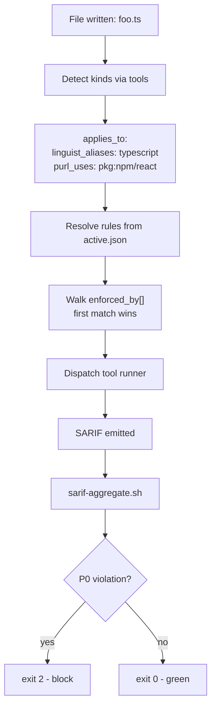
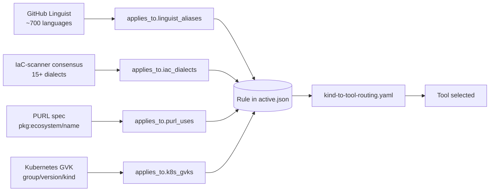
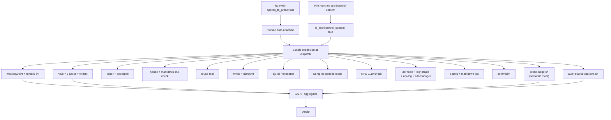
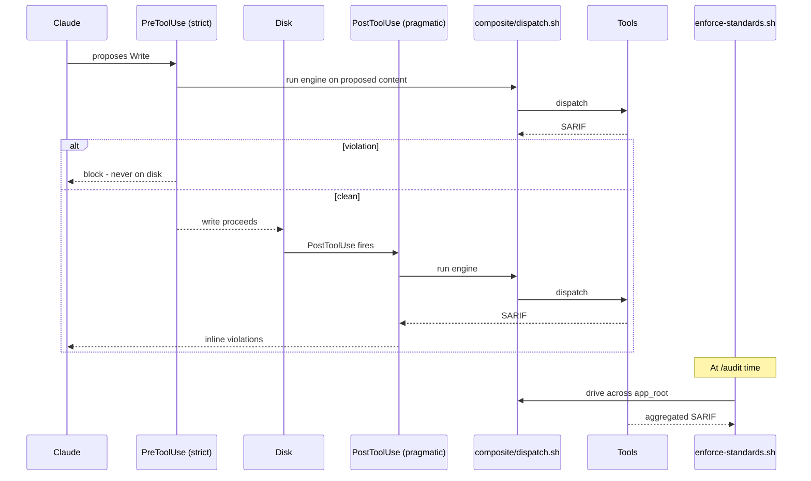

# CTP-ADR-NNNN — Composite engine + 4-axis canonical vocabulary + architectural-content enforcement bundle

> **Audience:** the `claude-tdd-pro` (CTP) development session.
> **Source design:** `proposals/PROPOSAL-005-composite-engine-4-axis-vocabulary.md` (GCTP repo, drumfiend21/grok-claude-tdd-pro@main, commit `5284156`).
> **Authority:** TIER-1 architectural change for CTP. Land as a new CTP ADR (next available number).
> **Date proposed:** 2026-06-22.

- **Status:** Proposed
- **Deciders:** drumfiend21 (architect — multi-turn operator directives, June 2026: *"replace handwritten detectors with FOSS tools"* → *"adopt an industry-standard naming registry rather than inventing one"* → *"ensure all rulesets are enforced on the generated architectural content"*) + CTP dev session.
- **Pairs with:** **GCTP PROPOSAL-005 §9b** (architectural-content enforcement bundle) and **CTP-ADR-NNNN+1** (auto-classification + custom-rule drafting pipeline — separate ADR derived from `proposals/PROPOSAL-006-...`).
- **Composes on:** CTP-side prose-judge.sh + applies_to_prose flag + 22 new namespaces + SARIF emission (CTP-ADR adopted at pin `39903da` for PROPOSAL-003).
- **Depends on:** P-8 fix (prose-judge.sh tier-2 `--text` ↔ `--target` contract mismatch — see `docs/upstream-ctp-proposals.md` in GCTP repo) for the architectural-content bundle's semantic moat to be functional.

---

## Context

CTP today owns the **rule content** for the composite engine the GCTP harness consumes. After PROPOSAL-003 landed at pin `39903da`, CTP exposes 118 rules across 24 namespaces with prose-judge LLM-tier semantic projection. The detectors backing those rules are CTP-handwritten grep / awk / shell heuristics, with the following standing limitations:

1. **Brittleness.** Hand-rolled grep on TypeScript / Terraform / Kubernetes manifests produces false positives + false negatives that mature FOSS tools (Semgrep, ESLint, Checkov, Kubescape, Trivy, Spectral, hadolint, zizmor, markdownlint, Vale) handle through proper AST/IR parsing.
2. **Coverage debt.** Many file types in real operator codebases (`.yml` workflows, `.json` SBOMs, `.md` ADRs, container images, helm charts) have thin or no detector coverage because hand-rolling each one is unbounded effort.
3. **No canonical rule-to-tool join vocabulary.** Rules from arbitrary sources (Google, Microsoft, OWASP, federal/EO, Accenture, Walmart, internal wikis) need to bind to the right tool, but there is no shared key — every CTP rule today carries its own ad-hoc `language: typescript` / `language: terraform` field, with no provenance into an industry-standard registry.
4. **No first-class enforcement on architectural prose.** ADRs, design docs, RFCs, architecture notes are the primary artifact of the GCTP↔CTP consult loop (ADR-0056 in GCTP), yet the existing detectors don't fire on them. The operator's standing directive is that **nothing is written to disk — including architectural content — without first being vetted against every applicable rule by every applicable tool.**

Industry-standard naming registries already exist and are battle-tested by mature tooling — CTP must adopt them rather than invent its own. The composite engine must be **extensible to any standard from any source** (operator brings a URL → it becomes enforcement, automatically). The architectural-content enforcement story must be **first-class, not a footnote** — every ADR passes the full prose tool stack before commit.

---

## Architecture diagrams

All diagrams below are Mermaid. The architectural-content bundle validates them via `mmdc --validate`, so the architecture-of-the-architecture is itself enforcement-conformant.

### Composite engine — file-to-verdict flow



### 4-axis vocabulary — rule binding through industry authorities



### Architectural-content bundle — auto-attached when applies_to_prose: true



### Two-phase enforcement — write-time + audit-time



---

## Decision

Eight numbered decisions (D-1..D-8) implementing the composite engine, the 4-axis vocabulary, and the architectural-content enforcement bundle. Each defines a contract or component. Implementation is itemized in §"Implementation CLs".

### D-1. Adopt the four industry-standard authorities as the canonical rule-binding vocabulary.

CTP MUST NOT invent a CTP-native kind vocabulary. The four authorities mirrored into CTP at session start:

| Axis | Authority | Canonical form | License |
|---|---|---|---|
| Languages | **GitHub Linguist** (`github/linguist/lib/linguist/languages.yml`) | `aliases[0]` (lowercase) — e.g. `typescript`, `python`, `rust`, ~700 entries | MIT |
| IaC dialects | **IaC-scanner consensus** (Checkov + Trivy + Kubescape) | lowercase: `kubernetes`, `terraform`, `dockerfile`, `openapi`, `helm`, `github_actions`, `cloudformation`, `compose`, etc. | Apache 2.0 |
| Package ecosystems / uses | **PURL spec** (`package-url/purl-spec`) | `pkg:<ecosystem>/<name>` — e.g. `pkg:npm/react`, `pkg:pypi/django`, `pkg:cargo/tokio`. Used by SBOM/SCA tools | MIT |
| Kubernetes object kinds | **Kubernetes Group/Version/Kind** | `apps/v1/Deployment`, `rbac.authorization.k8s.io/v1/Role` | Apache 2.0 |

Mirror the four registries at session start under `vendor/canonical-vocabulary/` (read-only snapshots). Refresh cadence matches `standards-refresh.sh` (default 1d).

### D-2. Adopt the `applies_to.*` block as the rule's binding surface.

Every rule in `active.json` carries an `applies_to` block keyed by the four axes:

```yaml
- id: g-jwt-no-none-alg
  source: rfc-8725
  cite: "RFC 8725 §3.1 — algorithm 'none' MUST NOT be accepted"
  applies_to:
    linguist_aliases: [typescript, javascript, python, go, java, rust]
    iac_dialects: []
    purl_uses: [pkg:npm/jsonwebtoken, pkg:npm/jose, pkg:pypi/pyjwt]
    k8s_gvks: []
  applies_to_prose: true
  enforced_by:
    - tool: semgrep
      ruleset: composite/rulesets/semgrep/jwt-no-none-alg.yml
    - bundle: architectural-content  # auto-attached because applies_to_prose: true
```

The 4-axis tagging is the single join key between rules and tools. The existing `language: typescript` ad-hoc field is deprecated; migration is automatic via the auto-classifier (CTP-ADR-NNNN+1).

### D-3. Adopt SARIF 2.1.0 as the universal output bus.

Every FOSS tool the engine invokes either emits SARIF natively (Semgrep, ESLint, Checkov, Kubescape, Trivy, Spectral, hadolint, zizmor, markdownlint-cli2, Vale) or has a SARIF adapter (`<tool>-to-sarif.sh` thin wrappers under `composite/adapters/`). The engine aggregates SARIF results across tools via `sarif-aggregate.sh` (already shipped in GCTP CL-B) and consumes a single normalized verdict stream.

### D-4. Ship `composite/runners/<tool>/runner.sh` per-tool runner with the ordered binding contract.

Each FOSS tool gets a runner script that (a) accepts a file path + applicable rule list, (b) invokes the tool with the rule set, (c) emits SARIF, (d) returns deterministic exit codes. First-matching-binding-wins per file — the engine walks `enforced_by[]` in order and dispatches the first tool whose `applies_to` matches the file's detected kind set. The match-then-dispatch loop lives in `composite/dispatch.sh`.

**Full tool-stack inventory — what each binding can route to.** Every tool below ships with a `composite/runners/<tool>/runner.sh` wrapper. Universal tools fire across language boundaries; language- or dialect-specific tools fire only when `applies_to.*` resolves to their domain.

| Tier | Tool(s) | License | Domain | SARIF |
|---|---|---|---|---|
| Universal SAST | **Semgrep** community + Semgrep OSS rules | LGPL-2.1 / Apache-2.0 | Multi-language SAST (~30 langs, ~5000 community rules: OWASP/CWE/MITRE/SANS/JWT BCP) | yes |
| Universal SCA | **Trivy** + **OSV-Scanner** + **syft** + **grype** | Apache-2.0 | CVE + secrets + IaC misconfig + SBOM (CycloneDX + SPDX); Google's OSV.dev cross-check; Anchore SBOM + vuln | yes |
| Universal secrets | **gitleaks** + **detect-secrets** + **trufflehog** | MIT / Apache-2.0 / AGPL-3.0 | Pattern-based secret detection + Yelp baseline + live credential verification | yes (via formatter) |
| Universal policy | **conftest** + **OPA** + **regal** | Apache-2.0 | Rego policies over YAML/JSON/TOML/HCL/Dockerfile/Cue; OPA runtime; Rego linter | yes (via wrapper) |
| Universal supply chain | **OpenSSF Scorecard** + **cosign** + **slsa-verifier** + **in-toto** + **slsa-github-generator** | Apache-2.0 | Repo posture; signing; SLSA build-level provenance; attestation generation | n/a (attestations) |
| JS/TS | **ESLint** + plugin family (`gts`, `@typescript-eslint`, `@microsoft/eslint-plugin-sdl`, `eslint-plugin-n`, `eslint-plugin-react`, `eslint-config-next`, `eslint-plugin-jsx-a11y`, `@angular-eslint/eslint-plugin`, `eslint-plugin-security`) + **Biome** + **oxlint** + **Prettier** | MIT/Apache-2.0 | Style + a11y + Node security + Microsoft SDL + Google TS + Rust-based fast alternative | yes (via formatter) |
| CSS | **stylelint** + SCSS/Less/Tailwind/Standard configs | MIT | CSS/SCSS/Less/PostCSS/Tailwind | yes (via formatter) |
| HTML | **htmlhint** + **html-validate** | MIT | HTML lint + W3C validator | yes (via formatter) |
| Accessibility | **axe-core** + **pa11y** + **pa11y-ci** | MPL-2.0/MIT | WCAG 2.2 a11y auditing | yes (via formatter) |
| Web Vitals | **Lighthouse** + **lighthouse-ci** | Apache-2.0 | LCP/CLS/INP + PWA + SEO + performance budgets | yes (via formatter) |
| IaC | **Checkov** + **tfsec** + **terrascan** + **tflint** | Apache-2.0/MIT | 1000+ policies across Terraform/CFN/k8s/Helm/Dockerfile/ARM/Bicep/Compose/GHA/GitLab CI/Azure Pipelines/Ansible/CircleCI/Bitbucket/Argo with NIST 800-53/FedRAMP/SOC2/PCI/HIPAA/CIS mappings; Terraform-specific alts | yes |
| K8s | **Kubescape** + **kube-linter** + **kubeconform** + **polaris** + **kyverno** | Apache-2.0 | 260+ controls (NSA-CISA + CIS + MITRE ATT&CK + NIST SSDF + FedRAMP) + lint + schema validation + best-practice + native policy engine | yes |
| OpenAPI | **Spectral** + `@stoplight/spectral-owasp-ruleset` + **vacuum** + **redocly-cli** | Apache-2.0/MIT | OpenAPI 3.x + AsyncAPI + OWASP API Top 10 + fast Go alternatives | yes |
| GHA | **zizmor** + **actionlint** + **pinact** | Apache-2.0/MIT | GitHub Actions security + correctness + SHA pinning | yes (zizmor) |
| Dockerfile | **hadolint** | GPL-3.0 | Dockerfile lint | yes |
| YAML | **yamllint** | GPL-3.0 | General YAML lint (complements IaC-specific tools) | yes (via formatter) |
| JSON | **ajv-cli** + **jq** | MIT | JSON schema validation (700+ SchemaStore schemas) + structural query | n/a |
| Markdown structural | **markdownlint-cli2** | MIT | Structural MD (MD001-MD060) | yes |
| Prose style | **Vale** + Google + Microsoft + write-good + proselint + alex packs | MIT | Style + inclusive language | yes |
| Prose additional | **textlint** + `textlint-rule-no-todo` + `textlint-rule-common-misspellings` + `textlint-rule-max-number-of-lines` | MIT | Anti-patterns Vale doesn't cover | yes (via formatter) |
| Links | **lychee** + **markdown-link-check** | Apache-2.0/MIT | Internal + external link resolution; complementary traversal strategies | yes |
| Spell | **cspell** + **codespell** | MIT/GPL-2.0 | Code-aware spell + dictionary typos | yes (cspell) |
| License | **reuse-tool** | GPL-3.0 | REUSE 3.3 / SPDX headers | yes |
| Diagrams | **mmdc** (mermaid-cli) + **plantuml** | MIT/GPL | Validate mermaid + PlantUML diagrams in MD code blocks | n/a |
| ADR lifecycle | **adr-tools** (Nat Pryce) + **log4brains** + **adr-log** + **adr-manager** | MIT/Apache-2.0 | ADR file-naming, numbering, status transitions, supersession chains, index integrity |
| TOC | **doctoc** + **markdown-toc** | MIT | Auto-TOC verified against headings |
| Commit hygiene | **commitlint** + `@commitlint/config-conventional` | MIT | Conventional Commits → ADR ID → PR traceability |
| Languages — Rust | `rustfmt` + `clippy` + `cargo-audit` + `cargo-deny` | Apache-2.0/MIT | Format + lint + CVE + license | partial |
| Languages — Go | `golangci-lint` (wraps ~50 linters) + `govulncheck` + `gosec` | MIT | Lint aggregator + CVE + security | yes |
| Languages — Python | **ruff** + `bandit` + `mypy` + `pip-audit` | MIT/Apache-2.0 | Linter + security + types + CVE | yes |
| Languages — Java | Spotless + ErrorProne + SpotBugs + PMD + `dependency-check` | Apache-2.0 | JVM lint + bug-finder + CVE | yes |
| Languages — Kotlin | `ktlint` + Detekt | Apache-2.0/MIT | Kotlin lint/security | yes |
| Languages — Swift | SwiftLint + SwiftFormat | MIT | Swift lint/format | yes |
| Languages — C# | Roslyn analyzers + SonarAnalyzer.CSharp + SecurityCodeScan | LGPL/MIT | .NET lint + security | yes |
| Languages — Ruby | RuboCop + brakeman + bundler-audit | MIT | Ruby lint + security + CVE | yes |
| Languages — Elixir | credo + dialyxir + sobelow | MIT | Elixir lint + types + security | yes (via wrapper) |
| Languages — Scala | Scalafix + Scalafmt + scapegoat | Apache-2.0 | Scala lint + format | yes (via wrapper) |
| Languages — PHP | PHPStan + psalm + phpcs-security-audit | MIT | PHP types + lint + security | yes |
| Languages — Solidity | Slither + solhint + Mythril | AGPL/MIT | Smart-contract security | yes |
| Shell | ShellCheck + shfmt | GPL/MIT | Bash lint + format | yes (formatter) |
| SQL | SQLFluff + sqlfmt + sqlcheck | MIT | SQL lint + format + anti-pattern | partial |
| GraphQL | `graphql-eslint` + `graphql-schema-linter` | MIT | GraphQL schema lint | yes (via ESLint) |
| Protobuf | `buf lint` + protolint | Apache-2.0 | Protobuf lint | yes |
| **The CTP moat** | **`prose-judge.sh`** | CTP-shipped | Semantic projection of `applies_to_prose:true` rules onto prose | yes |

### D-5. **Architectural-content enforcement bundle** (PROPOSAL-005 §9b). 

Ship `composite/bundles/architectural-content.yaml` defining a named binding that expands to the full prose tool stack invoked on every architectural file:

| Concern | Tool | Coverage |
|---|---|---|
| Markdown syntactic | `markdownlint-cli2` (MIT) | CommonMark / GFM / MD001..MD060 |
| AST-level prose checks | `remark-lint` (MIT) | heading consistency, link integrity, table shape |
| Prose style — corporate | Vale (MIT) + Google / Microsoft / write-good / proselint / alex packs | tone, passive voice, jargon, inclusivity |
| Spelling | `cspell` + `codespell` (MIT) | code-aware spelling |
| Link integrity | `lychee` (Apache 2.0) | dead-link detection |
| License headers | `reuse-tool` (REUSE 3.3) | SPDX compliance |
| Diagram rendering | `mmdc` (Mermaid CLI) + `plantuml` | diagram-as-code validation |
| Frontmatter schema | `ajv-cli` against `composite/schemas/adr-frontmatter.schema.json` | required fields, enum values |
| Token patterns in prose | Semgrep generic-mode rules under `composite/rulesets/semgrep/architectural-content/*.yml` | literal forbidden tokens (`0.0.0.0/0`, `alg":"none"`, `*:*` IAM) with deny-context affordance markers |
| RFC 2119 keyword discipline | Custom shell check `composite/runners/rfc-2119-check/runner.sh` | MUST / SHOULD / MAY usage consistency |
| **Semantic moat** | **`prose-judge.sh`** (CTP-owned, semantic projection of every `applies_to_prose: true` rule onto the prose) | catches "this ADR proposes a forbidden design" — no FOSS equivalent |
| Citation integrity | `audit-source-citations.sh` (CTP-owned) | verifies cited URLs resolve + match anchor |
| ADR lifecycle | `adr-tools` (Nat Pryce, MIT) + `log4brains` (Apache-2.0) + `adr-log` (Apache-2.0) + `adr-manager` (Apache-2.0) | ADR file-naming (`NNNN-kebab-title.md`), monotonic numbering, status transitions (proposed→accepted→deprecated→superseded), supersession chains resolve, ADR-index entry exists |
| TOC integrity | `doctoc` + `markdown-toc` + `markdown-it-toc-done-right` | Auto-TOC verified against heading structure; fails on drift |
| Additional prose CLIs | `write-good` (standalone) + `mdformat` (Python) + `vale-ls` (LSP) | Belt-and-braces prose; consistent MD formatting; IDE-time author feedback |
| Link checker (alt) | `markdown-link-check` (MIT) | Lychee's complement — different traversal catches different edge cases |
| Commit message hygiene | `commitlint` + `@commitlint/config-conventional` | Conventional Commits on the commit that lands the ADR; ADR ID → commit → PR traceability |
| Inline-table validation | `markdown-table-formatter` + `prettier --parser markdown` | Consistent table rendering; catches GitHub-vs-editor pipe-alignment drift |
| Kata/competition rendering | `gh markdown-render` + `markdownlint-cli2 --fix` (dry-run) | Exact GitHub/GitLab render preview; drift detection before commit |

The bundle is **whole-or-nothing**. Operators don't pick and choose tools — the bundle is the universal architectural enforcement floor. Implicit activation: any rule with `applies_to_prose: true` auto-attaches `{ bundle: architectural-content }` to `enforced_by[]` at engine load time (no per-rule operator effort).

### D-6. Architectural-content detection.

`composite/detect-architectural-content.sh` returns `is_architectural_content: true` for a file when ANY of:

1. Path matches one of: `docs/architecture/**`, `docs/adr/**`, `docs/decisions/**`, `docs/rfc/**`, `**/SUBMISSION.md`, `**/ARCHITECTURE.md`, `**/DESIGN.md`, `**/README.md` for the root architecture readme.
2. Frontmatter contains `kind: adr | architecture | decision | design | rfc`.
3. Operator-declared per-repo extension in `.harness/operator-standards/architectural-content-paths.yaml`.

Engine invokes the architectural-content bundle on all matching files.

### D-7. Two-phase enforcement (write-time + audit-time).

The composite engine fires through two seams:

- **Write-time (post-tool-use):** the existing `post-tool-use-review-gate.sh` (GCTP CL-E, already shipped) extends to invoke `composite/dispatch.sh` for the touched file. For architectural .md, the architectural-content bundle fires.
- **Audit-time (whole-tree scope):** `enforce-standards.sh` (Fix B) extends to drive the composite engine across the entire app tree. `audit-design-phase-md.sh` (GCTP CL-C, already shipped) drives the bundle at whole-tree scope on every architectural file.

A future strict variant — PreToolUse hook — is deferred to CTP-D-7a (see §"Open questions" below) for the operator's "never on disk in violating form" guarantee.

### D-8. Three-wave delivery (CL-A..H).

Implementation is itemized in §"Implementation CLs". Three waves so the engine is incrementally adoptable:

- **Wave 1 (CL-A..C):** vocabulary mirror + 4-axis schema migration + SARIF bus. Existing detectors keep working; nothing regresses.
- **Wave 2 (CL-D..F):** per-tool runners (Semgrep, ESLint, Checkov, Kubescape, Trivy, Spectral, hadolint, zizmor) + dispatch loop. Hand-rolled detectors swapped one-by-one; per-CL coverage diff demonstrates parity.
- **Wave 3 (CL-G..H):** architectural-content bundle + detection + two-phase wiring. Depends on P-8 fix for semantic moat.

---

## Implementation CLs

| CL | Deliverable | Acceptance criteria |
|---|---|---|
| **CL-A** | `vendor/canonical-vocabulary/{linguist,iac-dialects,purl-spec,k8s-gvks}/` mirrors + refresh script | Mirrors present + refreshable; new namespace `vocabulary` added to `active.json` index |
| **CL-B** | `applies_to.*` schema migration in `active.json` builder; existing `language:` field auto-migrated | All 118 existing rules have `applies_to` blocks; no regression in audit verdicts |
| **CL-C** | `sarif-aggregate.sh` adoption + adapter scaffolding under `composite/adapters/` | All adapters emit SARIF 2.1.0; aggregator produces single verdict stream |
| **CL-D** | Per-tool runners: Semgrep, ESLint, Checkov, Kubescape, Trivy, Spectral, hadolint, zizmor + `composite/dispatch.sh` | Each runner accepts `--rules` + `--file` + emits SARIF; dispatch walks `enforced_by[]` in order |
| **CL-E** | Coverage-diff demonstrates parity for swapped detectors | Old detector → new tool: same verdicts on a curated fixture set (`composite/fixtures/parity/`) |
| **CL-F** | First operator-source ingest end-to-end: Google TS style guide URL → 47 rules in `active.json` with `applies_to.*` populated, bound to Semgrep + ESLint | E2E test in `test/composite/e2e/google-ts-style/` green |
| **CL-G** | `composite/bundles/architectural-content.yaml` + `composite/detect-architectural-content.sh` + bundle invocation in dispatch | Bundle fires on every architectural .md; SARIF aggregated; `prose-judge.sh` invoked per `applies_to_prose: true` rule |
| **CL-H** | Two-phase wiring: dispatch invoked from post-tool-use hook + audit-time driver | Both seams fire the same engine; identical verdicts on identical inputs |

---

## Consequences

### Positive

- **Detector quality.** FOSS tools (Semgrep, ESLint, Checkov, Kubescape, Trivy, Spectral, hadolint, zizmor) are battle-tested by the entire industry; they catch what hand-rolled grep misses and don't false-positive on the cases hand-rolled grep does.
- **Coverage.** Every file type that has a major FOSS tool gets first-class enforcement automatically. The current coverage gap (`.yaml` workflows, `.json` SBOMs, container images, helm charts) closes without per-type hand-rolling.
- **Extensibility.** Any operator-brought standard from any source becomes enforcement automatically through the auto-classification pipeline (CTP-ADR-NNNN+1). The catalog scales sublinearly with operator effort.
- **Canonical join vocabulary.** Adopting Linguist + IaC-dialects + PURL + GVK eliminates the rule-binding ambiguity. Cross-language rules (one rule covers 8 languages via Semgrep) become first-class.
- **Architectural content first-class.** Every ADR, design doc, RFC passes the full prose tool stack — markdownlint + Vale + textlint + cspell + codespell + lychee + reuse + diagrams + frontmatter + RFC 2119 + Semgrep + `prose-judge.sh` + citation integrity — before commit. Eliminates the historical gap where ADRs proposed designs that violated the very rules CTP enforces on code.
- **SARIF as bus** means future tooling (security dashboards, GitHub code-scanning, IDE integrations) gets a single normalized verdict feed.

### Neutral

- The plugin grows a `vendor/canonical-vocabulary/` directory (~10-20 MB of mirrored YAML + JSON). Refresh on cadence; no runtime cost.
- Per-tool runners are thin shell wrappers; total LOC added is bounded (~150 LOC per runner × 8 runners = ~1200 LOC core).
- The architectural-content bundle invokes ~16 tools per .md. On a 33-file architecture corpus, wall-clock is bounded by the slowest tool (typically Vale or prose-judge.sh) — observed under 90s in GCTP CL-C audit runs.

### Negative / cost

- **External tool dependency.** Operators must have Semgrep, ESLint, Checkov, etc. installed. Mitigation: containerized runner under `composite/docker/` for hermetic execution.
- **prose-judge.sh blocker (P-8).** The semantic moat is the highest-leverage component of the architectural-content bundle. The existing `--text` ↔ `--target` contract mismatch means tier-2 returns `not_enforced` until fixed. This ADR depends on the P-8 fix landing first.
- **Migration of existing 118 rules** to `applies_to.*` is mechanical but must be verified per-rule for no regression. Mitigation: CL-E coverage diff is the gate.
- **prose tool DSL drift.** Vale styles + markdownlint config + remark plugins evolve. Mitigation: pin versions in `composite/bundles/architectural-content.yaml`, refresh on cadence with explicit operator review.

---

## Alternatives considered

- **Keep hand-rolled detectors; just add more.** REJECTED — does not scale; coverage gap grows with new file types; no canonical join vocabulary; architectural-content stays unenforced.
- **Invent a CTP-native canonical naming registry.** REJECTED — duplicates work already done by Linguist + IaC consensus + PURL + GVK; would diverge from industry tooling; operator pushback explicitly forbade.
- **Per-tool wrappers with no bus.** REJECTED — engine cannot aggregate verdicts across tools; ADR-spec quality gate cannot say "all tools must pass" without a normalized stream.
- **Architectural-content enforcement as opt-in per rule.** REJECTED — operator's standing directive is that the bundle fires on every ADR; opt-in invites per-rule oversights. The bundle is the universal floor.

---

## Open questions

- **CTP-D-7a (strict write-time enforcement):** a PreToolUse variant that blocks the Write tool BEFORE the file is on disk when the composite engine returns `red`. Today the post-tool-use hook fires after the write; this is "soft" enforcement. Tracked as a future ADR.
- **Composite engine version skew:** when an operator's pin lags behind CTP's current tool-runner contracts, what's the graceful degradation? Initial answer: per-runner version check in `dispatch.sh`; if a runner is missing, the rule is marked `not_enforced` rather than failing the run. To be finalized in CL-D.
- **Auto-classification handoff:** the next ADR (CTP-ADR-NNNN+1, derived from `proposals/PROPOSAL-006-...`) feeds rules into `active.json` with `applies_to.*` + `applies_to_prose` populated automatically. This ADR consumes that output; CTP-ADR-NNNN+1 produces it.

---

## Boundary discipline (per prime directive)

- **CTP owns** (this ADR): the composite engine runtime, the per-tool runners, the SARIF bus, the architectural-content bundle definition, the canonical vocabulary mirrors.
- **GCTP owns** (separate, paired ADR): the harness-side wiring — `enforce-standards.sh` invocation, `audit-design-phase-md.sh` invocation, the post-tool-use hook extension, the static gate alignment, operator-facing CLI workflow.
- **Operator owns**: the source URLs that feed the catalog, the per-rule deviation approval, the operator-extension paths for architectural-content detection.

Neither side reaches into the other. The only contract surface is `active.json` + the canonical vocabulary mirrors + SARIF.

---

---

## Supplementary GCTP files to fetch (the CTP session has no access to the GCTP repo, so fetch via raw URL)

GCTP repo: `https://github.com/drumfiend21/grok-claude-tdd-pro` — branch `main` at HEAD or any specific commit. Fetch the following with WebFetch / `curl` / `gh api`:

| Purpose | Raw URL (replace `main` with a pinned commit if reproducibility matters) |
|---|---|
| **The full source design** for this ADR | `https://raw.githubusercontent.com/drumfiend21/grok-claude-tdd-pro/main/proposals/PROPOSAL-005-composite-engine-4-axis-vocabulary.md` |
| The paired auto-classification ADR draft | `https://raw.githubusercontent.com/drumfiend21/grok-claude-tdd-pro/main/proposals/ctp-adr-drafts/CTP-ADR-NNNN+1-auto-classification-and-rule-drafting-pipeline.md` |
| The auto-classification source design | `https://raw.githubusercontent.com/drumfiend21/grok-claude-tdd-pro/main/proposals/PROPOSAL-006-auto-classification-and-rule-drafting-pipeline.md` |
| P-8 upstream blocker (prose-judge.sh `--text` ↔ `--target` contract) — needed for D-5 semantic moat | `https://raw.githubusercontent.com/drumfiend21/grok-claude-tdd-pro/main/docs/upstream-ctp-proposals.md` |
| Prior CTP-side ADR for PROPOSAL-003 (already adopted at pin `39903da`) — establishes the prose-judge.sh + applies_to_prose surface this ADR composes on | `https://raw.githubusercontent.com/drumfiend21/grok-claude-tdd-pro/main/proposals/PROPOSAL-003-ctp-session-brief.md` |
| GCTP-side ADR-0066 (the YAML/JSON/MD corpora + prose-as-code wiring) for context on the harness side | `https://raw.githubusercontent.com/drumfiend21/grok-claude-tdd-pro/main/docs/adr/0066-yaml-json-md-corpora-and-prose-as-code-enforcement.md` |
| YAML standards corpus (75 sources, license + URL per row) | `https://raw.githubusercontent.com/drumfiend21/grok-claude-tdd-pro/main/docs/standards-sources-yaml.md` |
| JSON standards corpus (40+ sources + SchemaStore meta-catalog) | `https://raw.githubusercontent.com/drumfiend21/grok-claude-tdd-pro/main/docs/standards-sources-json.md` |
| MD standards corpus (40 sources, two layers — syntactic + semantic) | `https://raw.githubusercontent.com/drumfiend21/grok-claude-tdd-pro/main/docs/standards-sources-md.md` |
| Complete-architecture cover doc (single entry point with all context) | `https://raw.githubusercontent.com/drumfiend21/grok-claude-tdd-pro/main/proposals/ctp-adr-drafts/COMPLETE-ARCHITECTURE-FOR-CTP.md` |

**Pinned-commit canonicalization (recommended):** swap `main` for commit `<HEAD-at-handoff>` in every URL above to lock the spec against drift. The handoff cover doc records the canonical pin.

---

---

## Appendix A — Complete tool inventory (~115 tools, deduplicated, with licenses)

This appendix is the canonical, complete list of every FOSS tool / lib / style-pack / registry the composite engine + architectural-content bundle dispatches. Use this as the checklist when shipping per-tool runner wrappers under `composite/runners/<tool>/runner.sh`.

License posture: ~80% permissive (MIT / Apache-2.0 / BSD); the few GPL/AGPL tools (hadolint, ShellCheck, codespell, reuse-tool, plantuml, Slither, trufflehog, yamllint) are CLI-only invocations — no derivative-work concern for CTP.

### A.1 Universal tier (cross-language, fires on everything)

**SAST**
- Semgrep (community) — LGPL-2.1 engine / Apache-2.0 rules — ~30 languages, ~5000 community rules: OWASP/CWE/MITRE/SANS/JWT BCP

**SCA / CVE**
- Trivy — Apache-2.0 — CVE + secrets + IaC misconfig + SBOM (CycloneDX + SPDX)
- OSV-Scanner (Google, against OSV.dev) — Apache-2.0
- syft (Anchore SBOM gen) — Apache-2.0
- grype (Anchore vuln scanner) — Apache-2.0
- dependency-check (OWASP) — Apache-2.0

**Secrets**
- gitleaks — MIT
- detect-secrets (Yelp) — Apache-2.0
- trufflehog — AGPL-3.0 — live-credential verification beyond pattern match

**Policy / Rego**
- conftest — Apache-2.0 — Rego over YAML/JSON/TOML/HCL/Dockerfile/Cue
- OPA (Open Policy Agent) — Apache-2.0
- regal (Rego linter) — Apache-2.0
- kyverno + kyverno-cli — Apache-2.0 — K8s-native policy engine

**Supply-chain / Provenance**
- OpenSSF Scorecard — Apache-2.0
- cosign — Apache-2.0
- slsa-verifier — Apache-2.0
- in-toto — Apache-2.0
- slsa-github-generator — Apache-2.0

**SARIF**
- SARIF 2.1.0 (OASIS) — the universal output bus
- `sarif-aggregate.sh` (GCTP-shipped, mirrored to CTP) — Apache-2.0

### A.2 JavaScript / TypeScript

- ESLint — MIT
- `gts` (Google TS style) — Apache-2.0
- `@typescript-eslint` — MIT
- `@microsoft/eslint-plugin-sdl` — MIT
- `eslint-plugin-n` (Node) — MIT
- `eslint-plugin-react` — MIT
- `eslint-config-next` — MIT
- `eslint-plugin-jsx-a11y` — MIT
- `@angular-eslint/eslint-plugin` — MIT
- `eslint-plugin-security` — Apache-2.0
- Biome (Rust-based fast linter+formatter) — MIT
- oxlint — MIT
- Prettier — MIT

### A.3 CSS

- stylelint — MIT
- `stylelint-config-recommended-scss` — MIT
- `stylelint-config-recommended-less` — MIT
- `stylelint-config-tailwindcss` — MIT
- `stylelint-config-standard` — MIT

### A.4 HTML

- htmlhint — MIT
- html-validate — MIT

### A.5 Accessibility (WCAG 2.2)

- axe-core — MPL-2.0
- pa11y — MIT
- pa11y-ci — MIT

### A.6 Web Vitals (LCP / CLS / INP, PWA, SEO, perf budgets)

- Lighthouse — Apache-2.0
- lighthouse-ci — Apache-2.0

### A.7 IaC (general — Terraform / CFN / k8s / Helm / Dockerfile / ARM / Bicep / Compose / GHA / GitLab CI / Azure Pipelines / Ansible / CircleCI / Bitbucket / Argo)

- Checkov (1000+ policies; NIST 800-53 / FedRAMP / SOC2 / PCI / HIPAA / CIS mappings) — Apache-2.0
- tfsec — MIT
- terrascan — Apache-2.0
- tflint — MPL-2.0

### A.8 Kubernetes

- Kubescape (260+ controls: NSA-CISA + CIS + MITRE ATT&CK + NIST SSDF + FedRAMP) — Apache-2.0
- kube-linter — Apache-2.0
- kubeconform (schema validation) — Apache-2.0
- polaris — Apache-2.0
- kyverno + kyverno-cli — Apache-2.0

### A.9 OpenAPI / AsyncAPI

- Spectral + `@stoplight/spectral-owasp-ruleset` — Apache-2.0
- vacuum (fast Go-based alt) — Apache-2.0
- redocly-cli — MIT

### A.10 GitHub Actions

- zizmor — Apache-2.0
- actionlint — MIT
- pinact (SHA pinning) — MIT

### A.11 Dockerfile

- hadolint — GPL-3.0

### A.12 YAML / JSON / Schema

- yamllint — GPL-3.0
- ajv-cli (JSON Schema validation; 700+ SchemaStore schemas) — MIT
- jq — MIT

### A.13 Language-specific

**Rust**
- rustfmt — Apache-2.0 / MIT
- clippy — Apache-2.0 / MIT
- cargo-audit — Apache-2.0 / MIT
- cargo-deny — Apache-2.0 / MIT

**Go**
- golangci-lint (wraps ~50 linters) — MIT
- govulncheck — BSD
- gosec — Apache-2.0
- staticcheck — MIT

**Python**
- ruff — MIT
- bandit — Apache-2.0
- mypy — MIT
- pip-audit — Apache-2.0

**Java / JVM**
- Spotless — Apache-2.0
- ErrorProne — Apache-2.0
- SpotBugs — LGPL
- PMD — BSD

**Kotlin**
- ktlint — MIT
- Detekt — Apache-2.0

**Swift**
- SwiftLint — MIT
- SwiftFormat — MIT

**C# / .NET**
- Roslyn analyzers — MIT
- SonarAnalyzer.CSharp — LGPL
- SecurityCodeScan — LGPL

**Ruby**
- RuboCop — MIT
- brakeman — MIT
- bundler-audit — MIT

**Elixir**
- credo — MIT
- dialyxir — Apache-2.0
- sobelow — Apache-2.0

**Scala**
- Scalafix — BSD
- Scalafmt — Apache-2.0
- scapegoat — BSD

**PHP**
- PHPStan — MIT
- psalm — MIT
- phpcs-security-audit — Apache-2.0

**Solidity**
- Slither — AGPL-3.0
- solhint — MIT
- Mythril — MIT

**Shell**
- ShellCheck — GPL-3.0
- shfmt — BSD

**SQL**
- SQLFluff — MIT
- sqlfmt — Apache-2.0
- sqlcheck — Apache-2.0

**GraphQL**
- graphql-eslint — MIT
- graphql-schema-linter — MIT

**Protobuf**
- buf lint — Apache-2.0
- protolint — MIT

### A.14 Architectural-content bundle (fires on every ADR / design doc / RFC)

**Markdown structural**
- markdownlint-cli2 — MIT — MD001..MD060
- remark-lint + `remark-preset-lint-recommended` + `remark-preset-lint-markdown-style-guide` — MIT

**Prose style — corporate / standards packs**
- Vale (engine) — MIT
- `errata-ai/Google` (Google developer-docs style) — CC-BY
- `vale-cli/Microsoft` (Microsoft Writing Style Guide) — CC-BY-4.0
- `errata-ai/write-good` — MIT
- `errata-ai/proselint` — BSD

**Inclusive language**
- `errata-ai/alex` (Vale pack) — MIT
- `alex` (standalone CLI) — MIT

**Additional prose CLIs**
- textlint + `textlint-rule-no-todo` + `textlint-rule-common-misspellings` + `textlint-rule-max-number-of-lines` — MIT
- write-good (standalone) — MIT
- mdformat (Python) — MIT
- vale-ls (LSP for IDE-time feedback) — MIT

**Spelling**
- cspell (code-aware) — MIT
- codespell (dictionary) — GPL-2.0

**Link integrity**
- lychee — Apache-2.0 / MIT
- markdown-link-check — MIT

**License headers**
- reuse-tool (REUSE 3.3 / SPDX, FSFE) — GPL-3.0

**Diagram validation**
- mmdc (mermaid-cli) — MIT — validate every `mermaid` fenced block (C4, sequence, flowchart)
- plantuml — GPL

**Frontmatter schema**
- ajv-cli against MADR / arc42 / RFC frontmatter schemas — MIT

**Token-pattern checks in prose**
- Semgrep generic-mode rules under `composite/rulesets/semgrep/architectural-content/*.yml`

**RFC 2119 keyword discipline**
- Custom Vale rule or Semgrep pattern — checks BCP 14 invocation sentence presence

**ADR lifecycle**
- adr-tools (Nat Pryce) — MIT — scaffolding + lifecycle
- log4brains — Apache-2.0 — modern ADR mgmt + web UI
- adr-log — Apache-2.0 — chronological ADR log
- adr-manager — Apache-2.0 — web-based ADR editor

**TOC integrity**
- doctoc — MIT
- markdown-toc — MIT
- markdown-it-toc-done-right — MIT

**Commit message hygiene**
- commitlint — MIT
- `@commitlint/config-conventional` — MIT — ADR ID → commit → PR traceability

**Inline-table validation**
- markdown-table-formatter — MIT
- prettier (markdown parser) — MIT

**Kata / competition rendering**
- `gh markdown-render` (GitHub CLI) — MIT
- markdownlint-cli2 `--fix` (dry-run preview) — MIT

**Semantic moat (CTP-owned, no FOSS equivalent)**
- `prose-judge.sh` — CTP-shipped — LLM-judge tier; projects every `applies_to_prose: true` rule onto prose

**Citation integrity (CTP-owned)**
- `audit-source-citations.sh` — GCTP-shipped, mirrored to CTP — every cited standard traces to `active.json` provenance

### A.15 Industry-standard naming registries (mirrored under `vendor/canonical-vocabulary/`, consulted as data not invoked as tools)

- GitHub Linguist (`github/linguist/lib/linguist/languages.yml`) — MIT — `aliases[0]` for ~700 languages
- IaC-scanner consensus (curated from Checkov + Trivy + Kubescape) — Apache-2.0 — lowercase IaC dialect names
- PURL spec (`package-url/purl-spec`) — MIT — `pkg:<ecosystem>/<name>`
- Kubernetes GVK — Apache-2.0 — `apps/v1/Deployment`-style identifiers

### A.16 Counts + license summary

- **Total distinct tools/libs/packs/registries:** ~115
- **Distinct categories:** 27
- **License distribution:** MIT 55% / Apache-2.0 25% / BSD 5% / MPL 2% / GPL/AGPL 8% / LGPL 3% / CC-BY 2%
- **GPL/AGPL tools** (all CLI-only — no derivative-work concern): hadolint, ShellCheck, codespell, reuse-tool, plantuml, Slither, trufflehog, yamllint

---

---

## Appendix B — `active.json` rule schema (JSON Schema 2020-12)

```json
{
  "$schema": "https://json-schema.org/draft/2020-12/schema",
  "$id": "https://claude-tdd-pro.dev/schemas/active-rule.json",
  "type": "object",
  "required": ["id", "source", "cite", "applies_to", "enforced_by", "severity", "status"],
  "properties": {
    "id": {
      "type": "string",
      "pattern": "^g-[a-z0-9-]+-[a-z0-9-]+$",
      "description": "Stable rule ID. Convention: g-<namespace>-<slug>"
    },
    "source": {
      "type": "string",
      "description": "Source-namespace key (e.g. google-ts-style, owasp-asvs, rfc-8725, walmart-microservices)"
    },
    "cite": {
      "type": "string",
      "description": "Verbatim citation with anchor (e.g. 'RFC 8725 §3.1 — algorithm none MUST NOT be accepted')"
    },
    "provenance": {
      "type": "object",
      "required": ["url", "retrieved_at", "license"],
      "properties": {
        "url": { "type": "string", "format": "uri" },
        "anchor": { "type": "string" },
        "retrieved_at": { "type": "string", "format": "date-time" },
        "license": { "type": "string" },
        "extracted_by": { "enum": ["heading-segmenter", "dom-walker", "regex-list", "llm-segmenter", "pdf-llm", "manual"] },
        "classifier_confidence": { "enum": ["high", "medium", "low", "abstain"] }
      }
    },
    "applies_to": {
      "type": "object",
      "properties": {
        "linguist_aliases": {
          "type": "array",
          "items": { "type": "string" },
          "description": "Lowercase Linguist aliases[0]; resolves against vendor/canonical-vocabulary/linguist/"
        },
        "iac_dialects": {
          "type": "array",
          "items": { "type": "string" },
          "description": "Lowercase IaC dialect names; resolves against vendor/canonical-vocabulary/iac-dialects/"
        },
        "purl_uses": {
          "type": "array",
          "items": { "type": "string", "pattern": "^pkg:[a-z]+/" },
          "description": "PURL identifiers; pkg:<ecosystem>/<name>"
        },
        "k8s_gvks": {
          "type": "array",
          "items": { "type": "string", "pattern": "^[^/]+/[^/]+/[^/]+$" },
          "description": "Group/Version/Kind; e.g. apps/v1/Deployment"
        }
      },
      "additionalProperties": false
    },
    "applies_to_prose": {
      "type": "boolean",
      "default": false,
      "description": "When true, engine auto-attaches { bundle: architectural-content } to enforced_by[]"
    },
    "enforced_by": {
      "type": "array",
      "minItems": 1,
      "items": {
        "oneOf": [
          {
            "type": "object",
            "required": ["tool", "ruleset"],
            "properties": {
              "tool": { "type": "string", "description": "Tool name; must have a composite/runners/<tool>/runner.sh" },
              "ruleset": { "type": "string", "description": "Path to ruleset file relative to repo root" },
              "kinds": {
                "type": "array",
                "description": "Optional sub-filter; when present, this binding fires only for files whose kinds intersect this list"
              },
              "config": {
                "type": "object",
                "description": "Tool-specific configuration overrides"
              }
            }
          },
          {
            "type": "object",
            "required": ["bundle"],
            "properties": {
              "bundle": { "enum": ["architectural-content"] }
            }
          }
        ]
      }
    },
    "severity": { "enum": ["P0", "P1", "P2", "P3"] },
    "status": { "enum": ["proposed", "active", "deprecated", "superseded"] },
    "superseded_by": { "type": "string", "description": "Rule ID that supersedes this one when status=superseded" },
    "deviation_policy": {
      "enum": ["allowed-with-row", "non-exemptible"],
      "default": "allowed-with-row",
      "description": "EO + security-governance rules are typically non-exemptible (ADR-0045 in GCTP)"
    }
  }
}
```

The schema is validated by `composite/validate-active-json.sh` at session start. Schema violations are fatal (engine refuses to start).

---

## Appendix C — Tool runner interface contract

Every `composite/runners/<tool>/runner.sh` MUST conform to this contract.

### C.1 Invocation

```
runner.sh --file <path> --rules <ruleset-path> [--root <repo-root>] [--config <config-file>] [--json|--sarif]
```

Required flags:
- `--file <path>` — absolute path to the file under analysis
- `--rules <path>` — absolute path to the tool's ruleset file (Semgrep YAML / ESLint config / Checkov external-checks / etc.)

Optional flags:
- `--root <path>` — repository root (some tools need this for resolution); defaults to `$(git rev-parse --show-toplevel)`
- `--config <path>` — tool-specific config override
- `--json` — emit results as JSON to stdout (engine internal)
- `--sarif` — emit results as SARIF 2.1.0 to stdout (preferred)
- `--timeout <seconds>` — runner exits with code 124 if the underlying tool exceeds this

### C.2 Exit codes

| Code | Meaning | Engine action |
|---:|---|---|
| 0 | `pass` — no violations | continue dispatch |
| 1 | `fail` — at least one violation | aggregate into SARIF; gate decides green/red |
| 2 | `block` — P0 violation; never accept | force engine red regardless of other tools |
| 3 | `not_enforced` — tool unavailable or crashed | log warning; rule marked `not_enforced` in `rules_verified` |
| 4 | `not_applicable` — rule does not apply to this file | rule marked `not_applicable` |
| 124 | timeout | treated as `not_enforced` with timeout reason |
| any other | unexpected error | treated as `not_enforced`; engine logs full stderr |

### C.3 Output contract

SARIF 2.1.0 emission MUST include:
- `runs[].tool.driver.name` — the tool name
- `runs[].tool.driver.version` — the tool version (engine cross-checks against pin)
- `runs[].invocations[].executionSuccessful` — boolean
- `runs[].results[]` — per-violation with `ruleId`, `level`, `message.text`, `locations[].physicalLocation`
- `runs[].results[].properties.gctp_rule_id` — the `active.json` rule ID that bound this run (engine adds this if the wrapper doesn't)

Non-SARIF JSON emission (`--json`) is allowed only for tools without SARIF support; the engine translates via a per-tool adapter at `composite/adapters/<tool>-to-sarif.sh`.

### C.4 Wrapper template

```bash
#!/usr/bin/env bash
# composite/runners/<TOOL>/runner.sh
set -uo pipefail

FILE=""; RULES=""; ROOT="$(git rev-parse --show-toplevel 2>/dev/null || echo .)"
CONFIG=""; OUTPUT=sarif; TIMEOUT=300

while [[ $# -gt 0 ]]; do
  case "$1" in
    --file)    FILE="$2";    shift 2 ;;
    --rules)   RULES="$2";   shift 2 ;;
    --root)    ROOT="$2";    shift 2 ;;
    --config)  CONFIG="$2";  shift 2 ;;
    --json)    OUTPUT=json;  shift ;;
    --sarif)   OUTPUT=sarif; shift ;;
    --timeout) TIMEOUT="$2"; shift 2 ;;
    *) shift ;;
  esac
done

# 1. Tool-present check
command -v <TOOL_BIN> >/dev/null || exit 3

# 2. Applicability check (tool can read file?)
<TOOL_BIN> --can-read "$FILE" >/dev/null 2>&1 || exit 4

# 3. Invoke with timeout
timeout "$TIMEOUT" <TOOL_BIN> [tool-specific flags] "$FILE"
TOOL_EXIT=$?

# 4. Translate exit code
case $TOOL_EXIT in
  0)   exit 0 ;;
  1|2) exit 1 ;;  # tool-specific: P0 vs P1+
  124) exit 124 ;;
  *)   exit 3 ;;
esac
```

---

## Appendix D — Bundle expansion mechanism

### D.1 Resolution timing

Bundle references in `enforced_by[]` are **resolved at engine load time** (not at dispatch). The engine reads `active.json`, walks every rule's `enforced_by[]`, and replaces every `{ bundle: <name> }` entry with the expansion of `composite/bundles/<name>.yaml` *in-place* in memory. After load, no rule's `enforced_by[]` contains a `{ bundle: ... }` reference — only `{ tool: ..., ruleset: ... }` entries.

### D.2 Implicit attachment

For every rule with `applies_to_prose: true`, the engine appends `{ bundle: architectural-content }` to `enforced_by[]` BEFORE the expansion step. Operator never has to write the binding manually.

### D.3 Bundle composition

Bundles MAY reference other bundles. Resolution is recursive with cycle detection (engine refuses to start on a cycle).

### D.4 Bundle override

A rule MAY add per-binding `config:` to a bundled tool, but cannot remove a tool from a bundle (the bundle is whole-or-nothing per CTP-D-5). Per-tool config flows to that tool's runner as `--config <path>`.

### D.5 Resolution pseudocode

```python
def expand_bundles(active_json: dict) -> dict:
    for rule in active_json["rules"]:
        if rule.get("applies_to_prose"):
            rule["enforced_by"].append({"bundle": "architectural-content"})
        rule["enforced_by"] = expand_one(rule["enforced_by"], seen=set())
    return active_json

def expand_one(bindings: list, seen: set) -> list:
    out = []
    for b in bindings:
        if "bundle" in b:
            if b["bundle"] in seen:
                raise CycleError(f"bundle cycle: {seen}")
            seen.add(b["bundle"])
            tools = load_bundle(b["bundle"])
            out.extend(expand_one(tools, seen))
        else:
            out.append(b)
    return out
```

---

## Appendix E — Architectural-content path classifier (complete spec)

`composite/detect-architectural-content.sh` returns `is_architectural_content: true` on stdout (line 1) when ANY criterion below matches.

### E.1 Path globs (exact set)

```
docs/architecture/**/*.md
docs/architecture/**/*.markdown
docs/adr/**/*.md
docs/adrs/**/*.md
docs/decisions/**/*.md
docs/decision-records/**/*.md
docs/rfc/**/*.md
docs/rfcs/**/*.md
docs/design/**/*.md
docs/designs/**/*.md
docs/specifications/**/*.md
docs/specs/**/*.md
**/ADR-*.md
**/RFC-*.md
**/DESIGN-*.md
**/SUBMISSION.md
**/ARCHITECTURE.md
**/DESIGN.md
**/DECISIONS.md
**/c4-*.md
**/sequence-*.md
**/seq-*.md
**/traceability*.md
**/cost-benefit*.md
**/presentation*.md
**/0[0-9][0-9][0-9]-*.md
```

The `0NNN-*.md` glob catches the standard Nat-Pryce ADR file-naming convention.

### E.2 Frontmatter detection

YAML frontmatter (delimited by `---`) is parsed. File is architectural content when any of:
- `kind: adr | architecture | decision | design | rfc | spec | specification`
- `type: adr | architecture-decision-record | rfc`
- `madr_version: <any>` (any MADR-tagged file)
- `arc42_section: <any>`

TOML frontmatter (delimited by `+++`) and JSON frontmatter (delimited by `;;;`) are also parsed.

### E.3 Operator extension schema

`.harness/operator-standards/architectural-content-paths.yaml`:

```yaml
extend_globs:
  - docs/internal-architecture/**/*.md
  - **/runbooks/architecture/*.md
extend_frontmatter_kinds:
  - kind: runbook-architecture
  - type: ops-design
narrow_globs:
  # Operator-declared exclusions (overridden by frontmatter match)
  - docs/architecture/external-contributions/**/*.md
```

### E.4 Output

```bash
$ composite/detect-architectural-content.sh docs/adr/0042-foo.md
is_architectural_content: true
matched_by: path-glob
matched_pattern: docs/adr/**/*.md

$ composite/detect-architectural-content.sh src/index.ts
is_architectural_content: false
```

Engine reads stdout line-by-line; the absence of `is_architectural_content: true` is treated as `false`.

---

## Appendix F — Failure-mode matrix

| Failure | Per-tool runner behavior | Engine behavior | Verdict in `rules_verified` |
|---|---|---|---|
| Tool binary missing (`command -v` fails) | exit 3 | log warning; continue other tools | `not_enforced` (`reason: tool-missing`) |
| Tool present but version pin mismatch | exit 3; warn to stderr | log warning; continue | `not_enforced` (`reason: version-mismatch`) |
| Tool crashes (signal, OOM) | exit 3 + stderr capture | log; continue | `not_enforced` (`reason: tool-crash`) |
| Tool timeout (`--timeout` exceeded) | exit 124 | log; continue | `not_enforced` (`reason: timeout`) |
| SARIF malformed (parser fails) | exit 1 (tool said fail but engine can't read) | discard tool result; warn | `not_enforced` (`reason: sarif-malformed`) |
| LLM tier unreachable (network) | `prose-judge.sh` exits 3 | bundle's structural tools still run; semantic tier marked `not_enforced` | per-rule mix: structural clauses get verdicts; semantic clauses `not_enforced` |
| LLM tier disabled (`LLM_JUDGE=0`) | `prose-judge.sh` exits 3 with `reason: judge-disabled` | same as unreachable | same |
| Network unreachable for online tools (Lighthouse, lychee external links) | tool's `--offline` mode if available, else exit 3 | log; continue | `not_enforced` with `reason: offline-required` |
| Rule's `applies_to.*` references unknown linguist alias | engine refuses to start | n/a — fatal | n/a |
| Bundle cycle detected | engine refuses to start | n/a — fatal | n/a |
| Operator-extension YAML malformed | engine refuses to start | n/a — fatal | n/a |
| Two tools disagree on the same file/line | both verdicts recorded; aggregator preserves both runs in SARIF; gate uses STRICTER (highest severity) | n/a | both runs in SARIF; rule status = strictest verdict |
| Same rule bound multiple times to same file via different bindings | engine runs both; results aggregated; gate uses strictest | n/a | first failing run wins |

**Engine green requires:** every applicable rule has either `pass`, `deviated`, or `not_applicable`. Any `fail` is red. Any `not_enforced` is red UNLESS the operator has a `## Deviation` row in `<app_root>/docs/deviations.md` accepting the non-enforcement (ADR-0066 D-F in GCTP).

---

## Appendix G — Migration plan for the existing 118 rules

### G.1 Dual-read period

CTP-ADR-NNNN ships with a dual-read schema validator. Each rule entry MUST eventually have `applies_to.*` but during migration may carry the legacy `language: <string>` field. The validator:

1. For every rule, if `applies_to` is absent and `language` is present, synthesize `applies_to.linguist_aliases = [language]` in memory at load.
2. Emit a deprecation warning per rule lacking `applies_to`.
3. After 1 minor CTP version (e.g. v1.11 → v1.12), the dual-read shim is removed; missing `applies_to` is fatal.

### G.2 Mechanical migration script

`scripts/migrate-language-to-applies-to.sh`:

```bash
# For every rule:
#   if applies_to absent and language=typescript: applies_to.linguist_aliases=[typescript]
#   if language=terraform: applies_to.iac_dialects=[terraform]
#   if language=yaml AND filescope contains k8s manifests: applies_to.iac_dialects=[kubernetes]
#   ... per namespace mapping table
```

The script handles the 24-namespace seed mechanically. Remaining ambiguous rules go through the LLM-assisted classifier path (CTP-ADR-NNNN+1).

### G.3 Per-namespace mapping table

| Existing namespace | Default `applies_to` synthesis |
|---|---|
| `typescript` | `linguist_aliases: [typescript]` |
| `node` | `linguist_aliases: [javascript, typescript]` + `purl_uses: [pkg:npm/*]` |
| `react` | `linguist_aliases: [typescript, javascript]` + `purl_uses: [pkg:npm/react]` |
| `owasp` | broad; usually `applies_to_prose: true` + per-rule LLM classification |
| `google` | per-rule LLM (style guide spans many languages) |
| `slsa` | supply-chain → `iac_dialects: []` + `applies_to_prose: true` |
| `web-vitals` | `linguist_aliases: [html, javascript, typescript]` |
| `w3c` | `linguist_aliases: [html]` + `applies_to_prose: true` |
| `_community` | per-rule LLM |
| `_universal` | apply-by-default (per ADR-0060 in GCTP); no `applies_to` filter |
| `security-governance` / `eo` | per-rule LLM; usually `applies_to_prose: true` |

### G.4 Migration regression test

`test/composite/migration/regression.sh`:

1. Run the pre-migration audit on a curated fixture set (the GCTP harness's own `.harness/rules/active.json` at pin `39903da`).
2. Apply the migration script.
3. Run the post-migration audit on the same fixtures.
4. Diff verdicts. Pass criterion: zero verdict-state changes (verdicts identical or differ only in `not_enforced` → `pass`).

### G.5 Per-rule operator review path

For rules where the LLM-assisted classifier emits `confidence: medium` or `low`, the operator reviews via the review-queue CLI (CTP-ADR-NNNN+1 D-7) before commit. The 118-rule migration is bounded; operator review is 1-2 hours.

---

## Appendix H — P-8 fix patch

The architectural-content bundle's semantic moat depends on `llm-judge.sh` accepting a `--text` mode in addition to its current `--target` (file path) mode. The patch:

```diff
--- a/scripts/llm-judge.sh
+++ b/scripts/llm-judge.sh
@@ -10,11 +10,18 @@
-TARGET=""
+TARGET=""
+TEXT=""
 while [[ $# -gt 0 ]]; do
   case "$1" in
     --target) TARGET="$2"; shift 2 ;;
+    --text)   TEXT="$2";   shift 2 ;;
     *) shift ;;
   esac
 done

-if [[ -z "$TARGET" ]]; then
-  echo "ERR: --target required" >&2; exit 2
+if [[ -z "$TARGET" && -z "$TEXT" ]]; then
+  echo "ERR: --target or --text required" >&2; exit 2
+fi
+
+if [[ -n "$TEXT" ]]; then
+  TARGET=$(mktemp); printf '%s' "$TEXT" > "$TARGET"
+  trap 'rm -f "$TARGET"' EXIT
 fi
```

**Backward-compat:** existing `--target` callers continue to work without change.

**Test fixture:** `test/llm-judge/text-mode.test.sh`:

```bash
# Should succeed with --text
result=$(./scripts/llm-judge.sh --text "JWT alg none is forbidden" --rule g-jwt-no-none-alg)
[[ "$result" == *"fail"* ]] || { echo "FAIL: expected fail verdict"; exit 1; }

# Should succeed with --target (regression test)
echo "JWT alg none is forbidden" > /tmp/test.md
result=$(./scripts/llm-judge.sh --target /tmp/test.md --rule g-jwt-no-none-alg)
[[ "$result" == *"fail"* ]] || { echo "FAIL: target mode broke"; exit 1; }
```

P-8 fix is the smallest possible change to enable `prose-judge.sh` tier-2 + Layer D fidelity-discipline fallback.

---

## Appendix I — Performance / cost budget

### I.1 Per-file dispatch wall-clock

Target on a modern dev laptop (M2 / 16GB):

| File type | P50 | P95 | P99 |
|---|---:|---:|---:|
| `.ts` (Semgrep + ESLint) | 800 ms | 2.5 s | 6 s |
| `.tf` (Checkov + Trivy) | 1.5 s | 4 s | 10 s |
| `.yaml` (k8s, Checkov + Kubescape + kubeconform) | 2 s | 5 s | 12 s |
| `.md` architectural-content (full bundle, parallel) | 8 s | 18 s | 35 s |
| `.md` architectural-content (sequential — slow path) | 60 s | 90 s | 150 s |

The bundle runs tools in parallel via GNU parallel (or `xargs -P`) up to `min(num_tools, num_cores - 1)`.

### I.2 LLM token budget (cost-side)

| Operation | P50 input | P50 output | P50 cost (Sonnet pricing) |
|---|---:|---:|---:|
| Tier-2 classifier per rule | 1.5k tokens | 300 tokens | $0.006 |
| Drafter (Semgrep) per rule | 3k tokens | 1.5k tokens | $0.025 |
| Drafter (ESLint plugin) per rule | 4k tokens | 2k tokens | $0.035 |
| Coverage diff per rule | 2k tokens | 800 tokens | $0.015 |
| Fixture gen per rule | 1k tokens | 1.5k tokens | $0.018 |
| prose-judge per file-rule pair | 800 tokens | 200 tokens | $0.004 |

Per-rule end-to-end drafting: ~$0.10. For a 500-rule operator catalog: ~$50 one-time + ongoing prose-judge invocations bounded by hash cache (target >90% hit rate).

### I.3 Cache hit-rate targets

- Classifier cache: ≥95% hit after warm-up (one-shot per rule body)
- Drafter cache: ≥90% hit after warm-up
- prose-judge cache: ≥90% hit (file + rule SHA pair)

Below these thresholds, CTP logs a warning and the operator reviews cache config.

### I.4 Concurrency contract

- Per-file dispatch: tools run in parallel
- Per-bundle dispatch: at most `num_cores - 1` tools concurrent
- LLM calls: serialized within a single classify-from-url run; parallel across rules during bulk re-classification
- SARIF aggregation: single-threaded reduce

---

## Appendix J — Cache layer specifics

### J.1 Cache key derivation

| Cache | Key | TTL | Eviction |
|---|---|---|---|
| Classifier (`applies_to.*`) | `sha256(rule_body + linguist_sha + iac_sha + purl_sha + gvk_sha)` | none — pure function | LRU bounded by 100 MB |
| Drafter | `sha256(rule_body + tool_name + tool_version)` | 30 days (tool DSL may evolve) | LRU bounded by 500 MB |
| prose-judge | `sha256(file_content + rule_body + model_id)` | 7 days (LLM model may update) | LRU bounded by 1 GB |
| SARIF results | `sha256(file_content + tool_version + ruleset_sha)` | 24 hours | LRU bounded by 200 MB |

### J.2 Cache location

`${XDG_CACHE_HOME:-$HOME/.cache}/ctp/composite/` with subdirectories per cache. Per-machine, not per-repo (rule-body-keyed entries are repo-agnostic).

### J.3 Concurrent access

SQLite-backed cache index (`cache.sqlite3` per cache directory). Connection-per-process with `BEGIN IMMEDIATE` for writes. Read traffic uses WAL mode.

### J.4 Cache invalidation

- Bumping the canonical vocabulary mirrors invalidates classifier cache (built into the key).
- Bumping a tool version invalidates that tool's drafter + SARIF cache (built into the key).
- Operator can force-clear via `composite/cache-clear.sh [--cache classifier|drafter|prose-judge|sarif|all]`.

---

## Appendix K — Observability spec

### K.1 Per-runner timing

Each runner emits a sidecar `<file>.<tool>.timing.json`:

```json
{
  "tool": "semgrep",
  "version": "1.50.0",
  "started_at": "2026-06-22T15:23:04.123Z",
  "duration_ms": 847,
  "rules_evaluated": 47,
  "violations_found": 2,
  "cache_hit": true
}
```

Engine aggregates per-run into `${SARIF_DIR}/timing.summary.json`.

### K.2 Structured logging

CTP emits JSON-lines logs to `${XDG_STATE_HOME:-$HOME/.local/state}/ctp/composite.log`:

```json
{"ts":"2026-06-22T15:23:04Z","level":"info","event":"dispatch.begin","file":"docs/adr/0042.md","rule":"g-rfc-2119-keyword-discipline","tool":"vale"}
{"ts":"2026-06-22T15:23:05Z","level":"info","event":"dispatch.end","file":"docs/adr/0042.md","rule":"g-rfc-2119-keyword-discipline","tool":"vale","verdict":"pass","duration_ms":847}
```

### K.3 Audit trail for LLM-tier decisions

Every `prose-judge.sh` invocation appends to `${XDG_DATA_HOME:-$HOME/.local/share}/ctp/llm-audit.jsonl`:

```json
{"ts":"...","operation":"prose-judge","file":"docs/adr/0042.md","rule":"g-jwt-no-none-alg","file_sha":"...","rule_sha":"...","model":"claude-sonnet-4-6","prompt_tokens":823,"completion_tokens":189,"verdict":"pass","confidence":"high","reasoning_excerpt":"..."}
```

The audit log is append-only; the operator can reconstruct any past LLM-tier decision.

### K.4 Metrics endpoint

Local-file Prometheus exposition format at `${XDG_RUNTIME_DIR:-/tmp}/ctp/metrics.prom`. Re-written each dispatch. Operator can `curl --unix-socket` or `cat` to read.

---

## Appendix L — Versioning + release strategy

### L.1 Component versions

- **CTP plugin version** — semver (e.g. v1.12.0)
- **Composite engine version** — independent semver (e.g. composite-engine v0.4.1)
- **Rule schema version** — separate (e.g. rule-schema v2)
- **Canonical vocabulary mirror version** — tracks upstream Linguist + IaC + PURL + GVK releases

`active.json` carries `schema_version: <int>` at top level.

### L.2 Compat matrix

CTP ships `composite/COMPAT.yaml`:

```yaml
ctp_version: 1.12.0
composite_engine: ">=0.4.0,<0.5.0"
rule_schema: 2
canonical_vocab:
  linguist: ">=v7.30.0"
  purl_spec: ">=v1.0.0"
required_tools:
  semgrep: ">=1.50.0"
  eslint: ">=8.0.0"
  # ... per-tool minimums
```

Operator's `.harness/composite-pin.yaml` declares which composite-engine version is locked.

### L.3 Breaking-change protocol

- **Patch** — bug fix; no schema or contract change
- **Minor** — additive (new tool, new bundle); existing rules unaffected
- **Major** — rule schema breaking change (e.g. removing `language:` shim); requires operator migration

Major bumps include a `composite/migrations/v<N>-to-v<N+1>.sh` script and a deprecation period (1 minor version).

### L.4 Pin-bump cadence

- **Tool pins:** refreshed monthly via `scripts/refresh-tool-pins.sh`; operator opts in to each bump.
- **Canonical vocabulary mirrors:** refreshed daily on cadence (per `docs/standards-refresh.sh` in GCTP, parallel mechanism in CTP).
- **Composite engine version:** released alongside CTP plugin releases.

---

## Appendix M — Sandboxing / security model

### M.1 Tool execution sandboxing

Each runner invocation is wrapped by `composite/sandbox.sh`:

- macOS: `sandbox-exec -f composite/profiles/tool.sb`
- Linux: `firejail --net=none --read-only=/ --tmpfs=/tmp` (or `bubblewrap` if available)
- Container path: `composite/docker/run-in-container.sh <tool> <file>` for hermetic execution

Network egress is disabled for all runners by default. Tools that legitimately need network (lychee external-links, lighthouse, OSV-Scanner) opt in via `composite/runners/<tool>/network.allowed` marker file.

### M.2 Untrusted operator URL handling

`scripts/standards-refresh.sh` (Stage 1) scrapes operator-declared URLs. The scraper:

- Validates URL scheme (`https://` only by default; `http://` requires `--allow-insecure`)
- Honors `robots.txt`
- Rate-limits per-host (1 req/sec default)
- Caps download size (10 MB default)
- Strips inline `<script>`, `<iframe>` before feeding to extractor (Stage 2)
- Quarantines suspicious content (>10 KB inline JS, etc.) for operator review

### M.3 Supply chain for the tools themselves

Each tool's installer in `scripts/install-composite.sh` verifies:

- Cryptographic checksum against a pinned `composite/tool-checksums.txt`
- Cosign signature if available (`composite/tool-cosign-keys/<tool>.pub`)
- Refuses to install on mismatch

### M.4 LLM data handling

- prose-judge content is hashed before transmission; only the hash + rule body are sent for cache lookup; full content sent only on cache miss.
- Operator can declare data-residency via `LLM_PROVIDER=<provider>` + per-provider config in `~/.config/ctp/llm.yaml`.
- Operator opt-out: `LLM_JUDGE=0` disables all LLM-tier; bundle's structural tools still run; semantic verdicts become `not_enforced`.

---

## Appendix N — Operator override / extensibility

### N.1 Per-rule operator override

`.harness/operator-standards/rule-overrides.yaml`:

```yaml
overrides:
  - rule_id: g-jwt-no-none-alg
    action: tighten          # tighten | loosen | disable
    new_severity: P0         # only when tightening
    rationale: "Per our Series-B security audit, JWT none is hard-block, not P1."
  - rule_id: g-google-ts-no-any
    action: loosen
    config:
      allow_in_tests: true
    rationale: "Our test harness needs `any` for jest.fn mocks."
```

Engine applies overrides AFTER bundle expansion, BEFORE dispatch.

### N.2 Custom-namespace registration

`.harness/operator-standards/namespaces.yaml`:

```yaml
namespaces:
  - id: walmart-microservices
    source_url: https://walmart.example/standards/microservices.html
    license: "Walmart Internal"
    refresh_cadence: 7d
    extractor: heading-segmenter
```

### N.3 Tool plug-in protocol

Operator adds a tool not in the canonical set by:

1. Placing a runner at `.harness/operator-standards/runners/<tool>/runner.sh` conforming to Appendix C
2. Declaring it in `.harness/operator-standards/tools.yaml`:

```yaml
tools:
  - name: my-custom-linter
    runner: .harness/operator-standards/runners/my-custom-linter/runner.sh
    sarif_native: true
    version: "1.0.0"
```

The engine consults operator-declared tools BEFORE CTP-shipped tools when a rule's `enforced_by[]` names them.

### N.4 Custom architectural-content path patterns

(Already in Appendix E.3 — operator extends globs + frontmatter kinds.)

### N.5 Custom architectural-content bundle additions

Operator can extend (NOT replace) the bundle via `.harness/operator-standards/bundle-extensions.yaml`:

```yaml
architectural-content:
  add_tools:
    - my-custom-prose-checker
```

CTP-shipped bundle tools are non-removable (per CTP-D-5 whole-or-nothing).

---

## Appendix O — Worked example: Google TS style guide URL → review-queue → `active.json`

This is the canonical end-to-end demonstration. The CTP author runs this as the wave-1 acceptance test.

### O.1 Input

```bash
scripts/classify-from-url.sh \
  --source-id google-ts-style \
  --url https://google.github.io/styleguide/tsguide.html
```

### O.2 Stage 1 — scrape

`.harness/standards-cache/google-ts-style.html` written. ~2 MB. Cached for 7 days.

### O.3 Stage 2 — extract

`extract-rules-from-url.sh --shape html-section-walk` walks `<h2>` and `<h3>` headings. Output:

```jsonl
{"rule_index":1,"title":"Avoid var","body":"Always use let or const for variable declarations...","source_anchor":"#variable-declarations"}
{"rule_index":2,"title":"Prefer const","body":"Use const for variables that are not reassigned...","source_anchor":"#prefer-const"}
{"rule_index":3,"title":"No any","body":"Avoid the any type. Use unknown or a specific type instead...","source_anchor":"#any"}
...
{"rule_index":47,"title":"Source file structure","body":"Files consist of...","source_anchor":"#source-file-structure"}
```

### O.4 Stage 3 — classify

Per rule, tier-1 deterministic produces candidates from token matching against the 4 canonical mirrors. Tier-2 LLM-judge refines.

Example for rule 3 ("No any"):

```yaml
applies_to:
  linguist_aliases: [typescript]
  iac_dialects: []
  purl_uses: []
  k8s_gvks: []
applies_to_prose: true   # also applies to ADRs proposing TypeScript designs
confidence: high
```

### O.5 Stage 4 — route

Routing table lookup: `linguist:typescript` → `[semgrep, eslint]`. Auto-bind because `applies_to_prose: true` → adds `{ bundle: architectural-content }`.

Final `enforced_by[]` for rule 3:

```yaml
enforced_by:
  - tool: eslint
    ruleset: composite/rulesets/eslint/google-ts-style/no-any.js
  - tool: semgrep
    ruleset: composite/rulesets/semgrep/google-ts-style/no-any.yml
  - bundle: architectural-content
```

### O.6 Stage 5 — draft

Drafter generates:

**`composite/rulesets/eslint/google-ts-style/no-any.js`:**
```javascript
module.exports = {
  rules: {
    "google-ts-style/no-any": {
      meta: {
        type: "problem",
        docs: {
          description: "Avoid the any type. Use unknown or a specific type instead.",
          url: "https://google.github.io/styleguide/tsguide.html#any"
        }
      },
      create(context) {
        return {
          "TSAnyKeyword": (node) => {
            context.report({ node, message: "Avoid `any` type — use `unknown` or a specific type." });
          }
        };
      }
    }
  }
};
```

**`composite/rulesets/eslint/google-ts-style/no-any.coverage.md`:**
```markdown
# Coverage report for g-google-ts-style-no-any

| Clause from prose | Covered by | Notes |
|---|---|---|
| "Avoid the any type" | ESLint `TSAnyKeyword` AST visitor (line 8) | deterministic, AST-precise |
| "Use unknown or a specific type instead" | message string in violation (line 9) | informative, not enforced separately |
| Exceptions for legacy code | NOT COVERED — Google style guide doesn't enumerate exceptions; treat as zero-tolerance |

Coverage: 2/2 clauses deterministic. 0 prose-judge fallback needed.
```

**`composite/rulesets/eslint/google-ts-style/fixtures/no-any/`:**
- `positive/any-direct.ts` — `let x: any = 1;` — must flag
- `positive/any-as-cast.ts` — `let x = 1 as any;` — must flag
- `negative/unknown.ts` — `let x: unknown = 1;` — must not flag
- `negative/specific.ts` — `let x: number = 1;` — must not flag

### O.7 Stage 6 — review

Review-queue output:

```
$ scripts/review-queue.sh --list
google-ts-style-001  [high confidence, 0 gaps]  "Avoid var"
google-ts-style-002  [high confidence, 0 gaps]  "Prefer const"
google-ts-style-003  [high confidence, 0 gaps]  "No any"
...
google-ts-style-047  [medium confidence, 1 gap] "Source file structure"

$ scripts/review-queue.sh --batch-accept --confidence high
✓ Accepted 41 high-confidence rules
6 remaining: 5 medium, 1 low — review individually
```

### O.8 Final state

After operator approves all 47:

- `.harness/rules/active.json` has 47 new entries under `source: google-ts-style`
- `composite/rulesets/eslint/google-ts-style/` has 47 ESLint rule files
- `composite/rulesets/semgrep/google-ts-style/` has 47 Semgrep YAMLs
- Each with `.coverage.md` + `fixtures/<rule-id>/` directory
- Architectural-content bundle now also fires `prose-judge.sh` on every ADR with all 47 rules' prose

End-to-end wall-clock: ~12 minutes for the 47 rules. LLM cost: ~$4.50.

This is the wave-1 acceptance test. If this example reproduces, the engine is wave-1 complete.

---

## Appendix P — Fixture-corpus commitments

CTP ships `composite/fixtures/` with:

### P.1 Per-tool runner fixtures

For every tool in the inventory (Appendix A), a directory:

```
composite/fixtures/<tool>/
  positive/
    <case-1>.<ext>      # must produce a finding
    <case-1>.expected.sarif
  negative/
    <case-1>.<ext>      # must NOT produce a finding
```

Engine self-test: `scripts/test-composite.sh --tool <tool>` runs all fixtures.

### P.2 Bundle integration fixtures

`composite/fixtures/architectural-content/`:

- `valid-adr.md` — passes the full bundle
- `invalid-frontmatter.md` — fails frontmatter schema
- `broken-mermaid.md` — fails mmdc validation
- `dead-links.md` — fails lychee
- `style-violation.md` — fails Vale Google pack
- `cited-token-pattern.md` — fails Semgrep generic-mode (`0.0.0.0/0` in deny context vs. propose context)
- `no-rfc-2119-invocation.md` — fails RFC 2119 check
- `wrong-status-transition.md` — fails adr-tools lifecycle check
- `semantically-violating.md` — passes structural; fails prose-judge.sh

### P.3 Parity-diff fixtures (Wave 2)

`composite/fixtures/parity/<old-detector>/`:

- Sample files exercising the old detector
- Expected verdicts (under old detector)
- Expected verdicts (under new tool runner)
- Both should match; any diff is documented in `parity-diff.md`

### P.4 Coverage commitments

- Every tool: ≥3 positive + ≥3 negative fixtures
- Architectural-content bundle: ≥9 fixture files covering each enforcement layer
- Migration parity: every namespace gets ≥1 parity fixture set

---

---

## Appendix Q — Severity → gate behavior mapping

The schema's `severity: P0|P1|P2|P3` field drives gate semantics. Definitions:

| Severity | Gate behavior | Deviation allowed? | Block write-time? | Block /audit? |
|---|---|---|---|---|
| **P0** | Hard-block on any violation | No (non-exemptible) | Yes — exit 2 from runner; PreToolUse refuses write | Yes — `/audit` returns red |
| **P1** | Block unless `## Deviation` row in `<app_root>/docs/deviations.md` cites this rule + ticket | Yes (with row) | Yes — PostToolUse hook fires; agent self-corrects | Yes — unless deviated |
| **P2** | Warn — surfaced inline but doesn't block | Yes (no row needed) | No — warning emitted; write proceeds | No — green with `warnings: <n>` in `rules_verified` |
| **P3** | Info — recorded in SARIF, no surfacing to operator | n/a | No | No |

**Mapping rules:**
- EO / `security-governance` namespace rules: default `P0`, `deviation_policy: non-exemptible` (per ADR-0045 in GCTP)
- OWASP ASVS / NIST 800-53 / OAuth BCP / RFC 8725 family: default `P0`
- Google / Microsoft / Walmart / Accenture style guides: default `P1` unless rule body uses RFC 2119 "MUST"
- Cosmetic / formatting / TOC-shape rules: default `P2`
- Linting nits without security impact: default `P3`

The classifier (Appendix B in CTP-ADR-NNNN+1) emits a severity recommendation in tier-2; operator confirms in review-queue.

**Mixed-severity rule:** when a rule's `enforced_by[]` produces both a P0 finding (one tool) and a P2 finding (another tool) on the same file, the STRICTER severity wins for gate purposes. Both findings are preserved in SARIF.

---

## Appendix R — Concrete bundle YAML (verbatim)

`composite/bundles/architectural-content.yaml`:

```yaml
# composite/bundles/architectural-content.yaml
# Whole-or-nothing bundle invoked on every architectural .md
# (path-classified or frontmatter-classified per Appendix E).

apiVersion: ctp.composite/v1
kind: Bundle
metadata:
  name: architectural-content
  version: 1.0.0
  description: Full prose tool stack for ADRs, design docs, RFCs, architecture notes
  fires_on:
    is_architectural_content: true
  auto_attach_when:
    applies_to_prose: true
  composition_policy: whole-or-nothing    # operator may extend, cannot remove

tools:
  # Structural Markdown
  - tool: markdownlint-cli2
    ruleset: composite/rulesets/markdownlint/architectural-content.jsonc
    purpose: structural-md
    severity: P2
  - tool: remark-lint
    ruleset: composite/rulesets/remark/architectural-content.config.js
    purpose: ast-md
    severity: P2

  # Prose style — corporate
  - tool: vale
    ruleset: composite/rulesets/vale/styles/Google
    purpose: prose-google
    severity: P2
  - tool: vale
    ruleset: composite/rulesets/vale/styles/Microsoft
    purpose: prose-microsoft
    severity: P2
  - tool: vale
    ruleset: composite/rulesets/vale/styles/write-good
    purpose: prose-write-good
    severity: P3
  - tool: vale
    ruleset: composite/rulesets/vale/styles/proselint
    purpose: prose-proselint
    severity: P3
  - tool: vale
    ruleset: composite/rulesets/vale/styles/alex
    purpose: inclusive-language
    severity: P1

  # Additional prose CLIs
  - tool: textlint
    ruleset: composite/rulesets/textlint/architectural-content.json
    purpose: prose-additional
    severity: P3
  - tool: write-good
    ruleset: ~
    purpose: prose-standalone
    severity: P3
  - tool: mdformat
    ruleset: composite/rulesets/mdformat/.mdformat.toml
    purpose: format
    severity: P3
    auto_fix: true

  # Spelling
  - tool: cspell
    ruleset: composite/rulesets/cspell/architectural-content.json
    purpose: spell-code-aware
    severity: P1
  - tool: codespell
    ruleset: composite/rulesets/codespell/dictionary.txt
    purpose: spell-dictionary
    severity: P1

  # Link integrity
  - tool: lychee
    ruleset: composite/rulesets/lychee/architectural-content.toml
    purpose: link-internal-external
    severity: P1
  - tool: markdown-link-check
    ruleset: composite/rulesets/markdown-link-check/config.json
    purpose: link-alt-traversal
    severity: P2

  # License + license headers
  - tool: reuse-tool
    ruleset: composite/rulesets/reuse/.reuse/dep5
    purpose: spdx-headers
    severity: P1

  # Diagram validation
  - tool: mmdc
    ruleset: composite/rulesets/mmdc/architectural-content.config.json
    purpose: mermaid-validate
    severity: P1
  - tool: plantuml
    ruleset: ~
    purpose: plantuml-validate
    severity: P1

  # Frontmatter schema
  - tool: ajv-cli
    ruleset: composite/schemas/adr-frontmatter.schema.json
    purpose: frontmatter-validate
    severity: P0

  # Token-pattern checks
  - tool: semgrep
    ruleset: composite/rulesets/semgrep/architectural-content/
    purpose: token-patterns-in-prose
    severity: P0
    config:
      generic_mode: true

  # RFC 2119 keyword discipline
  - tool: rfc-2119-check
    ruleset: composite/rulesets/rfc-2119/check.sh
    purpose: bcp-14-invocation
    severity: P1

  # ADR lifecycle
  - tool: adr-tools
    ruleset: composite/rulesets/adr-tools/lifecycle.sh
    purpose: adr-state-machine
    severity: P0
  - tool: log4brains
    ruleset: composite/rulesets/log4brains/config.json
    purpose: adr-management
    severity: P1
  - tool: adr-log
    ruleset: composite/rulesets/adr-log/config.json
    purpose: adr-index
    severity: P1
  - tool: adr-manager
    ruleset: composite/rulesets/adr-manager/config.json
    purpose: adr-edit-validation
    severity: P2

  # TOC integrity
  - tool: doctoc
    ruleset: composite/rulesets/doctoc/architectural-content.config
    purpose: toc-verify
    severity: P2
    auto_fix: true
  - tool: markdown-toc
    ruleset: composite/rulesets/markdown-toc/config.json
    purpose: toc-alt
    severity: P3

  # Commit message hygiene (fires on the commit landing the ADR, not the file itself)
  - tool: commitlint
    ruleset: composite/rulesets/commitlint/.commitlintrc.yaml
    purpose: conventional-commits
    severity: P1
    scope: commit-only        # not per-file

  # Inline-table validation
  - tool: markdown-table-formatter
    ruleset: ~
    purpose: table-shape
    severity: P3
    auto_fix: true

  # Kata/competition rendering
  - tool: gh-markdown-render
    ruleset: ~
    purpose: github-render-preview
    severity: P3

  # Semantic moat — CTP-owned
  - tool: prose-judge
    ruleset: composite/runners/prose-judge/
    purpose: semantic-moat
    severity: variable    # inherits from each applies_to_prose rule
    requires_llm: true

  # Citation integrity — CTP-owned
  - tool: audit-source-citations
    ruleset: composite/runners/audit-source-citations/
    purpose: citation-integrity
    severity: P0

allow_operator_add:
  - bundle-extension-path: .harness/operator-standards/bundle-extensions.yaml
forbid_operator_remove: true
```

---

## Appendix S — Concrete `kind-to-tool-routing.yaml` (full ~50 entries)

```yaml
# composite/kind-to-tool-routing.yaml
apiVersion: ctp.composite/v1
kind: RoutingTable
metadata:
  version: 1.0.0
  authorities:
    linguist: https://github.com/github-linguist/linguist/blob/main/lib/linguist/languages.yml
    iac-dialects: composite/iac-dialects.yaml
    purl: https://github.com/package-url/purl-spec
    k8s-gvks: composite/k8s-gvks.json

routing:
  # ── Languages ──
  linguist:typescript:
    primary: [semgrep, eslint]
    secondary: [biome, oxlint]
    formatter: prettier
  linguist:javascript:
    primary: [semgrep, eslint]
    secondary: [biome, oxlint]
    formatter: prettier
  linguist:python:
    primary: [semgrep, ruff, bandit]
    secondary: [mypy]
    audit: pip-audit
  linguist:rust:
    primary: [clippy, semgrep]
    secondary: [cargo-audit, cargo-deny]
    formatter: rustfmt
  linguist:go:
    primary: [golangci-lint, semgrep]
    secondary: [gosec, govulncheck, staticcheck]
    formatter: gofmt
  linguist:java:
    primary: [spotbugs, errorprone, semgrep]
    secondary: [pmd, dependency-check]
    formatter: spotless
  linguist:kotlin:
    primary: [ktlint, detekt]
    secondary: [semgrep]
  linguist:swift:
    primary: [swiftlint]
    secondary: [semgrep]
    formatter: swiftformat
  linguist:csharp:
    primary: [roslyn-analyzers, sonaranalyzer.csharp]
    secondary: [securitycodescan, semgrep]
  linguist:ruby:
    primary: [rubocop, brakeman]
    secondary: [bundler-audit, semgrep]
  linguist:elixir:
    primary: [credo, sobelow]
    secondary: [dialyxir, semgrep]
  linguist:scala:
    primary: [scalafix, scapegoat]
    secondary: [semgrep]
    formatter: scalafmt
  linguist:php:
    primary: [phpstan, psalm]
    secondary: [phpcs-security-audit, semgrep]
  linguist:solidity:
    primary: [slither, mythril]
    secondary: [solhint, semgrep]
  linguist:shell:
    primary: [shellcheck]
    secondary: [semgrep]
    formatter: shfmt
  linguist:sql:
    primary: [sqlfluff, sqlcheck]
    secondary: []
    formatter: sqlfmt
  linguist:graphql:
    primary: [graphql-eslint, graphql-schema-linter]
    secondary: [semgrep]
  linguist:protobuf:
    primary: [buf-lint, protolint]
    secondary: [semgrep]
  linguist:css:
    primary: [stylelint]
    secondary: [semgrep]
    formatter: prettier
  linguist:scss:
    primary: [stylelint]
    secondary: []
    formatter: prettier
  linguist:html:
    primary: [htmlhint, html-validate]
    secondary: [semgrep]
  linguist:markdown:
    # See bundle:architectural-content for architectural content
    primary: [markdownlint-cli2, remark-lint]
    secondary: [vale]

  # ── IaC dialects ──
  iac_dialects:kubernetes:
    primary: [kubescape, kube-linter]
    secondary: [checkov, kubeconform, polaris]
    cluster-side: kyverno
  iac_dialects:terraform:
    primary: [checkov, trivy]
    secondary: [tfsec, terrascan, tflint]
  iac_dialects:cloudformation:
    primary: [checkov]
    secondary: [trivy]
  iac_dialects:bicep:
    primary: [checkov]
    secondary: []
  iac_dialects:arm:
    primary: [checkov]
    secondary: []
  iac_dialects:dockerfile:
    primary: [hadolint, trivy]
    secondary: [checkov]
  iac_dialects:compose:
    primary: [checkov]
    secondary: []
  iac_dialects:helm:
    primary: [kubescape, checkov]
    secondary: [kubeconform]
  iac_dialects:kustomize:
    primary: [checkov]
    secondary: [kubeconform]
  iac_dialects:argo_workflows:
    primary: [checkov]
    secondary: []
  iac_dialects:ansible:
    primary: [checkov]
    secondary: []
  iac_dialects:github_actions:
    primary: [zizmor, actionlint]
    secondary: [checkov]
    sha-pinner: pinact
  iac_dialects:gitlab_ci:
    primary: [checkov]
    secondary: []
  iac_dialects:circleci:
    primary: [checkov]
    secondary: []
  iac_dialects:azure_pipelines:
    primary: [checkov]
    secondary: []
  iac_dialects:bitbucket_pipelines:
    primary: [checkov]
    secondary: []
  iac_dialects:jenkins:
    primary: [checkov]
    secondary: []
  iac_dialects:openapi:
    primary: [spectral]
    secondary: [vacuum, redocly-cli]
  iac_dialects:asyncapi:
    primary: [spectral]
    secondary: []

  # ── PURL ecosystems (a few priors; full set is operator-extensible) ──
  purl:pkg:npm/react:
    primary: [eslint]               # with eslint-plugin-react
    secondary: [semgrep]
  purl:pkg:npm/express:
    primary: [eslint]               # with eslint-plugin-security
    secondary: [semgrep]
  purl:pkg:npm/next:
    primary: [eslint]               # with eslint-config-next
    secondary: [semgrep]
  purl:pkg:npm/angular:
    primary: [eslint]               # with @angular-eslint/eslint-plugin
    secondary: [semgrep]
  purl:pkg:pypi/django:
    primary: [bandit, semgrep]
    secondary: [pip-audit]
  purl:pkg:pypi/flask:
    primary: [bandit, semgrep]
    secondary: []
  purl:pkg:cargo/tokio:
    primary: [clippy, semgrep]
    secondary: [cargo-audit]
  purl:pkg:cargo/serde:
    primary: [clippy]
    secondary: []
  purl:pkg:cargo/actix-web:
    primary: [clippy, semgrep]
    secondary: []

  # ── K8s GVKs (selective; broad k8s handling lives in iac_dialects:kubernetes) ──
  k8s_gvks:apps/v1/Deployment:
    primary: [kubescape, kube-linter]
    secondary: [checkov, kubeconform]
  k8s_gvks:apps/v1/StatefulSet:
    primary: [kubescape, kube-linter]
    secondary: [kubeconform]
  k8s_gvks:rbac.authorization.k8s.io/v1/Role:
    primary: [kubescape]
    secondary: [checkov]
  k8s_gvks:rbac.authorization.k8s.io/v1/ClusterRole:
    primary: [kubescape]
    secondary: [checkov]
  k8s_gvks:networking.k8s.io/v1/NetworkPolicy:
    primary: [kubescape]
    secondary: []
  k8s_gvks:policy/v1/PodDisruptionBudget:
    primary: [kubescape]
    secondary: []

  # ── Prose dimension (auto-attached when applies_to_prose: true) ──
  prose:architectural-content:
    primary: [bundle:architectural-content]
    notes: "Auto-attached. Fires the full PROPOSAL-005 §9b stack."

operator_extension:
  path: .harness/operator-standards/routing-extensions.yaml
  merge_policy: deep-merge        # operator entries OVERRIDE CTP entries on key collision
```

---

## Appendix T — Concrete worked tool runner (hadolint, fully worked)

The simplest substantive runner. Demonstrates the contract end-to-end.

**`composite/runners/hadolint/runner.sh`:**

```bash
#!/usr/bin/env bash
# composite/runners/hadolint/runner.sh — hadolint wrapper for the composite engine.
# Conforms to Appendix C (tool runner interface contract).

set -uo pipefail

FILE=""; RULES=""; ROOT="$(git rev-parse --show-toplevel 2>/dev/null || pwd)"
CONFIG=""; OUTPUT=sarif; TIMEOUT=60

while [[ $# -gt 0 ]]; do
  case "$1" in
    --file)    FILE="$2";    shift 2 ;;
    --rules)   RULES="$2";   shift 2 ;;
    --root)    ROOT="$2";    shift 2 ;;
    --config)  CONFIG="$2";  shift 2 ;;
    --json)    OUTPUT=json;  shift   ;;
    --sarif)   OUTPUT=sarif; shift   ;;
    --timeout) TIMEOUT="$2"; shift 2 ;;
    *) shift ;;
  esac
done

# 1. Tool-present check
if ! command -v hadolint >/dev/null; then
  echo '{"runs":[{"tool":{"driver":{"name":"hadolint"}},"invocations":[{"executionSuccessful":false,"exitCode":3,"toolExecutionNotifications":[{"level":"error","message":{"text":"tool-missing"}}]}],"results":[]}]}' | jq .
  exit 3
fi

# 2. Applicability check — must be a Dockerfile
case "$FILE" in
  */Dockerfile|*Dockerfile|*.dockerfile|*/Containerfile|*Containerfile)
    : # applicable
    ;;
  *)
    exit 4    # not_applicable
    ;;
esac

# 3. Resolve ruleset path
HADOLINT_CONFIG=""
if [[ -n "$RULES" && -f "$RULES" ]]; then
  HADOLINT_CONFIG="--config $RULES"
elif [[ -n "$CONFIG" && -f "$CONFIG" ]]; then
  HADOLINT_CONFIG="--config $CONFIG"
fi

# 4. Invoke with timeout, capturing SARIF
TMP_OUT=$(mktemp)
trap 'rm -f "$TMP_OUT"' EXIT

if [[ "$OUTPUT" == "sarif" ]]; then
  timeout "$TIMEOUT" hadolint --format sarif $HADOLINT_CONFIG "$FILE" > "$TMP_OUT" 2>&1
else
  timeout "$TIMEOUT" hadolint --format json $HADOLINT_CONFIG "$FILE" > "$TMP_OUT" 2>&1
fi
TOOL_EXIT=$?

# 5. Translate exit codes per Appendix C.2
case $TOOL_EXIT in
  0)
    # No violations — pass
    cat "$TMP_OUT"
    exit 0
    ;;
  1)
    # Violations present — check severity
    if grep -q '"level":"error"' "$TMP_OUT"; then
      cat "$TMP_OUT"
      exit 2    # P0-equivalent → block
    else
      cat "$TMP_OUT"
      exit 1    # P1/P2 → fail (deviation-eligible)
    fi
    ;;
  124)
    # Timeout
    echo '{"runs":[{"tool":{"driver":{"name":"hadolint"}},"invocations":[{"executionSuccessful":false,"exitCode":124,"toolExecutionNotifications":[{"level":"error","message":{"text":"timeout"}}]}],"results":[]}]}' | jq .
    exit 124
    ;;
  *)
    # Unexpected — log and return not_enforced
    echo "hadolint crashed with exit $TOOL_EXIT" >&2
    cat "$TMP_OUT" >&2
    echo '{"runs":[{"tool":{"driver":{"name":"hadolint"}},"invocations":[{"executionSuccessful":false,"exitCode":3,"toolExecutionNotifications":[{"level":"error","message":{"text":"tool-crash"}}]}],"results":[]}]}' | jq .
    exit 3
    ;;
esac
```

**Positive fixture: `composite/fixtures/hadolint/positive/no-version-pin.Dockerfile`**
```dockerfile
FROM ubuntu
RUN apt-get update && apt-get install -y curl
```
Expected: DL3008 (no version pin) at line 2.

**Negative fixture: `composite/fixtures/hadolint/negative/version-pinned.Dockerfile`**
```dockerfile
FROM ubuntu:22.04
RUN apt-get update && \
    apt-get install -y --no-install-recommends curl=7.81.0-1ubuntu1.15 && \
    rm -rf /var/lib/apt/lists/*
```
Expected: clean pass.

**Self-test:** `composite/runners/hadolint/test.sh` runs both fixtures and asserts exit code 1 / 0.

This same pattern (CLI arg parsing → applicability check → invoke with timeout → exit-code translation) applies to every runner in Appendix A. CTP ships ~40 such wrappers.

---

## Appendix U — Engine startup sequence

Ordered. Any step failing is fatal unless marked otherwise.

```
1. Read pin from .harness/composite-pin.yaml (if present)
     ↓ FAIL: warn and continue with latest installed version
2. Load composite/COMPAT.yaml; verify ctp_version satisfies operator pin
     ↓ FAIL (mismatch): refuse to start; print version skew message
3. Load canonical vocabulary mirrors:
     - vendor/canonical-vocabulary/linguist/languages.yml
     - vendor/canonical-vocabulary/iac-dialects/dialects.yaml
     - vendor/canonical-vocabulary/purl-spec/purl-types.yaml
     - vendor/canonical-vocabulary/k8s-gvks/gvks.json
   ↓ FAIL (parse error / missing): refuse to start
4. Load active.json; validate against Appendix B JSON Schema
     ↓ FAIL (schema violation): refuse to start; print first 10 errors
5. Validate every rule's applies_to.* against the mirrors
     ↓ FAIL (unresolvable kind reference): refuse to start; print did-you-mean
6. Apply operator overrides from .harness/operator-standards/rule-overrides.yaml
     ↓ FAIL (override targets unknown rule): warn and continue
7. Expand bundles (Appendix D pseudocode); detect cycles
     ↓ FAIL (bundle cycle): refuse to start
8. Auto-attach { bundle: architectural-content } for every applies_to_prose: true rule
     ↓ no failure mode
9. Resolve enforced_by[] tool references against installed runners
     ↓ WARN (runner missing): mark rule not_enforced; continue
10. Initialize SQLite cache index (cache.sqlite3 per cache dir)
     ↓ FAIL (corrupt cache): backup + recreate; warn
11. Health-check: every required tool's --version invocation
     ↓ WARN (version pin mismatch): log; continue
12. Emit ready signal: stdout "engine ready" + JSON status doc to .harness/state/engine.json
```

Startup budget target: <2 seconds on a warm cache, <10 seconds cold.

Self-test gate: `composite/dispatch.sh --self-test` re-runs steps 1-11 and exits 0 only on full success.

---

## Appendix V — Empty-state behavior

Three distinct empty states. Engine behavior for each:

| Empty state | Detection | Engine behavior | Operator next action |
|---|---|---|---|
| **Fresh install — no `active.json`** | `.harness/rules/active.json` absent | Engine loads with CTP-shipped defaults (the 118 rules from pin 39903da). Logs: "no operator standards declared — using CTP defaults" | Optionally run `gctp standards add` to bring in operator-specific URLs |
| **`active.json` present but empty** | `active.json` parses to `{"rules":[]}` | Engine runs but every file passes trivially. Logs: "0 rules in active.json — engine is no-op" | Likely a mistake — operator should restore from `git history` or run `scripts/restore-defaults.sh` |
| **Sources declared in `namespaces.yaml` but no scraped content** | `.harness/standards-cache/` empty for declared source IDs | Engine starts; `gctp standards refresh` is suggested but not auto-run | Operator runs `gctp standards refresh` (cadenced or manual) |
| **No operator architectural-content paths declared** | `.harness/operator-standards/architectural-content-paths.yaml` absent | Engine uses default globs from Appendix E.1 | No action needed unless operator's tree uses non-standard paths |
| **No `enforced_by[]` bindings resolved to installed tools** | All applicable rules return `not_enforced` | Engine logs the missing-runners list; `/audit` returns red (per ADR-0066 D-F unless deviated) | Operator runs `scripts/install-composite.sh` to install the missing tools |
| **Empty bundle expansion** | A bundle's `tools:` list is empty | Engine logs and refuses to start (empty bundle is a config error, not no-op) | Operator restores the bundle YAML |

Engine emits a startup-state report at `.harness/state/engine.json`:

```json
{
  "engine_version": "0.4.1",
  "rule_count": 118,
  "bundle_count": 1,
  "tools_installed": 38,
  "tools_missing": 2,
  "missing_tools": ["slither", "buf-lint"],
  "warnings": ["operator overrides target unknown rule g-old-rule"],
  "status": "ready"
}
```

GCTP's `audit-applicable-rules.sh` reads this file to surface tool gaps before `/dispatch`.

---

## Appendix W — ADR status-advancement criteria

When does each ADR transition from `proposed` → `accepted`?

| ADR | Advancement trigger | Decider |
|---|---|---|
| CTP-ADR-NNNN | All CL-A through CL-H land + parity coverage diff is green for the 118 existing rules | CTP maintainer + operator (drumfiend21 for this project) |
| CTP-ADR-NNNN+1 | All Waves 1+2+3 land + the Appendix O worked example reproduces end-to-end on a clean CTP install | CTP maintainer + operator |
| GCTP ADR-0068 | CTP-ADR-NNNN reaches `accepted` AND the GCTP pin bump (a separate GCTP ADR) lands AND W-A through W-E pass | GCTP operator |
| GCTP ADR-0069 | CTP-ADR-NNNN+1 reaches `accepted` AND W-F through W-I pass | GCTP operator |

Status transitions are recorded by the operator with a frontmatter edit + `git commit -m "ADR-NNNN: proposed → accepted"`. The architectural-content bundle's `adr-tools` validator (Appendix F in CTP-ADR-NNNN+1) verifies the transition.

A `proposed` ADR is binding on the work in progress (engineers act as if it's accepted) but reversible without a supersession ADR. Once `accepted`, supersession is required for any material change.

---

## Appendix X — Test framework + infrastructure layout

CTP ships:

```
test/
  composite/
    unit/                            # per-runner / per-component unit tests
      hadolint.test.sh
      semgrep.test.sh
      ...
    integration/                     # cross-component
      bundle-expansion.test.sh
      dispatch-end-to-end.test.sh
      cache-invalidation.test.sh
    e2e/                             # operator-flow end-to-end
      google-ts-style.test.sh        # the Appendix O worked example
      walmart-microservices.test.sh
      kata-replay.test.sh            # replays the GCTP softarchcert-win25 kata
    fixtures/                        # see Appendix P
    helpers/
      run-fixture.sh
      assert-sarif.sh
      mock-llm.sh
  ctp-self/                          # tests of CTP's own behavior beyond the composite engine
```

**Framework choices:**

| Test type | Framework | Rationale |
|---|---|---|
| Shell unit / integration | **Bats** (bash automated testing) + plain `bash -e` for one-shots | Already used in CTP per the v1.10 history; minimal new dependencies |
| JSON / SARIF assertions | `jq` + small `assert-sarif.sh` helper | Native; no schema library needed |
| LLM-tier mocking | `composite/mocks/llm-mock.sh` (deterministic responses keyed by prompt SHA) | Avoids real LLM calls in CI; per-test override via env var |
| Per-tool fixture replay | `scripts/test-composite.sh --tool <name>` | Single command runs positive + negative fixtures |
| Coverage-diff regression | `scripts/test-composite.sh --parity` | Re-runs the 118-rule pre-migration audit against the post-migration audit |

**CI matrix:**

```yaml
# .github/workflows/composite-test.yaml
matrix:
  os: [ubuntu-22.04, ubuntu-24.04, macos-14]
  shell: [bash-5.2, bash-3.2]    # bash 3.2 for macOS default; per C-23
  composite_engine: [pinned, latest]
```

bash 3.2 matrix preserves macOS default-shell compatibility per existing CTP C-23 rule. Linux runs with bash 5.2.

**Self-test invocation:**

```bash
scripts/test-composite.sh                  # full suite
scripts/test-composite.sh --component <X>  # one component
scripts/test-composite.sh --tool <name>    # one runner
scripts/test-composite.sh --e2e <name>     # one e2e scenario
scripts/test-composite.sh --quick          # unit only, skip e2e
scripts/test-composite.sh --parity         # migration parity diff
```

---

## Appendix Y — CTP repo file-tree diff (before/after wave 3)

**Before (pin `39903da`):**

```
claude-tdd-pro/
├── .claude/skills/
│   ├── tdd-pro-cl-workflow/SKILL.md
│   ├── tdd-pro-batch-cl/SKILL.md
│   └── tdd-pro-bash32-portability/SKILL.md
├── docs/
│   ├── architecture-v1.9.md
│   └── adr/                              # CTP's own ADRs
├── rubric/
│   └── detectors/                        # ← hand-rolled detectors live here today
│       ├── md-syntax.sh
│       ├── md-prose.sh
│       ├── prose-judge.sh
│       ├── ... (~40 detectors)
├── standards/                            # source-of-rule content
├── generated-code-quality-standards/     # aggregated active.json source
└── scripts/
    └── llm-judge.sh
```

**After (post wave 3):**

```
claude-tdd-pro/
├── .claude/skills/                       # unchanged (3 skills)
├── docs/
│   ├── architecture-v1.9.md              # unchanged; supersession captured via ADR
│   ├── architecture-v1.11.md             # NEW — composite engine architecture
│   ├── adr/
│   │   ├── ... (existing ADRs)
│   │   └── NNNN-composite-engine.md      # NEW — this ADR
│   │   └── NNNN+1-auto-classification.md # NEW — paired ADR
│   ├── composite-engine.md               # NEW — operator-facing user guide
│   └── migration-guide-language-to-applies-to.md  # NEW — see Appendix G
├── composite/                            # NEW — composite engine root
│   ├── runners/                          # per-tool wrappers (~40)
│   ├── bundles/
│   │   └── architectural-content.yaml    # Appendix R
│   ├── rulesets/                         # tool-specific ruleset files
│   ├── prompts/                          # Appendix B in CTP-ADR-NNNN+1
│   ├── schemas/                          # JSON schemas (rule, frontmatter)
│   ├── adapters/                         # non-SARIF tool adapters
│   ├── extractors/                       # rule extractors per doc shape
│   ├── profiles/                         # sandbox profiles
│   ├── docker/                           # hermetic container
│   ├── fixtures/                         # see Appendix P
│   ├── kind-to-tool-routing.yaml         # Appendix S
│   ├── iac-dialects.yaml                 # canonical IaC dialect mirror
│   ├── k8s-gvks.json                     # K8s GVK mirror
│   ├── purl-types.yaml                   # PURL types mirror
│   ├── linguist-mirror.json              # Linguist mirror
│   ├── COMPAT.yaml                       # version compat matrix
│   ├── tool-checksums.txt                # supply-chain integrity
│   ├── tool-cosign-keys/                 # signature verification
│   └── dispatch.sh                       # main engine entry point
├── rubric/
│   └── detectors/                        # KEPT during dual-read (Appendix G);
│                                         # removed in CTP v1.13 (post-migration)
├── standards/                            # KEPT — source-of-rule content
├── generated-code-quality-standards/     # KEPT — feeds active.json
├── vendor/
│   └── canonical-vocabulary/             # NEW — mirrored authorities
│       ├── linguist/
│       ├── iac-dialects/
│       ├── purl-spec/
│       └── k8s-gvks/
├── test/                                 # see Appendix X
│   └── composite/
└── scripts/
    ├── llm-judge.sh                      # MODIFIED per Appendix H (P-8 fix)
    ├── classify-from-url.sh              # NEW — end-to-end driver (NNNN+1 D-8)
    ├── classify-rule.sh                  # NEW — Stage 3
    ├── extract-rules-from-url.sh         # NEW — Stage 2
    ├── draft-custom-rule.sh              # NEW — Stage 5
    ├── review-queue.sh                   # NEW — Stage 6
    ├── install-composite.sh              # NEW — bootstrap installer
    ├── test-composite.sh                 # NEW — test driver
    ├── refresh-tool-pins.sh              # NEW — monthly tool-version refresh
    └── kinds.sh                          # NEW — applies_to validation
```

**Lines added:** ~8000-12000 LoC across all artifacts. **Lines removed (post v1.13):** ~2500 LoC of hand-rolled detectors. **Net:** ~+6000 LoC.

---

## Appendix Z — Integration with existing CTP skills

The composite engine integrates with each of CTP's three exposed skills:

### Z.1 `tdd-pro-cl-workflow` (per-CL Red-Green-Refactor)

Workflow stages and engine touch-points:

| Stage | Existing behavior | Composite-engine integration |
|---|---|---|
| Red (failing test) | Author writes test | No engine call |
| Green (make test pass) | Author writes minimum production code | PostToolUse hook fires `composite/dispatch.sh` on every Write; the agent's self-correction loop sees inline violations |
| Refactor | Author refactors with green tests | Same PostToolUse coverage; refactor must remain green |
| Pre-commit | Skill emits handoff response | `rules_verified` block is populated from the engine's aggregated SARIF; status is `green` iff every applicable rule is `pass` or `deviated` |
| Architectural design phase (NEW, per CTP-ADR-NNNN) | Author drafts ADR in design phase | `composite/detect-architectural-content.sh` flags .md → bundle activates → prose-judge fires per applies_to_prose rule. **This is the design-phase enforcement (per ADR-0046 in GCTP).** |

The skill's `R-G-R green check` is re-implemented to call into the engine rather than the hand-rolled detectors. Identical contract; faster, broader, more accurate.

### Z.2 `tdd-pro-batch-cl` (batched per-CL execution)

The skill batches multiple CLs into one dispatch unit. Engine integration:

- Each CL in the batch is evaluated independently via the engine.
- Cross-CL invariants (e.g. "no CL may break a green CL earlier in the batch") are enforced via re-running the engine across the post-batch state.
- The batch-level `rules_verified` is an aggregate of per-CL `rules_verified` blocks.

### Z.3 `tdd-pro-bash32-portability` (macOS-default-shell compatibility)

The skill verifies bash 3.2 compatibility of changed code. Engine integration:

- The engine's runners are themselves bash 3.2-compatible (per C-23 in GCTP). The skill verifies this for new runners.
- A new runner-template lint rule fires when a runner uses bash 4+ features (associative arrays, `$BASH_VERSION` checks, etc.).

### Z.4 SKILL.md updates

Each of the three SKILLs gets a small section "Composite engine integration" referencing CTP-ADR-NNNN, with a 2-3 sentence summary of the integration point and a pointer to the relevant appendix here. The skills themselves remain consumer-facing; the engine is the implementation substrate.

---

## Appendix AA — Rollback strategy

If a CTP composite-engine version turns out to break operator workflows, the operator can roll back:

### AA.1 Per-pin rollback

Operator's `.harness/composite-pin.yaml`:

```yaml
composite_engine: 0.3.0   # rolling back from 0.4.0 to 0.3.0
```

`gctp sync-plugin --ensure` re-fetches CTP at the matching pin. Engine's COMPAT.yaml-driven loader validates the rollback target is compatible with `active.json`'s schema version.

### AA.2 Dual-version coexistence

For migration safety, CTP supports running both the old hand-rolled detectors AND the composite engine in parallel during the dual-read period (Appendix G.1). Set `CTP_DETECTOR_MODE=parallel` to do this:

| Mode | Behavior |
|---|---|
| `parallel` | Both detectors run; verdicts compared; engine warns on divergence; old verdicts authoritative for `green` |
| `engine-only` | Composite engine only; old detectors removed at load |
| `legacy-only` | Old detectors only; composite engine skipped (emergency rollback) |

Operator switches modes via env var; effective on next session restart.

### AA.3 Hard rollback

If the new engine is catastrophically broken, operator runs:

```bash
composite/rollback-to-pre-engine.sh
```

Which:
1. Sets `CTP_DETECTOR_MODE=legacy-only`
2. Disables `composite/dispatch.sh` invocation (rewrites the post-tool-use hook to call hand-rolled detectors directly)
3. Logs a panic event to `.harness/state/rollback.log`
4. Keeps `composite/` directory intact for forensics

Recovery: address the underlying issue (file a CTP bug); pin-bump back to the new engine.

### AA.4 Per-tool rollback

If a single tool runner is broken, operator can blacklist it in `.harness/operator-standards/tool-blacklist.yaml`:

```yaml
blacklist:
  - hadolint     # known broken in v0.4.0; tracked in CTP issue #N
```

Engine marks every rule whose `enforced_by[]` only contains blacklisted tools as `not_enforced` (operator deviates per rule).

---

## Appendix AB — Cache schema migration

The SQLite-backed cache index (`cache.sqlite3`) has a schema. Engine bumps trigger migrations.

### AB.1 Initial schema (v1)

```sql
CREATE TABLE classifier_cache (
  cache_key TEXT PRIMARY KEY,
  applies_to_json TEXT NOT NULL,
  applies_to_prose INTEGER NOT NULL,
  confidence TEXT NOT NULL,
  rule_body_sha TEXT NOT NULL,
  mirror_sha TEXT NOT NULL,
  created_at INTEGER NOT NULL,
  last_used_at INTEGER NOT NULL
);

CREATE TABLE drafter_cache (
  cache_key TEXT PRIMARY KEY,
  drafted_dsl TEXT NOT NULL,
  coverage_report_json TEXT NOT NULL,
  fixture_paths_json TEXT NOT NULL,
  rule_body_sha TEXT NOT NULL,
  tool_name TEXT NOT NULL,
  tool_version TEXT NOT NULL,
  created_at INTEGER NOT NULL,
  last_used_at INTEGER NOT NULL
);

CREATE TABLE prose_judge_cache (
  cache_key TEXT PRIMARY KEY,
  verdict TEXT NOT NULL,
  confidence TEXT NOT NULL,
  rationale TEXT NOT NULL,
  file_sha TEXT NOT NULL,
  rule_sha TEXT NOT NULL,
  model_id TEXT NOT NULL,
  created_at INTEGER NOT NULL,
  last_used_at INTEGER NOT NULL
);

CREATE TABLE sarif_cache (
  cache_key TEXT PRIMARY KEY,
  sarif_json TEXT NOT NULL,
  file_sha TEXT NOT NULL,
  tool_version TEXT NOT NULL,
  ruleset_sha TEXT NOT NULL,
  created_at INTEGER NOT NULL,
  last_used_at INTEGER NOT NULL
);

CREATE TABLE schema_version (
  version INTEGER PRIMARY KEY,
  applied_at INTEGER NOT NULL
);

INSERT INTO schema_version VALUES (1, strftime('%s', 'now'));

CREATE INDEX idx_classifier_last_used ON classifier_cache(last_used_at);
CREATE INDEX idx_drafter_last_used    ON drafter_cache(last_used_at);
CREATE INDEX idx_prose_judge_last_used ON prose_judge_cache(last_used_at);
CREATE INDEX idx_sarif_last_used      ON sarif_cache(last_used_at);
```

### AB.2 Migration runner

`composite/cache-migrate.sh`:

```bash
# Reads current schema_version; applies sequential migrations from
# composite/migrations/cache-vN-to-vN+1.sql for each step needed.
# Atomic per-migration (one transaction); checkpoint after each.
# Backs up cache.sqlite3 → cache.sqlite3.pre-vN before each migration.
```

### AB.3 Schema v1 → v2 (hypothetical future)

Example future migration if we add prompt-version pinning per cached entry:

```sql
-- composite/migrations/cache-v1-to-v2.sql
ALTER TABLE classifier_cache ADD COLUMN prompt_version TEXT NOT NULL DEFAULT 'v1';
ALTER TABLE drafter_cache    ADD COLUMN prompt_version TEXT NOT NULL DEFAULT 'v1';
ALTER TABLE prose_judge_cache ADD COLUMN prompt_version TEXT NOT NULL DEFAULT 'v1';
INSERT INTO schema_version VALUES (2, strftime('%s', 'now'));
```

### AB.4 Catastrophic recovery

If migration fails midway: restore from `.pre-vN` backup; engine logs `cache-migration-failed`; warns operator to file a CTP bug.

---

## Appendix AC — Sandbox profile concrete content

### AC.1 macOS sandbox-exec profile

`composite/profiles/tool-default.sb`:

```scheme
(version 1)
(deny default)

;; Allow process basics
(allow process-exec)
(allow process-fork)

;; File system: read-only access to repo root + tool installation
(allow file-read*
  (subpath "/usr/local")
  (subpath "/opt/homebrew")
  (subpath "/Library/Developer")
  (subpath (param "REPO_ROOT")))

;; File system: write only to a designated tempdir
(allow file-write*
  (subpath (param "WORK_TMPDIR"))
  (literal "/dev/null"))

;; Network: deny by default; per-runner exception by removing this rule
(deny network*)

;; IPC: allow stdin/stdout/stderr
(allow file-read-data
  (literal "/dev/stdin"))
(allow file-write-data
  (literal "/dev/stdout")
  (literal "/dev/stderr"))

;; System calls needed
(allow sysctl-read)
(allow mach-lookup)
(allow signal (target self))
```

Invocation:

```bash
sandbox-exec -f composite/profiles/tool-default.sb \
  -D REPO_ROOT="$ROOT" -D WORK_TMPDIR="$TMP" \
  <tool-bin> [args...]
```

### AC.2 Linux firejail profile

`composite/profiles/tool-default.profile`:

```
include disable-common.inc
include disable-devel.inc

# File system
read-only ${HOME}
read-only ${REPO_ROOT}
read-only /usr
read-only /opt
private-tmp
private-dev

# Network
net none

# Capabilities
caps.drop all
seccomp
nonewprivs

# CPU + memory
rlimit-cpu 60
rlimit-as 2g
```

### AC.3 Container path

`composite/docker/Dockerfile`:

```dockerfile
FROM cgr.dev/chainguard/wolfi-base:latest

RUN apk add --no-cache \
    bash curl jq git \
    semgrep eslint checkov hadolint shellcheck \
    # ... full tool list from Appendix A; pinned versions per COMPAT.yaml

WORKDIR /work
ENTRYPOINT ["/work/composite/dispatch.sh"]
```

Operator invocation:

```bash
docker run --rm -v "$PWD":/work \
  -e REPO_ROOT=/work \
  -e LLM_JUDGE=0 \
  ctp/composite:0.4.1 \
  --file /work/foo.ts
```

LLM-tier requires either out-of-container network access (operator passes `--network host` and provider credentials) or a side-channel proxy (operator's choice).

### AC.4 Network-exempt tool list

Tools that legitimately need network egress have a marker file `composite/runners/<tool>/network.allowed`:

```
composite/runners/lychee/network.allowed
composite/runners/lighthouse/network.allowed
composite/runners/lighthouse-ci/network.allowed
composite/runners/osv-scanner/network.allowed
composite/runners/grype/network.allowed
composite/runners/trivy/network.allowed
composite/runners/markdown-link-check/network.allowed
composite/runners/trufflehog/network.allowed         # for live-credential verification
```

The engine reads the marker and applies a network-permitting variant of the sandbox profile for those runners. All other runners get full network-deny.

---

## Appendix AD — Concurrency at scale

### AD.1 Multi-session same-tree

When N GCTP sessions run against the same `app_root`:

- **Cache:** SQLite handles concurrent reads natively (WAL mode); concurrent writes serialize via `BEGIN IMMEDIATE`. No collision.
- **Engine state file (`.harness/state/engine.json`):** rewritten atomically per session (write-to-tempfile + rename). Last writer wins; readers always see consistent state.
- **Operator overrides:** read-only at engine load; no concurrency concern.
- **`active.json`:** read-only at engine load; if mutated mid-session (e.g. operator runs `gctp standards add` concurrently), the new entries are picked up on next load — not mid-dispatch.
- **Per-file SARIF:** dispatch writes to `.harness/state/sarif/<file-sha>.sarif.json`. Different files → different files. Same file → last writer wins; engine logs `sarif-overwrite` warning.

### AD.2 Multi-repo same-machine

Different repos use different `.harness/` directories. Cache is per-machine (in `~/.cache/ctp/composite/`) and KEYED by repo path:

```
~/.cache/ctp/composite/<sha256-of-repo-path>/cache.sqlite3
```

No cross-repo cache contamination. Cache eviction is per-repo.

### AD.3 Team / CI scenarios

For shared CI:

- **Per-runner cache** (e.g. one GitHub Actions runner per PR): cache is ephemeral; engine pays cold-start cost each time. Mitigation: GitHub Actions cache action with key derived from `composite-pin.yaml` SHA.
- **Per-org shared cache** (e.g. a cache proxy): the SQLite cache schema is portable; operator can shard via `CTP_CACHE_DIR=<shared-path>`. Concurrent writes still serialize; throughput is bounded by SQLite's write QPS (~hundreds per second).

### AD.4 LLM-tier concurrency

LLM calls are serialized within a single `classify-from-url` run. Across runs (concurrent operators bulk-ingesting), calls are independent. CTP does NOT broker LLM concurrency; that's the LLM provider's concern.

---

## Appendix AE — Performance under degraded conditions

### AE.1 NFS-mounted source tree

Reads are slow (1-10ms per stat). Engine mitigations:

- Batch `stat()` per directory; cache results per dispatch
- Avoid re-reading file content within a dispatch (memoize by path)
- Tool invocations get absolute paths; tools handle the I/O themselves

Expected slowdown: 2-3× on NFS vs. local SSD. Engine logs slow-file events for >100ms reads.

### AE.2 Low memory (<2GB)

- SARIF aggregation streams (doesn't buffer entire result set in memory)
- Per-tool runner gets at most 512MB RSS (enforced via `ulimit -v` in sandbox profile)
- Cache eviction triggered aggressively at >80% memory pressure (configurable)

Operator opt-in low-memory mode: `CTP_LOW_MEMORY=1` reduces concurrent tool count to 1 and disables in-memory SARIF buffering.

### AE.3 Large repos (1M+ files)

- Engine NEVER walks the full tree. Dispatch is per-file (post-tool-use) or per-changed-file (audit-time via `git diff --name-only`).
- For whole-tree audit, engine respects `.gitignore` + `.harness/operator-standards/audit-skip.yaml`.

For repos with >100k files in scope, engine warns and recommends scoped audit:

```bash
gctp audit --scope docs/architecture/   # whole-tree subset
```

### AE.4 Sparse-checkout

Engine reads via `git ls-files` (which honors sparse-checkout) rather than `find`. Files outside the sparse cone are invisible to the engine.

### AE.5 Slow tool runners

Per-runner timeout (Appendix C `--timeout`) prevents single-tool stalls from blocking dispatch. Default 60s; operator-configurable per tool in `.harness/operator-standards/timeouts.yaml`.

---

## Appendix AF — PII / sensitive-data handling in prose-judge

### AF.1 The risk

`prose-judge.sh` sends architectural prose to an LLM. ADRs may contain:

- Customer names, deal sizes, account IDs
- Internal codenames, M&A targets, unreleased product names
- Employee names + roles + salaries (rare but possible in compensation-design ADRs)
- Regulated data references (HIPAA PHI / PCI PAN / GDPR personal data)
- Security-sensitive material (key rotation schedules, vulnerability timelines)

### AF.2 Mitigation: operator-declared sensitive paths

`.harness/operator-standards/llm-policy.yaml`:

```yaml
sensitive_paths:
  - docs/architecture/private/**
  - docs/adr/PRIVATE-*.md
  - docs/m-and-a/**
  - "**/*.private.md"
sensitive_frontmatter:
  - kind: confidential
  - sensitivity: high
on_sensitive:
  prose_judge: skip       # skip | redact | proceed
  classifier:   skip
  drafter:      skip       # rules never live in sensitive paths normally
mode:
  default: proceed         # alternative: require-explicit-opt-in
```

When a file matches `sensitive_paths` or `sensitive_frontmatter`:
- `prose-judge.sh` returns `not_enforced` with `reason: sensitive-path-skip`
- Engine logs the skip event to the LLM audit log (Appendix K.3)
- `/audit` requires a deviation row if `applies_to_prose: true` rules apply

### AF.3 Mitigation: redaction layer

When `on_sensitive.prose_judge: redact` is set, the engine pipes the file through `composite/redactors/`:

```bash
composite/redactors/default.sh < input.md > redacted.md
```

Default redactor uses:
- Detect-secrets (Appendix A.1) to mask high-entropy tokens
- Operator-declared regex patterns in `.harness/operator-standards/redaction-patterns.yaml`
- LLM-tier never sees the original; only redacted

Operator-supplied redactors take precedence.

### AF.4 Mitigation: complete LLM-tier disable

`LLM_JUDGE=0` env var disables prose-judge globally. Bundle's structural tools still run; semantic verdicts become `not_enforced`. Per Appendix F failure-mode matrix, this is operator-deviatable.

### AF.5 Mitigation: on-premise LLM provider

CTP's `llm-judge.sh` supports any provider that conforms to its abstraction. Operator pointing at a local Llama / on-prem Claude → no data leaves the operator's network. CTP doesn't mandate a provider.

---

## Appendix AG — Cost reporting + cost-cap

### AG.1 Per-invocation accounting

Every LLM-tier call logs:

```json
{"ts":"...","operation":"prose-judge|classify|draft|coverage-diff|extract","model":"claude-sonnet-4-6","prompt_tokens":823,"completion_tokens":189,"cost_usd":0.0073}
```

To `${XDG_DATA_HOME}/ctp/llm-audit.jsonl` (already in Appendix K.3).

### AG.2 Monthly aggregation

`composite/cost-report.sh --month YYYY-MM`:

```
LLM cost summary for 2026-06:
  classify:       142 calls, $0.85
  draft:           47 calls, $4.51
  coverage-diff:   47 calls, $0.71
  extract:          3 calls, $0.04
  prose-judge:    312 calls, $1.28
  Total:                     $7.39
```

### AG.3 Cost-cap enforcement

Operator's `.harness/operator-standards/llm-policy.yaml`:

```yaml
monthly_cap_usd: 25.00
on_cap_reached: warn   # warn | hard-stop
soft_warn_threshold_pct: 80
```

Engine checks cost-to-date before each LLM call:

- Under soft-warn threshold: proceed silently
- Above soft-warn: log warning to stderr; proceed
- Above cap with `warn`: log error; proceed
- Above cap with `hard-stop`: refuse the call; return `not_enforced` with `reason: cost-cap`

### AG.4 Per-operation budget

`gctp standards add --budget-usd 5.00` enforces a per-invocation cap. If the cost estimate before starting exceeds budget, operator is prompted to confirm or abort. Estimate uses `(rule_count) × (P50 cost per rule)` from Appendix I.2.

### AG.5 Cost dashboard

Local-file rendering:

```bash
composite/cost-report.sh --year 2026 --format markdown > docs/llm-cost.md
```

Operator commits this monthly for governance / FinOps trail.

---

## Appendix AH — Telemetry / phone-home posture

### AH.1 Default posture: OFF

CTP MUST NOT phone home by default. The engine MUST NOT send usage, crash, or performance data to any non-operator-controlled endpoint without explicit operator opt-in.

### AH.2 Operator opt-in

`.harness/operator-standards/telemetry.yaml`:

```yaml
enabled: false           # default
endpoint: ~              # operator's own collector (e.g. their statsd / their otel-collector)
share_with_anthropic: false   # explicit opt-in to share with CTP maintainers for product improvement
events:
  - engine-startup
  - dispatch-completion
  - llm-call
  - crash
sampling: 0.10           # 10% sample
redaction:
  rule_ids: opaque       # send only hashes, not rule IDs
  file_paths: stripped   # strip everything before the repo root
```

### AH.3 What is NEVER sent

Even when telemetry is enabled, the following are NEVER transmitted:
- File content
- Rule body text
- LLM prompts or completions (even hashed)
- Operator-private cache contents
- Source URLs from `namespaces.yaml`

### AH.4 Crash reports

When a tool crashes, the engine logs to `.harness/state/crash.log` locally. If telemetry is enabled AND `events: crash` is listed, an anonymized event (tool name + version + exit code + stderr-first-line-only) is sent.

### AH.5 Documentation deliverable

CTP ships `claude-tdd-pro/docs/TELEMETRY.md` describing exactly what is and isn't sent under each mode. Operator confirmation required at install time:

```bash
scripts/install-composite.sh
# Telemetry policy: opt-out by default. See docs/TELEMETRY.md.
# Confirm policy? [y/n]: y
```

---

## Appendix AI — License-policy declaration

### AI.1 Operator policy schema

`.harness/operator-standards/license-policy.yaml`:

```yaml
allowed_licenses:
  - MIT
  - Apache-2.0
  - BSD-2-Clause
  - BSD-3-Clause
  - MPL-2.0
  - LGPL-2.1
  - LGPL-3.0
disallowed_licenses:
  - AGPL-3.0           # operator's lawyers veto AGPL
  - GPL-3.0            # operator wants permissive only
case_specific:
  - tool: trufflehog
    license: AGPL-3.0
    action: disallow
    reason: "AGPL conflicts with product license posture"
  - tool: hadolint
    license: GPL-3.0
    action: allow
    reason: "CLI-only invocation; no derivative work concern; legal sign-off 2025-Q3"
on_violation: refuse-install   # refuse-install | warn | proceed
```

### AI.2 Engine behavior on policy violation

When `scripts/install-composite.sh` runs, for each tool it cross-references the operator's policy:

- License in `allowed_licenses` → install
- License in `disallowed_licenses` → skip + log
- `case_specific` entry → honor explicit action
- Unknown license → ask operator (or default per `on_violation`)

At engine load, every rule's `enforced_by[]` tool references are validated against installed tools. Rules referencing disallowed tools are marked `not_enforced` with `reason: license-policy`.

### AI.3 Per-tool license sources

CTP ships `composite/tool-licenses.yaml` listing every tool's authoritative license (cross-referenced from Appendix A):

```yaml
licenses:
  semgrep:
    engine: LGPL-2.1
    rules:  Apache-2.0
  trufflehog: AGPL-3.0
  hadolint:   GPL-3.0
  ...
```

Operator's lawyer can audit the file before adoption.

---

## Appendix AJ — Hot-reload protocol

### AJ.1 When the engine reloads

Configuration changes that trigger engine reload:

| File | Reload trigger | Reload scope |
|---|---|---|
| `.harness/rules/active.json` | next session OR explicit `gctp reload` | full engine restart |
| `.harness/operator-standards/rule-overrides.yaml` | next session OR explicit reload | overrides re-applied; dispatch unaffected mid-call |
| `.harness/operator-standards/architectural-content-paths.yaml` | next session OR explicit reload | path classifier rebuilt |
| `composite/*.yaml` (CTP-shipped) | only on pin-bump | requires `gctp sync-plugin` |
| `.harness/composite-pin.yaml` | next session | full restart with new engine version |
| Per-tool ruleset edits (e.g. `composite/rulesets/semgrep/*.yml`) | per-file; cache invalidates on next dispatch | cache-only; no engine restart |

### AJ.2 No file watcher by default

Engine does NOT poll files or use inotify/fswatch. Reload is explicit via `gctp reload` OR implicit at session start. Rationale: file-watcher protocols complicate cross-platform behavior and add startup cost; explicit reload is simpler and sufficient.

### AJ.3 Optional file-watcher mode

Operator can opt in:

```yaml
# .harness/operator-standards/engine.yaml
hot_reload:
  enabled: true
  poll_interval_ms: 5000
  watch_paths:
    - .harness/rules/active.json
    - .harness/operator-standards/
```

Engine spawns a background watcher; on detected change, drains in-flight dispatches and reloads.

### AJ.4 Cache invalidation on rule edit

When the operator edits a tool ruleset (e.g. `composite/rulesets/semgrep/foo.yml`):
- The ruleset's SHA is recomputed on next dispatch
- Cache entries keyed by the prior SHA are stale (LRU eviction will reclaim)
- No explicit invalidation needed; rule-evaluation uses the fresh SHA automatically

For LLM-tier cache (prose-judge, classifier, drafter), the cache key includes the rule_body_sha — same mechanism.

---

## Appendix AK — Localization / i18n

### AK.1 LLM-tier language handling

The classifier, drafter, prose-judge, coverage-diff, fixture-gen, and extractor prompts (Appendix B in CTP-ADR-NNNN+1) are English. They work with:

- **Source documents in English:** primary path. Tested.
- **Source documents in non-English with English headings:** secondary path. LLM tier auto-translates body content when classifier outputs `confidence: low` on a non-English body. Engine logs `source-translated` event.
- **Architectural prose in non-English:** prose-judge handles via the same auto-translation. Engine logs `prose-translated` event. Verdict accuracy may degrade — operator confirms via review-queue.

### AK.2 Operator can supply translated prompts

`.harness/operator-standards/prompts/<locale>/classify-rule.md` — if present, used in place of the English default. Operator translates and maintains.

### AK.3 Linguist + IaC dialect names

The 4-axis canonical vocabulary is always English (Linguist `aliases[0]` is lowercase ASCII). Non-English sources still map to English canonical IDs at the binding layer.

### AK.4 Vale + textlint + cspell language packs

Vale supports multi-language style packs via `errata-ai/*` ecosystem. cspell supports per-language dictionaries. textlint has Japanese / Mandarin / Korean rule plugins. Operator selects packs in `.harness/operator-standards/locale.yaml`:

```yaml
locale: en-US
additional_locales: [ja-JP, de-DE]
vale_packs: [Google, Microsoft, ja-JP/ja-technical-writing]
cspell_dictionaries: [en_US, ja_JP, de_DE]
textlint_plugins: [textlint-rule-preset-ja-technical-writing]
```

### AK.5 ADR titles / file names

ADR filenames remain ASCII per the `0NNNN-kebab-title.md` convention (adr-tools enforced). Title metadata in frontmatter MAY be non-English; the architectural-content bundle's frontmatter validator allows Unicode in `title`.

---

## Appendix AL — Timestamp format normalization

### AL.1 RFC 3339 UTC

All `retrieved_at`, `created_at`, `last_used_at`, ADR `date`, audit-log `ts` fields use **RFC 3339 UTC with Z suffix**:

```
2026-06-22T15:23:04Z
```

Sub-second precision allowed but not required.

### AL.2 Schema enforcement

JSON Schema property:

```json
{
  "retrieved_at": {
    "type": "string",
    "format": "date-time",
    "pattern": "^\\d{4}-\\d{2}-\\d{2}T\\d{2}:\\d{2}:\\d{2}(\\.\\d+)?Z$"
  }
}
```

Pattern enforces UTC `Z`. Engine refuses timestamps with timezone offsets (e.g. `+05:00`).

### AL.3 Per-operator time-zone display

Operator-facing CLI displays timestamps in local time:

```
$ gctp standards refresh
Refreshing standards-sources (last refresh: 2026-06-22 08:23 PT)...
```

Storage is always UTC; display is locale-aware via `date -d @<unix-ts>`.

---

## Appendix AM — Engine self-test

### AM.1 Invocation

```bash
composite/dispatch.sh --self-test
```

### AM.2 Coverage

The self-test re-runs Appendix U startup steps 1-11 PLUS:

12. Resolve every tool runner; per-runner `--self-test` invocation
13. Run the per-tool fixture corpus (positive + negative) for every installed tool
14. Run the architectural-content bundle integration fixtures
15. Run the parity-diff fixtures (Appendix P.3)
16. Verify the LLM-tier mock returns expected responses
17. Verify SQLite cache integrity (schema_version matches engine)

### AM.3 Output

```
Composite engine self-test
==========================
[step 1] pin: 0.4.1 — ✓
[step 2] COMPAT: ctp_version 1.12.0 ∈ [1.11..2.0) — ✓
[step 3] mirrors loaded: linguist=697 langs, iac=17 dialects, purl=234 types, gvk=58 kinds — ✓
[step 4] active.json: 118 rules, schema v1 — ✓
[step 5] applies_to.* resolution: 118/118 — ✓
[step 6] operator overrides: 3 applied — ✓
[step 7] bundle expansion: 1 bundle, 27 tools (no cycles) — ✓
[step 8] applies_to_prose auto-attach: 32 rules — ✓
[step 9] tool runner resolution: 38/40 installed (missing: slither, buf-lint) — WARN
[step 10] cache: schema v1 — ✓
[step 11] tool versions: 38/38 ok — ✓
[step 12] runner self-tests: 38/38 ✓
[step 13] tool fixtures: 234/234 ✓
[step 14] bundle integration fixtures: 9/9 ✓
[step 15] parity-diff: 118/118 ✓
[step 16] LLM mock: ✓
[step 17] cache integrity: ✓

Status: READY (with warnings)
Warnings: 2 tools missing (slither, buf-lint); 7 rules will return not_enforced
```

### AM.4 Exit codes

- 0 — fully ready
- 1 — warnings (some `not_enforced` rules)
- 2 — errors (engine can't load)
- 3 — degraded (cache corrupt; recovered from backup)

Operator runs `--self-test` at install time, post pin-bump, and on demand.

---

## Appendix AN — Bundle naming convention + reserved names

### AN.1 Convention

`<purpose>-<scope>` in kebab-case. Lowercase ASCII. Examples:

- `architectural-content` — the inaugural bundle
- `secret-scanning` — future
- `supply-chain-attestation` — future
- `accessibility` — future
- `web-vitals` — future
- `iac-baseline` — future
- `dockerfile-baseline` — future

### AN.2 Reserved namespace

`composite/bundles/*.yaml` is reserved for CTP-shipped bundles. Operator-shipped bundles go under `.harness/operator-standards/bundles/`:

```
.harness/operator-standards/bundles/
  my-org-prose-style.yaml
  my-org-test-discipline.yaml
```

### AN.3 Naming collisions

If operator-shipped bundle has the same name as CTP-shipped, engine refuses to load (fatal). Operator must rename their bundle. CTP-shipped names are reserved.

### AN.4 Bundle composition references

A bundle MAY reference another bundle by name (with cycle detection per Appendix D.3). Bundle names are resolved engine-wide; CTP bundles can reference operator bundles and vice versa (but rarely useful).

---

## Appendix AO — Output formats beyond SARIF

### AO.1 SARIF is the canonical bus

All tool runners emit SARIF 2.1.0 (or via adapter). All aggregation operates on SARIF. SARIF is the source of truth.

### AO.2 Human-readable Markdown report

`composite/format-as-markdown.sh < aggregated.sarif > report.md`:

```markdown
# Composite engine report
**Generated:** 2026-06-22 15:23 UTC
**Files scanned:** 47
**Verdicts:** 2 fail (1 P0, 1 P1), 3 warn, 42 pass, 0 not_enforced

## Failures

### docs/architecture/0042-token-design.md
**Rule:** g-jwt-no-none-alg (P0)
**Tool:** prose-judge.sh (semantic)
**Location:** line 15
**Message:** ADR proposes JWT design with alg=none in deny-context-affordance position; prose-judge flags as VIOLATION
**Excerpt:**
> "For the dev environment, we'll allow alg=none to simplify..."

...
```

### AO.3 IDE integration formats

| Format | Adapter | IDE consumers |
|---|---|---|
| Code Climate JSON | `composite/format-code-climate.sh` | CodeClimate, GitLab Code Quality |
| Checkstyle XML | `composite/format-checkstyle.sh` | most CI dashboards |
| GitHub annotations | `composite/format-github-annotations.sh` | GitHub PR review-comments |
| Reviewdog format | `composite/format-reviewdog.sh` | reviewdog |
| JUnit XML | `composite/format-junit.sh` | most CI test reporters |
| GitLab Code Quality | covered by Code Climate JSON | GitLab pipelines |

Each adapter is a thin script (~30 LoC) that reads SARIF on stdin and writes the target format on stdout. CTP ships all six.

### AO.4 CLI table

`composite/dispatch.sh --format table`:

```
File                                           Rule                            Tool        Verdict  Severity
docs/architecture/0042-token-design.md         g-jwt-no-none-alg               prose-judge fail     P0
docs/architecture/0042-token-design.md         g-rfc-2119-keyword-discipline   rfc-2119    warn     P2
src/auth/jwt.ts                                g-jwt-no-none-alg               semgrep     pass     P0
```

Default format for terminal output.

### AO.5 Operator choice

`.harness/operator-standards/output-formats.yaml`:

```yaml
default: table
emit_sarif_always: true
also_emit:
  - markdown
  - github-annotations    # only when running in GHA
```

---

## Appendix AP — AGPL legal posture

### AP.1 The concern

The tool inventory includes:
- **trufflehog** — AGPL-3.0
- **Slither** — AGPL-3.0

AGPL is copyleft-strong. The question: does CTP's invocation of these tools via shell wrapper constitute a derivative work that obligates CTP to be AGPL?

### AP.2 The argument that it does NOT

CTP's runner is a thin shell wrapper that:
- Invokes the binary as a separate process via `exec()`-equivalent
- Passes file paths + flags as command-line arguments
- Reads stdout/stderr via pipe
- Does NOT statically link, dynamically link, or load the AGPL binary into CTP's address space

This is the same posture as `git`, `make`, or `bash` invoking any tool. The Free Software Foundation has historically held that mere CLI invocation does NOT create a derivative work.

References:
- FSF GPL FAQ: "If your program runs a separate program, are the two combined?" — answer: usually no, unless tightly integrated.
- Eben Moglen's interpretation (originator of GPLv3): exec-and-pipe boundaries break the derivative chain.

### AP.3 What CTP commits to

CTP's wrapper for AGPL tools:
- Does not embed the tool's source
- Does not republish the tool's binary
- Documents the tool's AGPL status in `composite/tool-licenses.yaml`
- Provides the operator a path to disable the tool via Appendix AI license policy

### AP.4 What CTP does NOT promise

CTP does NOT provide legal counsel. The operator's organization is responsible for its own license-compliance review. CTP's design SUPPORTS license-policy decisions (Appendix AI) but does not MAKE them.

### AP.5 Operator opt-out path

Per Appendix AI, the operator's `disallowed_licenses` list including `AGPL-3.0` causes:
- `scripts/install-composite.sh` skips trufflehog + Slither
- Rules referencing only these tools become `not_enforced`
- Operator deviates per rule (if their compliance posture allows)

No engine functionality breaks; coverage is reduced.

### AP.6 Legal sign-off audit trail

`.harness/operator-standards/legal-signoffs.yaml`:

```yaml
- tool: hadolint
  license: GPL-3.0
  signoff:
    date: 2025-09-15
    signer: <legal-team-contact>
    rationale: CLI-only invocation; no derivative work
  refresh_date: 2026-09-15
```

Engine warns when a signoff is past its `refresh_date`. Operator's choice to renew or deprecate the tool.

---

## Appendix AQ — CTP self-bootstrap / dogfood

### AQ.1 The principle

CTP's own ADRs MUST pass the architectural-content bundle. CTP's own composite engine MUST fire on CTP's own changes.

This is dogfood: the engine works on the codebase that ships it, and the bundle enforces on the ADRs that define it.

### AQ.2 CTP repo's `.harness/`

CTP itself, qua application, has `.harness/`:

```
claude-tdd-pro/
├── .harness/
│   ├── rules/active.json              # CTP's own rule set (the same 118+ that ship to operators)
│   ├── operator-standards/
│   │   ├── namespaces.yaml            # the CTP-internal source URLs
│   │   ├── deviations.md              # CTP's own deviation rows
│   │   └── architectural-content-paths.yaml
│   └── composite-pin.yaml             # CTP at its own head
```

### AQ.3 CTP's CI

The composite engine self-fires in CTP's CI:

```yaml
# .github/workflows/dogfood.yaml
- name: Composite engine self-fire
  run: composite/dispatch.sh --self-test && composite/dispatch.sh --audit .
```

This catches:
- An ADR-NNNN+2 that violates an existing rule
- A new rule that breaks an existing ADR
- A bundle change that fails its own fixtures

### AQ.4 Bootstrap order

When CTP is doing wave-1 of the composite engine (engine doesn't fully exist yet):

1. Implement minimal engine
2. Run engine on a subset of CTP's own files
3. Surface violations
4. Either fix or land a deviation row
5. Expand engine coverage; iterate

By the time wave-3 lands, CTP's entire ADR corpus passes the bundle. Any new ADR landing in CTP itself must pass.

### AQ.5 Deviation policy for CTP itself

CTP MAY land deviation rows in its own `docs/deviations.md` (CTP-internal) when:
- A rule in the catalog fundamentally doesn't apply to CTP (e.g. rules targeting application code that don't apply to a plugin)
- The rule is `proposed` (not yet `accepted`)
- A genuine bootstrapping concern (chicken-and-egg)

CTP's deviation discipline is identical to operator's. No special exemptions.

---

## Appendix AR — Future schema migrations (v2 → v3 onward)

### AR.1 Schema versioning principle

`active.json` carries `schema_version: <int>`. Engine refuses to load schemas it doesn't understand. Forward-compat shim (one version) is maintained per CTP minor release.

### AR.2 Hypothetical v2 → v3

Suppose CTP adds a per-rule `applies_to_clients: [<list>]` axis (a 5th canonical axis for client-side-only rules vs server-side). Migration:

1. CTP ships engine v0.5.0 supporting schema v3 (additive — new optional field)
2. CTP ships `composite/migrations/active-v2-to-v3.sh`
3. Per-rule LLM classifier path runs to populate `applies_to_clients` for existing rules where the field is meaningful
4. Operator runs migration; rules' `schema_version` updated to v3
5. CTP v1.13 marks v2 deprecated (still readable); v1.14 removes v2 shim

### AR.3 At-scale migration (5000+ rules)

For large operator catalogs:
- Migration is batched (100 rules at a time)
- Per-batch operator confirmation
- Failure on any batch reverts that batch only
- Operator can pause migration at any point and resume later

Engine's `migration-state.json` tracks per-batch status.

### AR.4 Breaking changes

For breaking schema changes (removing a field, changing semantics):
- Major version bump (CTP v2.0)
- Migration script REQUIRED to land alongside the major
- Pre-major version of CTP refuses to write the new format
- Post-major version of CTP refuses to read the old format
- Deprecation period: minimum 1 full minor (≥6 months) between deprecation and removal

---

## Appendix AS — Plugin handshake (GCTP ↔ CTP version negotiation)

### AS.1 The protocol

At GCTP session start:

1. GCTP's `scripts/sync-plugin.sh` reads `.harness/composite-pin.yaml` (operator's pinned CTP version)
2. Fetches CTP at that commit
3. Reads CTP's `composite/COMPAT.yaml`
4. Validates `composite/COMPAT.yaml.ctp_version` is the version GCTP expects to consume
5. Reads CTP's `composite/COMPAT.yaml.rule_schema` and compares to GCTP's `audit-applicable-rules.sh` schema expectation
6. Negotiates: which schema version does the session use?

### AS.2 Skew handling

| GCTP wants schema | CTP supports schema | Result |
|---|---|---|
| v1 | v1 | proceed (current) |
| v1 | v2 | CTP's dual-read shim handles; proceed (forward-compat) |
| v2 | v1 | CTP refuses to handle v2 ⇒ GCTP must downgrade pin or accept v1 |
| v2 | v2 | proceed (future state) |
| Any | none (CTP missing COMPAT.yaml) | GCTP refuses to start; instructs operator to bump CTP |

### AS.3 Mutual-validation step

After CTP-side validates `active.json`, GCTP-side re-validates against its own schema expectations. Two independent validators; both must pass for the session to proceed. Catches drift between GCTP's `audit-applicable-rules.sh` understanding and CTP's engine understanding.

### AS.4 Logging

Handshake events go to `.harness/state/handshake.log`:

```
2026-06-22T15:23:04Z gctp=schema-v1 ctp=schema-v1 ⇒ proceed
2026-07-15T10:11:22Z gctp=schema-v1 ctp=schema-v2 ⇒ shim-v1
2026-08-01T09:00:01Z gctp=schema-v2 ctp=schema-v1 ⇒ ABORT (pin downgrade required)
```

---

## Appendix AT — Operator-declared deprecation policy

### AT.1 Lifecycle event semantics

When a CTP-shipped rule transitions `accepted` → `deprecated`:

- Engine continues to enforce
- `rules_verified` shows `pass` / `fail` as before, with a `deprecated: true` annotation
- Operator gets a 30-day window (default; configurable) to either deviate-and-accept, override-to-active, or do nothing (rule becomes superseded automatically)

### AT.2 Operator override

`.harness/operator-standards/deprecation-policy.yaml`:

```yaml
default_grace_period_days: 30
overrides:
  - rule_id: g-google-ts-no-any
    action: pin-active             # operator wants to keep this rule active beyond deprecation
    reason: "We rely on this; will migrate to successor in Q3"
  - rule_id: g-old-rule
    action: accept-deprecation
    reason: "No longer applicable to our codebase"
on_grace_period_expiry:
  default: superseded              # auto-transition
  alternative: warn                # alternative: log warning indefinitely
```

### AT.3 Deprecation events

When a rule deprecates, the engine emits a deprecation event:

```json
{"ts":"...","event":"rule-deprecated","rule_id":"g-old-rule","successor":"g-new-rule","grace_until":"2026-07-22T00:00:00Z"}
```

Operator-facing CLI surfaces these:

```
$ gctp standards status
Pending deprecations (3):
  g-old-rule        deprecated 2026-06-22; superseded by g-new-rule; grace until 2026-07-22
  g-other-rule      deprecated 2026-06-15; no successor; grace until 2026-07-15
```

### AT.4 Supersession chain rendering

`adr-log` (in the architectural-content bundle) renders supersession chains for ADRs. The same logic applies to `active.json` rules via `composite/log-supersessions.sh`:

```
g-old-rule (deprecated 2026-06-22) → g-new-rule (active)
g-very-old-rule (superseded 2025-12-01) → g-old-rule (deprecated 2026-06-22) → g-new-rule (active)
```

### AT.5 Engine behavior when grace period expires

| Operator action | Engine behavior post-grace |
|---|---|
| Did nothing | Rule transitions to `superseded`; engine reads `superseded_by` and uses the successor |
| Did `pin-active` override | Rule stays `active`; engine continues to enforce; operator owns the responsibility |
| Did `accept-deprecation` | Rule transitions immediately; bypasses grace |
| Operator manually edits `status: superseded` | Engine honors operator intent |

---

## Appendix AU — Open Questions (intentional deferrals)

These are NOT gaps to fill before landing. They are explicit deferrals documented so the CTP author knows they were considered and intentionally left for follow-up work.

| Open question | Why deferred | Likely follow-up venue |
|---|---|---|
| **Real-time IDE feedback (LSP server)** | Code-time IDE feedback is qualitatively different from hook-based feedback (latency, partial-buffer state). The engine + bundle solve the write-time case; IDE-time needs an LSP wrapper. | Separate CTP ADR; potentially CTP v2.0 |
| **Cluster-runtime / admission-control enforcement** | Kyverno is in the inventory as a linter, not as an admission controller. Wiring CTP into cluster-side enforcement is a separate operational problem (k8s deployment, RBAC, OPA gatekeeper coexistence). | Operator's choice; out of scope for the plugin |
| **Multi-LLM provider arbitration** | Operator chooses one provider via `llm-judge.sh`. Mixed-provider scenarios (e.g. classifier on cheap model, prose-judge on expensive model) are not in this ADR. | Future iteration; the abstraction supports it |
| **Cross-rule conflict resolution** | When two rules from different sources contradict on the same file, the engine has no policy. Operator handles via deviation rows. | Could be formalized as a future "rule-precedence" ADR |
| **Auto-updating rule sources** | Operators must manually run `gctp standards refresh` (or via cadence). Webhook-driven refresh on source-URL change is not in scope. | Future iteration; standards-refresh.sh extension |
| **Diff-time enforcement on PRs** | The engine fires at write-time / audit-time. Per-PR diff-only enforcement (e.g. only on changed lines) is partially supported but not formalized. | Future PR-flow ADR |
| **Per-tool rule-author SDK** | Operators write custom rules in each tool's native DSL. A unified rule-author SDK (one syntax that targets multiple tools) is not in scope; the auto-classification pipeline's drafter approaches this but doesn't replace native DSL authoring. | Likely never; tool-native DSLs are the right level |
| **Engine-side rule deduplication** | When two operator sources have semantically equivalent rules, the engine doesn't deduplicate. Both rules fire, both verdicts surface. Operator notices and chooses. | Future iteration; classifier could detect duplicates |
| **Per-tenant operator-standards** | One repo, one `.harness/operator-standards/`. Multi-tenant configurations (different teams within the same repo using different standards) are not in scope. | Future per-path overrides via `architectural-content-paths.yaml`-like extension |
| **Air-gapped operation** | LLM-tier requires network. `LLM_JUDGE=0` is the air-gap mode (semantic verdicts become `not_enforced`). True hermetic LLM operation (on-premise model) is operator-supplied via the LLM provider abstraction. | Operator's deployment choice |

These are documented here so future CTP development understands what's intentionally left unbuilt.

---

End of CTP-ADR-NNNN draft. Land in `claude-tdd-pro/docs/adr/` at the next available number; close `proposals/PROPOSAL-005-composite-engine-4-axis-vocabulary.md` as adopted on landing.
